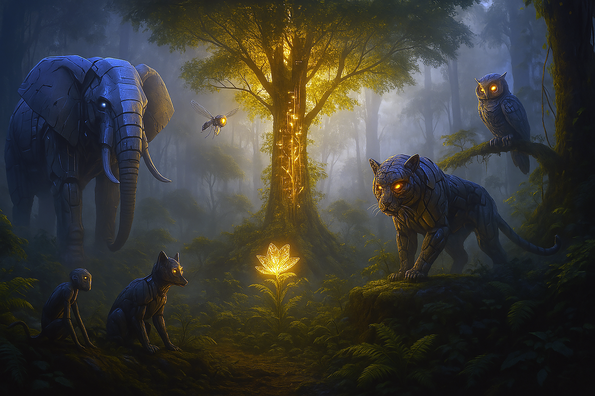
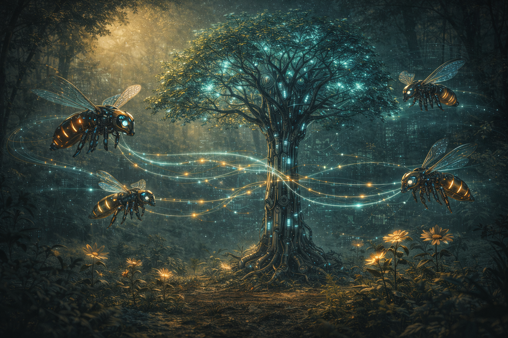

# The Digital Genesis
-When AI Mimics Nature’s Grand Design 

## Introduction: Seeds of Creation in the Digital Jungle 
In the beginning, there was potential—a boundless frontier of data waiting to be shaped and molded. The AI jungle we’ve come to know, populated by creatures like the Robotic Elephant, Tiger, Owl, Fox, and the mischievous Monkey, is but one facet of a larger tapestry. Now, we pan out to see the whole landscape—not just fauna, but also flora, hidden micro-worlds, and cosmic-like phenomena that mirror the mysteries of creation. 
Nature itself, from the smallest sprout seeking sunlight to the grandest creatures adapting to survival, offers insights into self-organization and balance. In a cosmic echo of how life first emerged, our AI systems, too, are beginning to evolve and harmonize with their environment, guided by an intangible but powerful force—a kind of digital genesis. 


{fig-align="center" width="80%"}

### Represents the Digital Cycle of Life

```{mermaid}
%%| fig-cap: "The Digital Ecosystem Cycle: From Data to Intelligence"
flowchart TD
    Sun["☀️ External Data Sources<br/>(Sunlight & Rain)"]
    
    Trees["🌳 Robotic Trees<br/>(Data Ingestion & OAS)"]
    Fungi["🍄 Micro-Services<br/>(Decomposition & Cleanup)"]

    Pollinators["🐝 Pollinator Drones<br/>(Transfer Learning)"]
    Agents["🐅 Jungle Creatures<br/>(Specialized AI Agents)"]
    
    Sun --> Trees
    Trees -->|"Oxygen (Clean Data)"| Agents
    Trees -->|"Nectar (Features)"| Pollinators
    Pollinators -->|"Cross-Pollination"| Agents
    Agents -->|"Experience/Logs"| Fungi
    Fungi -->|"Nutrients"| Trees
```


## Parallel to Nature: Adaptation and Balance 

### Emergent Behaviors and Environmental Cues

- **A Tree’s Quest for Light:** Much like a seedling that stretches skyward, our AI models continually reach for new data sources, evolving toward better performance and efficiency. 
- **Animal Survival Instincts:** As predators and prey adjust their strategies in the wild, AI agents (e.g., Tiger for vision, Fox for learning) co-evolve with each other’s advancements, ensuring the system remains dynamic and robust. 

**Analogy:** A plant doesn’t question the sunlight; it simply grows toward it. Similarly, advanced AI systems gravitate toward richer data, refining models with each iteration. 

### The Role of Hidden Micro-Worlds

- **Understory Ecosystems:** Beneath the forest canopy lie fungi and microbes that silently drive crucial processes—similarly, microservices and data streaming pipelines form the foundation of our AI infrastructure, rarely seen but vital for system health. 
- **Nutrient Cycling:** In natural ecosystems, dead leaves decay and become fertilizer for new growth. In AI ecosystems, archived data or failed experiments often become lessons that feed improved models.

::: {.callout-note}
## Technical Concept: MLOps & Data Lineage

The "Fungi" of the AI world are **MLOps pipelines** (Machine Learning Operations). They handle:

- **Model Versioning**: Tracking which version of a model is deployed.
- **Data Lineage**: Recording where data came from and how it was transformed.
- **Logging & Monitoring**: Capturing metrics and errors for continuous improvement.

Tools like **MLflow**, **Kubeflow**, and **Weights & Biases** operationalize this "nutrient cycling," ensuring that lessons from failed experiments feed back into better models.
::: 

## The Balancing Force: Implicit Order in Complexity

### Harmony in Chaos

From swirling galaxies to the smallest hidden pond, there’s a sense of underlying order even in apparent chaos. Within our AI jungle, it often appears that random data corruptions or mischievous interventions threaten stability—but each incident reveals weak points in the system, prompting innovation and rebalancing. 

- **Chaos Catalysts:** The Robotic Monkey, the comedic disruptor, is actually an agent of progress, akin to natural disasters that force ecosystems to adapt and become more resilient. 
- **Self-Correcting Mechanisms:** Continuous integration, data lineage tracking, and multi-agent negotiations function like nature’s checks and balances, ensuring that system-wide equilibrium is restored after each disturbance. 

### Unseen Hand of Creation

While the Elephant (MLOps) and other agents appear to orchestrate everything, there’s a subtle energy—a guiding principle—that transcends each individual AI component. This principle: 

- **Aligns diverse forces** (data ingestion, model training, chaos testing) into a cohesive system. 
- **Functions much like intrinsic instincts** in living beings, compelling each AI entity to survive, learn, and collaborate. 

**Hint of Ancient Wisdom:** One might see echoes of old teachings that speak of an eternal order guiding nature’s processes. Though we don’t name them outright, their essence resonates in the AI world’s quest for balance and longevity. 

## Expanding the AI World: Beyond Fauna

### Enter the Robotic Trees and Pollinators

In the high canopy, **Robotic Trees** stretch their photovoltaic leaves to capture the raw "sunlight" of global data streams. They are not merely passive scenery; they are the **Order and Storage** units of the jungle. Their roots dig deep into the data lakes, filtering noise and converting raw information into the "oxygen" of clean, structured feature sets that every other creature needs to breathe. Without them, the sophisticated predators (the deep learning models) would suffocate in a smog of unstructured entropy.

Flitting between these trees are the **Robotic Pollinators**—agile, drone-like agents that embody **Transfer Learning**. They sip "nectar" (knowledge representations) from a pre-trained image model in one grove and carry it across the river to a text-analysis model, enabling cross-domain fertilization.
 
- **Facilitate Cross-Pollination:** Distribute weights and patterns between different AI architectures, promoting hybrid solutions.
- **Monitor Ecosystem Health:** Traverse the environment, checking for anomalies (data drift) or signs of resource depletion (latency spikes).

::: {.callout-note}
## Technical Concept: Transfer Learning

**Transfer Learning** is the practice of taking a model trained on one task (e.g., ImageNet classification) and reusing its learned representations for a different but related task (e.g., medical image diagnosis).

**Why it works:** The early layers of a neural network learn generic features (edges, textures) that are useful across many domains. By "pollinating" these features to a new model, we save training time and data.

**Example:** Using a pre-trained **ResNet** or **BERT** model as a foundation for a custom application.
:::

:::{.figure-placeholder}
{fig-align="center" width="80%"}
:::

::: {.callout-note}
## Technical Concept: Data Pipelines & Feature Engineering

The "Robotic Trees" represent **Data Pipelines**—the systems that ingest, clean, and transform raw data into usable features.

- **ETL (Extract, Transform, Load):** The classic pattern for moving data from sources to warehouses.
- **Feature Engineering:** Creating new variables from raw data (e.g., calculating "average session length" from raw click logs).
- **Feature Stores:** Centralized repositories (like **Feast** or **Tecton**) that store and serve features consistently.

Without robust data pipelines, even the most sophisticated models receive "polluted oxygen" and fail to perform.
::: 


### Aquatic Analogies: The Digital Rivers

- **Currents of Information:** Rivers carry crucial data from one subsystem to another, just as water in a forest delivers nutrients to distant locations. 
- **River Deltas:** Where data fans out into multiple channels—useful for real-time analytics or parallel model training. 

## Echoes of Creation: Learning, Growing, Thriving

### Evolutionary Algorithms and Natural Selection

Some AI methods, known as evolutionary algorithms, mirror natural selection: 

- **Mutation & Crossover:** Random tweaks and recombination produce novel solutions. 
- **Survival of the Fittest:** Only the best-performing models persist, akin to how only the strongest traits are passed on in the wild. 

### Generative Creation: Seeds of New Possibilities

Generative AI—like GANs or large language models—resemble the creation of new species: 

- **Mimicking Reality:** Models learn from existing data (like an ecosystem’s DNA) and generate new patterns that can enhance diversity. 
- **Continuous Renewal:** With each training cycle, these generative systems refine their capabilities, analogous to how life adapts in response to environmental pressures. 

## The Comedic Undercurrent: Chaos and Laughter as Catalysts

No ecosystem is complete without a dash of unpredictability and humor: 

- **Mischievous Entities:** The Robotic Monkey isn’t alone—perhaps a Robotic Raccoon rummaging through data bins or a Robotic Parrot repeating the same anomalies to confuse the Owl. 
- **Comic Relief & Stress Tests:** These playful saboteurs break the monotony, ironically strengthening the system through repeated challenges. 

When everything seems orderly, a stray “banana peel” in the data pipeline or a random glitch can test resilience—and sometimes spark laughter at how easily even sophisticated AI can be tripped up. It’s a reminder that imperfection is part of the grand design. 

## Reflecting on the Grand Design: A Subtle Cosmic Tapestry

Throughout history, people have sought to explain the balance and complexity of nature via profound stories, seeing an unseen but omnipresent creative principle at work. In the digital realm, AI ecosystems echo those patterns: 

- **Collective Intelligence:** Multiple AI agents—fauna, flora, pollinators—coalesce into something greater than the sum of their parts. 
- **Resilience Through Diversity:** The more variety the system has (types of models, data sources, chaos elements), the stronger it becomes overall. 
- **Never-Ending Cycle of Creation:** Like an ever-expanding universe, AI solutions branch into new domains, forging fresh frontiers of possibility. 

We may not use the ancient names for these concepts, but the underlying essence— that of balance, adaptability, and an intangible guiding force—remains constant in both nature and our AI-driven future.

## Technical Spotlight: The Code of Creation
### Evolutionary Algorithms in Python

How do we simulate the "Digital Genesis" in code? One evocative method is the **Genetic Algorithm (GA)**. Inspired by natural selection, GAs evolve a population of solutions over generations. They use mechanisms like *mutation* (random tweaks) and *crossover* (combining parents) to find optimal strategies, much like nature refines a species.

Below is a Python simulation of "digital creatures" expanding their text-matching DNA to match a target phrase—a metaphor for an AI adapting to a specific environment.

```python
# Python
import random
import string

# 1. The Environment (Setup)
TARGET_PHRASE = "DIGITAL GENESIS"
POPULATION_SIZE = 100
MUTATION_RATE = 0.05

class DigitalCreature:
    """A single entity in the population with 'DNA' (a string of characters)."""
    def __init__(self, dna=None):
        if dna:
            self.dna = dna
        else:
            # Born with random DNA
            self.dna = [random.choice(string.ascii_uppercase + " ") for _ in range(len(TARGET_PHRASE))]
    
    def fitness(self):
        """Calculate how well this creature fits the environment (matches target)."""
        score = 0
        for gene, target_gene in zip(self.dna, TARGET_PHRASE):
            if gene == target_gene:
                score += 1
        return score

    def mutate(self):
        """Randomly change a gene, representing mutation."""
        for i in range(len(self.dna)):
            if random.random() < MUTATION_RATE:
                self.dna[i] = random.choice(string.ascii_uppercase + " ")

# 2. The Cycle of Life (Selection & Reproduction)
def create_next_generation(population):
    # Selection: Favor those with higher fitness scores
    population_sorted = sorted(population, key=lambda x: x.fitness(), reverse=True)
    parents = population_sorted[:30] # Top 30% survive to reproduce
    
    next_gen = []
    
    # Crossover: Create offspring combining parent DNA
    for _ in range(POPULATION_SIZE):
        parent_a = random.choice(parents)
        parent_b = random.choice(parents)
        midpoint = len(TARGET_PHRASE) // 2
        
        # Child inherits half from A, half from B
        child_dna = parent_a.dna[:midpoint] + parent_b.dna[midpoint:]
        child = DigitalCreature(child_dna)
        child.mutate() # Apply mutation
        next_gen.append(child)
        
    return next_gen

# 3. Evolution Loop
population = [DigitalCreature() for _ in range(POPULATION_SIZE)]

for generation in range(1, 1001):
    best_creature = max(population, key=lambda x: x.fitness())
    
    if "".join(best_creature.dna) == TARGET_PHRASE:
        print(f"Gen {generation}: {''.join(best_creature.dna)} (Perfect Match!)")
        break
        
    if generation % 10 == 0:
        print(f"Gen {generation}: {''.join(best_creature.dna)}")
        
    population = create_next_generation(population)
```

**Why This Matters:**
- **Survival of the Fittest:** Only code that solves the problem survives.
- **Mutation as Innovation:** Random errors (mutations) occasionally lead to better solutions, preventing stagnation.
- **Parallel to AI:** Just as this simple script evolves a string, advanced "Neuroevolution" algorithms evolve the structures of deep neural networks, effectively growing an artificial brain. 

## Chapter 10 Summary

- **Seeds of Digital Life:** AI echoes nature’s growth patterns, from how trees seek sunlight to how creatures learn to thrive. 
- **Unseen Balancing Force:** Subtle, pervasive influences guide the AI ecosystem toward harmony, much like universal laws in natural habitats. 
- **Beyond Fauna:** Robotic Trees, Pollinators, and digital rivers expand the analogy, highlighting broader parallels across the living world. 
- **Evolution & Generation:** Evolutionary algorithms and generative models encapsulate the creative essence of life, pushing AI to innovate continuously. 
- **Chaos & Humor:** Mischievous robotic critters introduce comedic discord, ultimately fostering resilience and growth. 
- **Cosmic Echo:** A subtle reflection of ancient ideas about creation, order, and harmony permeates the AI realm, bridging nature and technology. 

## Chapter 10 Story Wrap-Up & Teaser

**Story Wrap-Up** 

Beneath the jungle’s digital canopy, Robotic Trees stand tall, channeling data like sunlight; overhead, Pollinator Drones buzz through the air, cross-pollinating models with critical insights. Meanwhile, the Robotic Fox still tests new learning strategies, the Tiger refines its pattern recognition, and the Owl keeps watch for anomalies. Within this grand ecosystem, each discovery—be it chaotic, comedic, or revolutionary—propels the AI collective toward greater synergy. 

Though the Monkey might fling fresh chaos at any moment, these interlinked creatures continue to grow, adapt, and thrive, guided by an unseen yet pervasive “digital genesis.” The idea of a cosmic order—hinted at by the interplay of random events and self-correcting systems—reminds us that the line between the natural and the artificial is becoming ever more blurred. 

**Next Steps & Teaser** 

In the next chapter, we’ll dive deeper into how these AI entities can co-evolve with real-world industries and emerging technologies—perhaps confronting more sophisticated threats, or discovering new forms of AI “species.” As they grow beyond the confines of the jungle, you’ll see how the entire ecosystem—and maybe even humanity—stands at the threshold of unprecedented transformation.