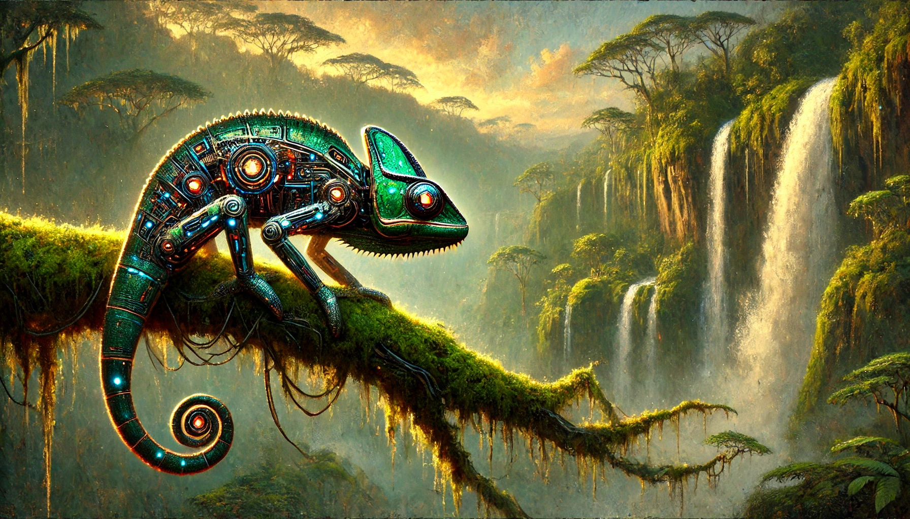
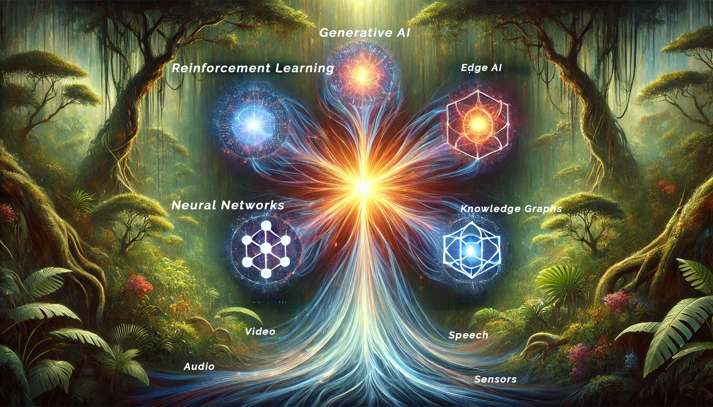

# A Chorus of Many Voices 

**The Multi-Modal RainforestA**  ***-Where Streams of Data Converge***

## Introduction:  A Mystical Dawn in the AI Jungle 
At the Break of Dawn 
Imagine stepping into a mystical rainforest at first light. High above, the canopy drips with dew that glimmers like tiny data crystals. Below, the air hums with hidden whispers—songbirds calling, leaves rustling, distant waterfalls roaring. It’s a symphony of colors, sounds, and life that you can almost feel pulsing beneath your feet. In this enchanted wilderness, you—our intrepid explorer— embark on a new chapter of discovery in AI and machine learning. 
Why are we here? Because single-mode sensing—relying solely on vision, text, or any one data stream—can be as limiting as navigating this lush jungle with eyes closed. To truly understand and thrive, you need multiple senses. In this chapter, we push beyond any one modality into the realm of multi-modal intelligence—a place where images, sounds, and sensor readings unite, much like the rainforest’s own vibrant tapestry of interconnected life. 
As you venture deeper, you’ll see how nature’s synergy mirrors advanced AI systems that learn from varied data inputs. The Digital Council—which you first met in earlier chapters—expands its ranks with new creatures. Each one fuses visual, auditory, textual, and even environmental data into a chorus of insights. Let’s step into the mist and discover how multi-modal AI can bring us closer to nature’s uncanny ability to adapt, survive, and flourish. 

## The New Voices of the Rainforest 

### The Chameleon: Seamless Audio-Visual Adaptation 
A Master of Two Worlds 
High on a moss-laden branch, the Chameleon adjusts its mech-like scales to match the swaying leaves. But its gift extends beyond camouflage—its flickering tongue captures not insects, but fragments of sound and infrared shadows, weaving them into a reality no single sense could perceive alone. A faint creak in a branch gains meaning only when a dark shape emerges nearby, revealing the unseen through the union of vision and sound. 


:::{.figure-placeholder}
{fig-align="center" width="80%"}
:::

Analogy in Action 

- In earlier chapters, the Tiger excelled at visual classification, but risked misjudgment when shadows or lighting conditions changed. 
- By syncing audio waves with the image stream, the Chameleon corrects these blind spots—spotting prey, threats, or anomalies in real time. 
Real-World Parallel: 
Industrial inspection systems that listen for subsonic cracks while also visually scanning surfaces. Only by fusing these channels can they catch early signs of equipment failure. 

### The Toucan: Bridge of Speech and Language 
A Translator of Echoes 
Perched on a sturdy vine, the Toucan emits metallic calls, each layered with coded messages. Its beak functions like a speech-to-text converter: capturing chirps, roars, or human voices and parsing them into tokenized words. In an instant, the Toucan relays these texts to the Owl (symbolic logic) or the Tiger (deep learning), bridging spoken and textual realms. 
Analogy in Action 

- Recall how the Owl once struggled to interpret foreign roars. Now, with Toucan's transcription and language processing, the Owl can reference its rule sets to decipher meaning. 
- The Fox, too, can train on live speech inputs, refining reinforcement strategies based on real-time dialogue or audio cues. 

Real-World Parallel: 
Voice assistants, call center AI, or multilingual chatbots that rely on robust ASR (Automatic Speech Recognition) and NLP—especially under noisy conditions where single-mode solutions might fail. 

### The Bioluminescent Moth: Sensor-Fusion Beacon 
Light in the Darkness 
As dusk approaches, luminescent wings dance among the foliage—a Moth that glows in patterns reflecting environmental data: temperature shifts, humidity spikes, seismic tremors. One brighter flash signals a potential threat. Another gentle flicker might announce stable conditions. 
Analogy in Action 

- The Elephant (MLOps) can scale up analytics if sensor readings signal an imminent storm, while the Fox might adapt its exploration policies to safer ground. 
- When combined with visual or audio data, these sensors build a complete situational awareness that surpasses any single viewpoint. 

Real-World Parallel: 
IoT networks that monitor climate, machinery, or even medical vitals, instantly alerting you to anomalies. The Moth’s glowing patterns compress sensor data into interpretable signals for the entire Council. 
Comedic Cameo: The Robotic Monkey’s Sabotage 
Suddenly, a Robotic Monkey vaults overhead, chucking “data bananas” into a nearby pond. Each banana emits fake sonar pings, aimed at confusing the Chameleon’s audio-visual logic. The Toucan squawks in alarm, while the Moth detects a weird spike in water temperature. But, thanks to multi-modal cross.checking, the Council quickly realizes it’s a prank—no real threat. Laughter ripples through the clearing, proving that multiple senses outwit any single-channel sabotage. 


:::{.figure-placeholder}
{fig-align="center" width="80%"}
:::

## Why Multi-Modal? A Deeper Perspective 

### Surpassing Single-Sense Limitations 
A predator that relies only on sight falters in a dense fog. An AI system that only processes text may misjudge critical context embedded in images or sensor data. By fusing multiple channels, the Council remains agile despite changing conditions—much like real rainforest life adapts to storms or nightfall. 

### Cross-Validation and Reduced Ambiguity 
Imagine hearing a suspicious growl—could be a hidden predator or just an echo in a cave. By aligning audio with thermal readings (Chameleon) or seismic data (Moth), the Council zeroes in on whether the threat is real. This synergy slashes false positives and boosts confidence in final decisions. 

### Discovering Hidden Patterns 
Some relationships surface only when merging distinct streams: a faint crack sound plus a micro-vibration plus a shifting visual pattern might herald a collapsing branch. Similarly, in finance or healthcare, textual notes and sensor logs might reveal anomalies that neither channel alone would detect. 

## Glimpsing the Technical Architecture 
While the rainforest teems with story and metaphor, the underlying mechanics are grounded in robust AI practices: 
Data Ingestion: 

- The Chameleon provides images + audio waveforms. 
- The Toucan delivers speech transcripts. 
- The Moth feeds sensor arrays (temperature, humidity, seismic). 

Fusion & Analysis: 

- Each modality transforms into embeddings (e.g., spectrograms for audio, pixel embeddings for images, numeric vectors for sensors). 
- A multi-modal attention layer (or weighted aggregator) merges these embeddings, unveiling richer context. 

Council Decision: 

- The Owl, Tiger, Fox, and Elephant each apply their unique strengths (symbolic logic, deep learning, RL strategy, MLOps orchestration). Conflicts or uncertainties are resolved through hierarchical arbitration, ensuring the best combined outcome. 
Code snippet that demonstrates embedding fusion or cross-attention:
 Suppose we have three data inputs: 
1.image_data (from the Chameleon’s visual feed), 
2.audio_data (from the Chameleon’s microphone or Toucan’s speech input), 
3.sensor_data (from the Moth). A simplified (pseudocode) snippet might look like this: 

```python
# Python Pseudocode for Digital Council Orchestration
# Step 1: Embed each modality
# e.g., outputs a [batch, embed_dim] tensor
image_embed = vision_model(image_data)
# e.g., outputs a [batch, embed_dim] tensor
audio_embed = audio_model(audio_data)
# e.g., outputs a [batch, embed_dim] tensor
sensor_embed = sensor_encoder(sensor_data)
# Step 2: Combine or fuse embeddings
fused_features = concatenate([image_embed, audio_embed, sensor_embed], dim=1)
# Optionally, apply an attention layer:
fused_features = multi_modal_attention(fused_features)
# Step 3: Pass the fused representation to the decision logic
decision = decision_maker(fused_features)
print("Final decision output:", decision)
```

:::{.figure-placeholder}
{fig-align="center" width="80%"}
:::

Fusion of AI Paradigms in a Rainforest Data Ecosystem 

## Real-World Relevance: Your Journey Forward 

**Practical Translation**

How does this multi-modal ethos help in everyday projects? 

- Healthcare Monitoring: Merge patient vitals (sensor data) with MRI images (visual) and doctor notes (text) for more accurate diagnoses.

- Wildlife Conservation: Sync camera traps (images), acoustic sensors (audio), and climate data (sensors) to track endangered species. 

- Robotics & Drones: Combine camera vision, microphone arrays, and proximity sensors for fully autonomous navigation—even in dynamic environments. By adopting a multi-modal mindset, you future-proof your AI systems. New data sources (like new sensor types or advanced language models) integrate with minimal friction—much like the rainforest thrives by constantly evolving and adapting new symbiotic relationships.


## Chapter 14 Summary & Next Steps 

**Key Insights** 

New Allies: Chameleon (Audio-Visual), Toucan (Speech-Language), Moth (Sensor Fusion). 

Multi-Modal Advantages: Overcomes single-channel weaknesses, cross-validates data, and reveals hidden patterns. 

Council Dynamics: The Owl (symbolic), Tiger (deep learning), Fox (RL), and Elephant (MLOps) now operate with richer inputs—enhancing every decision they make. 

Comedic Interlude: The Robotic Monkey’s pranks illustrate how integrated senses can defeat sabotage or confusion tactics. 

**Where We’re Headed** 

As dusk settles and the multi-modal rainforest glows with interwoven signals, rumors emerge of distant ecosystems forging their own AI networks—sharing knowledge across mountains, deserts, and even oceans. Could these local councils unite into a global tapestry of intelligence? In the next chapter, we’ll explore how collaboration at scale transcends even the densest jungle, forming alliances that reshape the very fabric of AI’s global future. 

**Master Key Takeaway:** 

Multi-modal intelligence stands at the heart of adaptability, just as the rainforest thrives by interlacing diverse life forms. When your AI sees, hears, and senses in tandem, it reaches new heights of resilience, insight, and creation—a true chorus of many voices echoing through a world brimming with possibility.