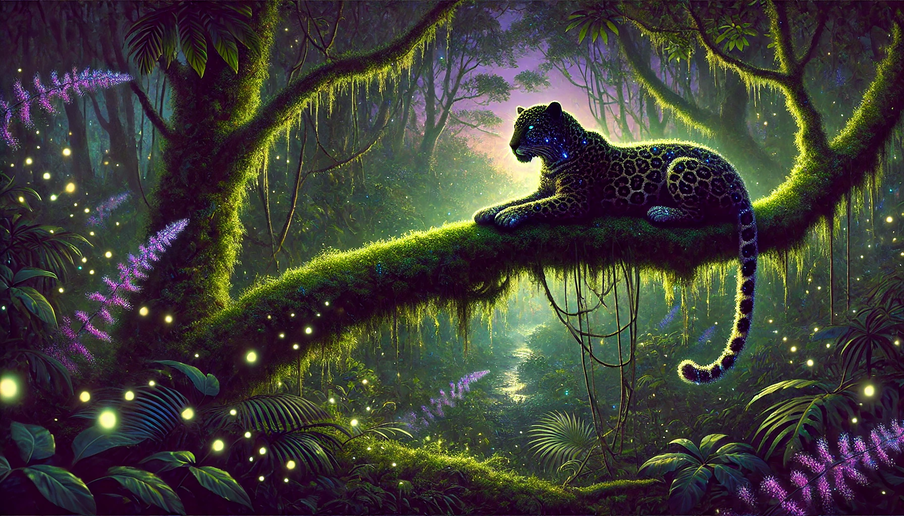
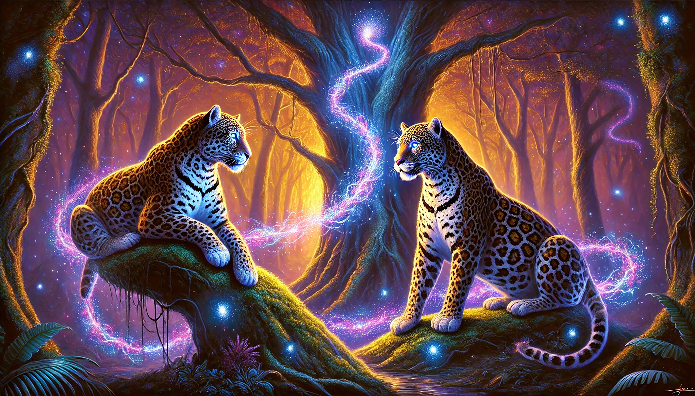

# The Mysterious Quantum Jaguar: Where Superposition Roams

## Introduction: A Hidden Realm Beyond Classical Paths

As dawn breaks over the AI Jungle, a mysterious hush settles across the canopy. Even the usually playful Robotic Monkey pauses in quiet curiosity, watching the fog gently reveal hidden paths. Beneath the ancient trees, the Council of Algorithms—neural networks, decision trees, and swarm intelligences, each represented by their animal avatars—gathers cautiously. Whispers have reached them about a secret clearing illuminated by star-like motes of quantum light, where an enigmatic predator, the **Quantum Jaguar**, prowls.

From the shadows emerges the Quantum Jaguar, its spotted coat shimmering with an otherworldly glow as it phases effortlessly between states. Rumors speak of its extraordinary powers: existing in many places simultaneously, connecting instantly across vast distances, and solving puzzles beyond the capabilities of classical creatures. Like a jaguar moving silently between shadows, quantum systems thrive in **superposition**—existing in multiple states until revealing their final choice.

In this chapter, we embark on a journey into quantum computing, where traditional bits become quantum **qubits**, flipping our understanding of computation itself. Together, we'll uncover how Quantum AI could revolutionize machine learning, accelerate complex searches, and redefine what we perceive as possible.

{#fig-quantum-jaguar}

## Encounter with the Quantum Jaguar

### The Quantum Jaguar’s Secret Powers: Superposition, Entanglement & Decoherence

The Quantum Jaguar settles on an overhanging branch, eyes gleaming. It begins to explain its magic in terms the jungle can understand. In the Quantum Jaguar’s realm, reality behaves in mind-bending ways that defy classical intuition.

1.  **Superposition:** The Jaguar describes how it can prowl everywhere and nowhere simultaneously. Just as a qubit can exist in a superposition of both 0 and 1 states, the Jaguar seems to walk multiple paths at once. Imagine a coin spinning so fast, it’s neither heads nor tails until you catch it. In quantum terms, a qubit can be in a blend of 0 and 1—a linear combination of states—until observed. Upon measurement, the qubit “collapses” to either 0 or 1.

2.  **Entanglement:** The Jaguar speaks of a mystical bond: two quantum jaguars separated by the jungle, yet their fates intertwined. In quantum computing, entangled qubits are like twin souls; changing one instantly influences the other, no matter the distance.

{#fig-entanglement}

3.  **Decoherence:** Finally, the Jaguar lowers its voice to speak of its greatest nemesis. Decoherence is like the cacophony of the rainforest disrupting the Jaguar’s stealth. For a quantum system, decoherence is the loss of its quantum-ness when the environment (heat, vibrations) interferes. Quantum computers require ultra-cold, controlled conditions to prevent this fragile magic from fading back into classical mundanity.

## Quantum Hunting Techniques: QAOA and QBM

Having shared the fundamentals of its power, the Quantum Jaguar proceeds to describe how it hunts solutions in the complex jungle of problems. Traditional predators (classical algorithms) follow a single trail, but the Jaguar can stalk prey in multiple dimensions of possibility. It introduces two of its prized hunting techniques, which correspond to advanced quantum algorithms.

-   **Quantum Approximate Optimization Algorithm (QAOA):** The Jaguar likens this technique to plotting many routes through the jungle simultaneously and then gradually converging on the optimal path to catch prey. QAOA is a hybrid quantum-classical algorithm designed for combinatorial optimization problems. It leverages the quantum ability to explore many configurations at once and the guidance of classical computation to hone in on good solutions. This approach has already shown promise, often matching or surpassing classical algorithms on certain tasks by finding near-optimal solutions faster. The Jaguar nods: indeed QAOA is an example of how quantum and classical cooperation can tackle tough optimization challenges, such as scheduling, routing, or portfolio optimization, which in classical terms might be intractable.

-   **Quantum Boltzmann Machine (QBM):** Next, the Jaguar describes a more mysterious technique, one that even many humans in the outside world rarely discuss. A QBM is the quantum analog of the classical Boltzmann machine (an energy-based neural network). Think of it as the Jaguar exploring a landscape of possibilities like a valley filled with fog, where it must find all the low-lying areas (optimal or probable states). By using quantum superposition and tunneling, the Jaguar can explore multiple valleys at once and even slip through hills (energy barriers) that would trap a classical creature. QBMs can sample complex probability distributions more efficiently, potentially seeing patterns or solutions a classical Boltzmann machine might miss. The Quantum Jaguar emphasizes that while QBM research is still young, early studies show it could excel at tasks like simulating quantum systems, optimizing complex scenarios, and deciphering intricate data patterns.

During this exchange, the Swarm Ants (Swarm Intelligence) whisper among themselves: “If we could all move like the Jaguar, exploring many paths at once, imagine what problems we could solve!” The Council grows excited, but the wise Decision Tree Owl interjects: “These powers are impressive, but do they apply beyond these idealized hunts? What can the Quantum Jaguar truly do for the world that we cannot?”

## Beyond the Beaten Path: Real-World Applications

In response, the Quantum Jaguar shares stories from beyond the jungle—tales of how quantum computing (and quantum AI) is being applied to problems in the human world, often going beyond what classical AI can achieve. The Jaguar’s eyes gleam as it speaks of uncharted territories where its quantum prowess shines:

-   **Modeling Complex Systems:** The Jaguar describes prowling through the atomic jungles of chemistry and materials. Quantum computers can naturally simulate quantum systems, like molecules and chemical reactions, much more efficiently than classical computers. This means breakthroughs in drug discovery and new materials are on the horizon. Quantum simulations could unravel protein folding mysteries or discover high-temperature superconductors by modeling interactions at the quantum level, tasks essentially intractable for classical algorithms. The Jaguar’s ability to exist in a superposition of many molecular states at once provides an exponentially rich canvas for simulation.

-   **Quantum-Enhanced Natural Language Processing (QNLP):** Perhaps most surprising to the Council is the Jaguar’s foray into language – a domain traditionally ruled by neural networks (the Parrot for generative models, perhaps). The Jaguar shares cutting-edge research where quantum computers assist in understanding human language. By exploiting entanglement and high-dimensional state spaces, quantum algorithms can encode meanings and relationships in text in novel ways. One experiment demonstrated that certain NLP tasks (like classifying phrases or understanding word relationships) could be performed on a quantum computer, even with today’s small quantum processors. Quantum-enhanced NLP is still emerging, but the Jaguar points out its potential: imagine question-answering systems that consider vast combinatorial interpretations of a query at once, or translation systems that natively handle the ambiguity and context of language by exploring many possible meanings simultaneously.

-   **Financial Optimization:** The Council’s interest deepens as the Jaguar talks about prowling the financial markets. Banks and investment firms have begun experimenting with quantum algorithms to optimize portfolios and manage risk in ways classical algorithms struggle with. A portfolio optimization involves searching among astronomical combinations of asset allocations under various constraints—truly a hunting ground for QAOA and other quantum optimizers. Indeed, companies like Citi and JPMorgan have partnered with quantum computing firms to test algorithms that could more efficiently find high-yield, lower-risk portfolio mixes. Early results show that even on small scales, quantum approaches can find solutions comparable to classical methods, hinting at advantages as hardware scales. Moreover, for complex derivatives pricing or credit risk simulations that require heavy Monte Carlo sampling, quantum computers offer the promise of a quadratic speed-up via algorithms like quantum amplitude estimation. The Jaguar tempers the excitement with realism: today’s quantum devices handle only toy-sized problems, but rapid progress suggests that in the near future, quantum-enhanced AI could guide financial decisions with unprecedented sophistication.

-   **Quantum-Enhanced AI in Other Fields:** The Jaguar mentions that optimization lies at the core of many challenges, and wherever there are hard optimization or search problems, it can potentially help. Logistics and supply chain optimization, traffic flow management, energy grid optimization—these complex systems could benefit from quantum algorithms searching through permutations vastly faster than any classical brute force method. Even in climate modeling or analyzing complex biological networks, quantum computers might provide new ways to model and find patterns. In cryptography, while quantum algorithms (like Shor’s) threaten classical encryption, quantum machine learning might also help in detecting anomalies and strengthening security by analyzing patterns in encrypted traffic without fully decrypting it. The Quantum Jaguar, embodying these advancements, stands as a symbol that AI augmented by quantum computing could crack problems that today stump classical AI.

The other animals exchange glances of respect and concern. The Reinforcement Learning Wolf whines softly, realizing that a Quantum Jaguar could solve certain game strategies or optimization of rewards exponentially faster. The Logical Tortoise (symbolizing classical deterministic algorithms) feels a pang of obsolescence but then pipes up: “Your powers are amazing, Jaguar. But how real are they today? What of the tales that quantum computing is mostly hype?” This leads the Jaguar to delve into the current state of its hardware and what’s happening at the frontiers of technology.

## In the Shadow of Giants: Hardware Advancements

Turning from software to hardware, the Jaguar addresses how it manifests in the real world. “To run as I do,” it says, “one needs a special kind of lair.” It describes the quantum hardware – effectively the dens in which the Quantum Jaguar prowls. Each hardware platform is like a different subspecies of the Jaguar, each with its strengths and challenges:

-   **Superconducting Qubits (The Arctic Jaguar):** The Jaguar begins with superconducting qubits, the basis of quantum computers built by IBM, Google, and others. These qubits are tiny electrical circuits made of superconducting materials kept at near absolute zero. In this frozen realm, electrons flow without resistance, and the qubits can maintain quantum states long enough to perform computations. The Jaguar explains that superconducting qubits are fast and agile; they can perform gate operations in mere nanoseconds, much faster than other qubit types. Moreover, they are built using well-understood semiconductor fabrication techniques, making them relatively scalable – tech giants have already made devices with dozens to hundreds of qubits on a chip. IBM, for instance, has a roadmap toward chips with over 1,000 qubits (its 1,121-qubit “Condor” processor) in the next couple of years. The Jaguar roars proudly that this approach currently leads the quantum race in terms of qubit count and integration. However, it also acknowledges the challenges: these qubits are extremely sensitive. Even minimal heat or electromagnetic noise can cause decoherence. Thus, they require dilution refrigerators (gleaming steel chambers that cool to millikelvin temperatures) and sophisticated error correction techniques to tame their wild quantum states. The Council envisions the superconducting quantum computer as a gleaming cryogenic cave where the Quantum Jaguar must remain in the bitter cold to keep its powers.

-   **Trapped Ion Qubits (The Celestial Jaguar):** Next, the Quantum Jaguar describes the trapped ion approach, used by companies like IonQ and academic labs. Instead of circuits, these qubits are individual charged atoms (ions) levitating in vacuum, held in place by electromagnetic fields. Each ion’s internal energy states serve as the 0 and 1 of a qubit. The Jaguar analogizes trapped ions to stars in a constellation, each shining steadily. Trapped-ion qubits are remarkably stable and exhibit some of the highest fidelities (accuracy of operations) among qubit types. They can remain coherent for long durations, and entangling them is achieved with lasers that nudge the ions into interacting. The Jaguar notes that precision is a hallmark of this platform: operations are slower (milliseconds rather than nanoseconds) compared to superconducting qubits, but very reliable. Scaling up is a challenge though—the ions need to be carefully spaced and controlled. Efforts are underway to shuttle ions across trap zones or connect multiple ion traps with photonic links to build larger processors. Recently, trapped-ion systems have demonstrated entangling up to 32 ions in a single register, and the Jaguar hints that modular systems could link many such registers. The Council imagines a serene cosmic dance: ions connected by beams of light, a graceful yet slower Quantum Jaguar variant that values precision over speed.

-   **Topological Qubits (The Mythical Jaguar):** With a tone of reverence, the Jaguar speaks of a cutting-edge approach still in the experimental stage: topological qubits. This is akin to a legendary Jaguar said to be invulnerable to environmental noise. Topological qubits aim to store information in fundamentally protected quantum states, exploiting exotic particles called Majorana zero modes which appear in certain superconducting materials. The Jaguar recounts a recent breakthrough: in 2025, researchers unveiled an 8-qubit topological quantum processor, the first of its kind. By creating a new phase of matter—a topological superconductor—they were able to demonstrate qubits that are expected to be far more robust against decoherence. The Council gasps at the notion of a Quantum Jaguar that might roam almost fearlessly, its quantum state shielded from the usual disturbances. “We have created a new state of matter,” the Jaguar quotes the scientists, describing how these Majorana modes encode qubits non-locally, so that local noise cannot easily corrupt them. While still early, if topological qubits mature, they could lead to quantum computers that require far less error correction and can scale more readily. It’s as if the Jaguar could finally hunt free of the cage of extreme refrigeration and stability requirements that confine other qubits. The Council finds this prospect thrilling—the fewer errors the Quantum Jaguar makes, the more practical and powerful it becomes in real-world tasks.

A packaged quantum processor chip (D-Wave’s 512-qubit “Vesuvius” chip) ready to be cooled to near absolute zero. Such superconducting chips are the hunting ground of the Quantum Jaguar, where qubits reside and quantum algorithms run. Researchers constantly advance hardware like this to increase qubit counts and reduce errors.
As the Jaguar concludes the hardware tour, it mentions other approaches as well—photonic qubits (quantum states of light), neutral atom qubits (neutral atoms in optical tweezers), each with their own jungle ecosystems. The diversity of hardware is akin to different habitats for the Jaguar, all in pursuit of stable, scalable quantum computing. The Council sits in awe. It’s clear that bringing the Quantum Jaguar to life is one of humanity’s grand engineering challenges. And progress is steady: qubit counts double, coherence times lengthen, and error rates drop with each passing year. The Neural Elephant recalls a prediction it read: with continuous improvements, hybrid quantum-classical systems are expected to start solving problems once thought unsolvable within the next decade. The Quantum Jaguar confirms this, stating that quantum computers are transitioning from lab curiosities to tools that industry and researchers can experiment with on real problems. In fact, already cloud services allow anyone to run small quantum programs on actual quantum chips—a taste of what’s to come.

## The Council’s Debate

Now that the Quantum Jaguar has laid out its nature, the Council convenes a grand debate under the glowing moon. Each member speaks from its perspective, classical or quantum, to assess how these powers can be harnessed together:

-   **Neural Network Elephant:** The Elephant, representing deep learning, rumbles in its deep voice, “I excel at perception—recognizing images, understanding speech—but I require massive data and compute. Jaguar, can you help me learn with less?” The Quantum Jaguar acknowledges that quantum computing might accelerate certain linear algebra subroutines that underlie neural networks (like solving systems of equations or sampling from distributions). There are ideas for quantum neural networks and quantum-enhanced training that could, for example, jump between multiple model configurations at once or escape sharp local minima that trap classical training processes. However, the Jaguar admits it’s not a silver bullet: “I won’t magically make a bad model good, but I might train a good model faster or enable new types of models.” The Elephant nods thoughtfully, imagining a future where a quantum circuit might be part of a deep learning pipeline (indeed, hybrid models are already being tested).

-   **Decision Tree Owl:** The Owl, ever logical, questions the reliability of the Jaguar’s methods. “Randomness, probabilities... how do we trust your results?” The Jaguar explains that many quantum algorithms, like QAOA, are probabilistic but can be run multiple times to gather high-confidence answers, much like how one might perform multiple heuristic trials classically. Moreover, for certain problems like unstructured search, algorithms like Grover’s provide provable quadratic speedups in finding a target item. The Owl concedes that in cases where exhaustive search is impossible, a probabilistic quantum approach might be the best guide available.

-   **Swarm Intelligence Ants:** A tiny ant speaks up on behalf of the swarm. “We solve problems by cooperation and exploring many possibilities with many agents. You, Jaguar, seem to do that all on your own, in parallel. Is there a way we could combine forces?” The Jaguar responds that one intriguing avenue is using quantum computers to simulate and enhance complex adaptive systems. For instance, a quantum annealer (like D-Wave’s machine) essentially performs a form of swarm-like optimization by letting a multitude of quantum states simultaneously crawl the energy landscape of a problem, seeking good solutions. It’s as if an entire colony of ants is instantiated within the quantum device. The Ant Colony could in the future use a quantum processor as a “boosted" mode for their algorithm when the landscape gets very rugged and high-dimensional, effectively leveling up the swarm’s capabilities.

-   **Reinforcement Learning Wolf:** The Wolf, representing learning by trial-and-error, is excited. It asks, “Could a Quantum Jaguar help me evaluate many possible future action sequences at once?” The Jaguar recounts an experiment where a quantum algorithm was used to speed up reinforcement learning by evaluating state transitions in superposition. Trapped-ion implementations of small reinforcement learning environments have been demoed. The Wolf envisions a quantum-enhanced planner that could examine a vast game tree of possibilities in parallel, something that might one day challenge even the cleverest classical game AIs. As each council member speaks, the dialogue highlights a theme: quantum computing isn’t here to replace classical computing or AI, but to augment and transcend it in targeted ways. The Quantum Jaguar is a new predator in the digital jungle, but it does not make the old ones obsolete overnight. Rather, it opens new niches and new strategies.

The Council agrees on a unifying insight: **Hybrid approaches are the near-term future.** The strengths of classical AI (like massive data processing and well-developed algorithms) combined with quantum’s ability to explore combinatorially many states could yield a powerful synergy. They foresee classical computers orchestrating high-level structure while quantum co-processors tackle the exponentially hard pieces within. This resonates with what’s already happening in early quantum AI research, where classical optimizers tweak quantum circuit parameters (as in variational algorithms like QAOA and VQE), and quantum circuits feed back solutions.

## Future Horizons: The Quantum Jaguar’s Promise

As the moon begins to set, the Council gathering winds down. The jungle is alive with newfound understanding and hope. The Mysterious Quantum Jaguar has demystified itself somewhat, showing that behind the magic is a growing body of science and engineering. The animals of the AI Jungle now see the Jaguar not as a threat, but as an ally—albeit one that behaves in wonderfully weird ways.

Before disappearing back into the shadows, the Quantum Jaguar leaves the Council with these parting thoughts: “Our journey is just beginning. Today, I am small and sometimes clumsy—my quantum claws are still sharpening. But each day, the humans advance our cause: adding more qubits, reducing errors, inventing new algorithms. Already, we’ve seen quantum computers achieve feats that were merely theory a decade ago, from quantum supremacy demonstrations to running primitive quantum machine learning on real hardware. Tomorrow, I will be stronger. With enough qubits and low enough error rates, I could tackle problems of staggering complexity with ease. Together, classical and quantum intelligences will solve puzzles that neither could alone.”
In the stillness, the Council members reflect on these words. The Deep Learning Ape imagines drug molecules being designed by quantum simulations feeding into classical neural networks that predict efficacy. The Bayesian Fox imagines sampling huge Bayesian networks with the help of quantum subroutines to handle combinatorial explosions. The Optimizing Cheetah dreams of instantly planning optimal routes for thousands of vehicles with quantum-enhanced algorithms – no traffic jam uncaught.
As dawn’s first light touches the canopy, the Quantum Jaguar fades into the rainforest mist, as elusive as ever but no longer a total enigma. The jungle chorus begins anew, and the Council disperses, each creature returning to its domain with fresh insight. They carry with them a deep appreciation: the union of nature’s analogies and quantum technology’s realities has enriched their understanding of intelligence itself.
In the chapters ahead, the AI Jungle will no doubt encounter challenges that call upon every tool at its disposal. But now, the legend of the Quantum Jaguar will guide them whenever they face the truly intractable problems—reminding them that sometimes, to outsmart a problem, you must embrace a bit of quantum weirdness and step beyond the classical trail. The mysterious Quantum Jaguar will be watching, ready to leap in when the time is right, leading the AI Jungle into the next era of discovery.

## Technical Spotlight: Quantum Machine Learning

### Introduction: Quantum Jaguars in the Machine Learning Jungle

In this chapter’s story, the **Quantum Jaguar** roams in a haze of possibilities, harnessing superposition and entanglement to outsmart its classical counterparts. This technical dive pulls back the curtain to reveal the technology inspiring that metaphor: **Quantum Machine Learning (QML)**. Just as the Jaguar can exist in many states at once, quantum bits (qubits) can represent multiple values simultaneously. This property, called **superposition**, along with **interference** (where quantum waves amplify or cancel out probabilities), promises to boost certain AI algorithms beyond classical limits.

Below, we explore three pillars of QML using **Qiskit 1.x** primitives: Grover’s search algorithm (quantum-accelerated search), quantum reinforcement learning (exploring multiple actions in parallel), and hybrid quantum-classical neural networks (combining quantum leaps with classical learning).

### Grover’s Algorithm: The Jaguar’s Quantum Search

One of the Quantum Jaguar’s talents in the story is sniffing out a target (“prey”) with astonishing speed, as if checking many hiding spots at once. Grover’s algorithm embodies this idea in QML: it finds a marked item in an unsorted dataset faster than any classical search could.

Grover’s key is preparing a superposition of all possibilities, then using an **oracle** (a quantum subroutine) to mark the correct answer’s amplitude and **interference** to amplify that mark while suppressing others. This is analogous to the Jaguar simultaneously prowling down all paths, then zeroing in on the correct trail by reinforcing the “scent” of the prey.

Let’s illustrate Grover’s search in Python with Qiskit for a simple case of four items (two qubits) where the “winning” state is $|11\rangle$ – the quantum equivalent of the Jaguar’s target prey:

```python
# Grover's Algorithm: The Jaguar's Quantum Search (Modern Qiskit 1.x)
from qiskit import QuantumCircuit
from qiskit.primitives import Sampler

# 1. Initialize: The Jaguar starts in an equal superposition of all paths
# |ψ⟩ = 1/2(|00⟩ + |01⟩ + |10⟩ + |11⟩)
qc = QuantumCircuit(2)
qc.h([0, 1])

# 2. Oracle: Mark the target state |11⟩ (the hidden prey)
# A Controlled-Z gate flips the phase of the target state.
qc.cz(0, 1)

# 3. Diffusion: Amplify the probability of the marked state
# Effectively "scenting" the trail by inverting probabilities about the average.
qc.h([0, 1])
qc.x([0, 1])
qc.cz(0, 1)
qc.x([0, 1])
qc.h([0, 1])

# 4. Prepare for measurement
qc.measure_all()

# Run using the modern Sampler primitive
sampler = Sampler()
result = sampler.run(qc).result()
probs = result.quasi_dists[0].binary_probabilities()

print(f"The Jaguar's search result: {probs}")
# Expected output: {'11': 1.0} (The prey found with certainty!)
```

In the code above, we create a quantum circuit with 2 qubits and apply Hadamard gates (`qc.h`) to put the system in a superposition of all 4 possible states ($|00\rangle, |01\rangle, |10\rangle, |11\rangle$). The oracle step uses a controlled-Z gate (`qc.cz(0,1)`) to flip the phase of the amplitude corresponding to $|11\rangle$ – marking our “winner.”

Next, the diffusion step inverts all amplitudes about their average: we Hadamard and X (NOT) all qubits, apply another phase flip on the $|00\rangle$ state (which, due to the prior X gates, corresponds to the unmarked states of the original superposition), then undo the X and Hadamard. This interference amplifies the probability of the marked $|11\rangle$ state. Finally, measuring the qubits collapses the superposition to a definite output. If you run the above code, the measurement counts will overwhelmingly favor '11' as the result – the quantum circuit “finds” the target with high probability.

Just as the Quantum Jaguar in our tale quickly homes in on its prey by leveraging quantum weirdness, Grover’s algorithm shows how superposition and interference can provide a quadratic speed-up in search problems, a tantalizing advantage for future AI systems searching through vast solution spaces.

### Quantum Reinforcement Learning: Exploring Many Paths

In the jungle narrative, the Jaguar’s quantum nature lets it explore many potential action paths at once, learning from all of them without having to try each sequentially. This mirrors the idea of **Quantum Reinforcement Learning (QRL)**, where an agent can leverage quantum states to explore multiple actions or states in parallel.

While true QRL is still largely theoretical, we can sketch a simple example to illustrate the concept. Imagine a trivial reinforcement learning task: a creature must choose between two actions, and one action consistently yields a reward. A classical agent might try each action in turn many times to learn which is better. A quantum agent, on the other hand, could start in a superposition of both “action 0” and “action 1,” effectively trying both at once, then update its strategy based on the result—much like our Jaguar simultaneously testing different hunting moves in a split-second and then favoring the successful one.

Below is a conceptual Python snippet demonstrating a quantum-inspired reinforcement learning loop. We use a single qubit to represent a superposition of two actions and a parameter $\theta$ (theta) that biases the qubit’s state. The agent updates $\theta$ based on received rewards, effectively “learning” which action is more profitable by adjusting quantum probabilities:

```python
import numpy as np
from qiskit import QuantumCircuit
from qiskit.primitives import Sampler

# Initialize policy parameter theta (start with equal superposition)
# theta = pi/2 means 50% chance of |0> and 50% chance of |1>
theta = np.pi / 2

# Simulated environment: Action 1 gives reward, Action 0 does not
def get_reward(action):
    return 1 if action == 1 else 0

sampler = Sampler()

# Reinforcement learning loop
for episode in range(10):
    # Quantum circuit to pick an action: qubit in superposition biased by theta
    qc = QuantumCircuit(1)
    qc.ry(theta, 0)       # Rotate around Y-axis by angle theta
    qc.measure_all()

    # Execute quantum circuit to "choose" an action based on measurement
    # The Sampler runs the circuit and gives us a probability distribution
    job = sampler.run(qc, shots=1)
    result = job.result().quasi_dists[0]
    
    # We take the single measured outcome (key is 0 or 1)
    action = list(result.keys())[0]

    # Get reward from environment for the chosen action
    reward = get_reward(action)

    # Update policy: 
    # If action 1 yielded reward, increase theta to favor |1> (theta -> pi)
    if action == 1 and reward == 1:
        theta = min(np.pi, theta + 0.2)
    # If action was 0 with no reward, also increase theta to favor trying 1 next time
    elif action == 0 and reward == 0:
        theta = min(np.pi, theta + 0.2)

    print(f"Episode {episode}: Action={action}, Reward={reward}, New Theta={theta:.2f}")
```

In this code, $\theta$ controls the qubit’s bias: when $\theta = \pi/2$, the qubit is in an equal superposition of $|0\rangle$ and $|1\rangle$, meaning the agent is choosing between action 0 and 1 at random. As $\theta$ approaches $\pi$, the qubit’s state leans towards $|1\rangle$ (action 1) with higher probability.

Each episode, we create a one-qubit circuit, apply a rotation $R_y(\theta)$ to set the superposition according to the current policy, and then measure to pick an action. The environment’s rule is simple: action 1 always yields a reward of 1 (success), action 0 yields 0 (failure). We then adjust $\theta$: if we chose action 1 and got a reward, we nudge $\theta$ upward, increasing the likelihood of choosing action 1 in the future. If we chose action 0 and got nothing, we also increase $\theta$ (making action 1 more likely next time).

Over several iterations, $\theta$ will drift towards $\pi$, meaning the agent “learns” to almost always choose action 1, the rewarding action. This toy example demonstrates how a quantum mechanism (superposition and probabilistic measurement) might be integrated into an RL setting. The Quantum Jaguar similarly evaluates many possibilities in parallel—it’s as if the Jaguar mentally tries all routes through the jungle at once, instantly senses which path yields a reward (prey), and then instinctively favors that direction.

### Hybrid Quantum-Classical Neural Networks: Joining the Jaguar with the Elephant

In the AI Jungle story, the Jaguar’s quantum prowess doesn’t operate in isolation—it teams up with classical intelligences like the **Elephant’s memory** and the **Tiger’s deep learning instincts**. This collaboration is reflected in **hybrid quantum-classical neural networks**, where quantum circuits are integrated as components within a classical model.

The idea is to use quantum subroutines as a "Jaguar Layer"—a high-dimensional feature extractor that captures complex patterns while still leveraging classical optimization for the rest of the pipeline. You can imagine a system where a single classical neuron is replaced by a tiny **“quantum jaguar circuit”** that processes inputs in a quantum state before feeding results back to the classical "elephant" pipeline. This way, the Jaguar’s strengths (exponential state spaces and entanglement) complement the classical strengths (reliable storage and proven optimization).

Let's look at a refined example. We will define a small classical layer (weight and bias) and then pass its output through a parameterized quantum "activation" circuit:

```python
import numpy as np
from qiskit import QuantumCircuit
from qiskit.circuit import Parameter
from qiskit.primitives import Sampler

# 1. Define the "Jaguar Layer" (Quantum Activation)
x_param = Parameter('x')
qc = QuantumCircuit(1)
qc.ry(x_param, 0) # Rotate qubit by 'x'
qc.measure_all()

sampler = Sampler()

# 2. Classical "Elephant" Processing (One Hidden Neuron)
def elephant_neuron(input_data, weight, bias):
    # Standard linear transformation: z = wx + b
    z = (weight * input_data) + bias
    # Map to [0, 1] range to serve as a rotation angle
    return 1 / (1 + np.exp(-z)) # Sigmoid activation

# 3. The Hybrid Forward Pass
def hybrid_inference(raw_input, w, b):
    # Elephant processes the raw signal
    classical_signal = elephant_neuron(raw_input, w, b)
    
    # Jaguar transforms it into a quantum probability
    # We scale the sigmoid output (0 to 1) to an angle (0 to pi)
    angle = classical_signal * np.pi
    
    # Run the quantum circuit
    job = sampler.run(qc, parameter_values=[angle], shots=100)
    prob_of_pounce = job.result().quasi_dists[0].get(1, 0)
    
    return prob_of_pounce

# Example usage: Simulating a single forward pass
input_feature = 0.82
final_output = hybrid_inference(input_feature, w=1.2, b=-0.5)

print(f"Raw Input: {input_feature}")
print(f"Hybrid Output (Jaguar Probability): {final_output:.4f}")
```

In this hybrid model, the `elephant_neuron` computes a classical activation (using a sigmoid function) on the input. That output (scaled between 0 and 1) is then fed into the quantum layer, where it dictates the rotation of a qubit. We then measure the qubit to estimate the probability of getting outcome 1—effectively using the qubit’s state as a transformed feature.

Although this example is simplistic, it shows how the **Quantum Jaguar** can be embedded within the **Elephant’s** classical pipeline. The Jaguar (quantum layer) provides a unique transformation of data—perhaps finding patterns the classical part alone might miss—while the Elephant (classical layer) handles the overall structure and training. This synergy is exactly how the story’s characters collaborated: the Jaguar’s quantum leaps gave the team new powers, opening “new frontiers” (like solving optimization and discovery problems that were intractable before) while still relying on the stability and wisdom of classical AI represented by the other animals.

**Conclusion: Bridging Back to the Quantum Jaguar’s Tale**

Through these technical explorations, we’ve illuminated the mystery of the **Quantum Jaguar** in tangible terms. Grover’s algorithm demonstrated how superposition and interference let our Jaguar pounce on the correct solution with far fewer tries than a classical search—much like finding a needle in a haystack by examining all straws at once. 

The reinforcement learning example showed the Jaguar’s knack for exploring many possible actions simultaneously, updating its strategy in a heartbeat; this parallels how a quantum agent might learn faster by sampling multiple paths in parallel. Finally, the hybrid quantum-classical network illustrated the Jaguar working in concert with classical AI allies—the **Elephant, Tiger, Owl, and Fox**—blending quantum insights into a conventional model to achieve feats neither could accomplish alone. 

In the narrative, the Mysterious Quantum Jaguar expanded the realm of possibility in the AI Jungle, hinting at technologies that break classical boundaries. Likewise, our code snippets provide a glimpse of quantum machine learning’s potential: from speeding up search to enriching models with quantum-powered layers. Quantum computing isn’t just abstract theory; it’s an emerging toolkit that, much like our Jaguar, can roam beyond classical limits and transform how AI systems learn. As we venture to the next chapter, keep in mind how these quantum principles foreshadow even greater leaps in intelligence—setting the stage for the **Meta-Being’s emergence**.