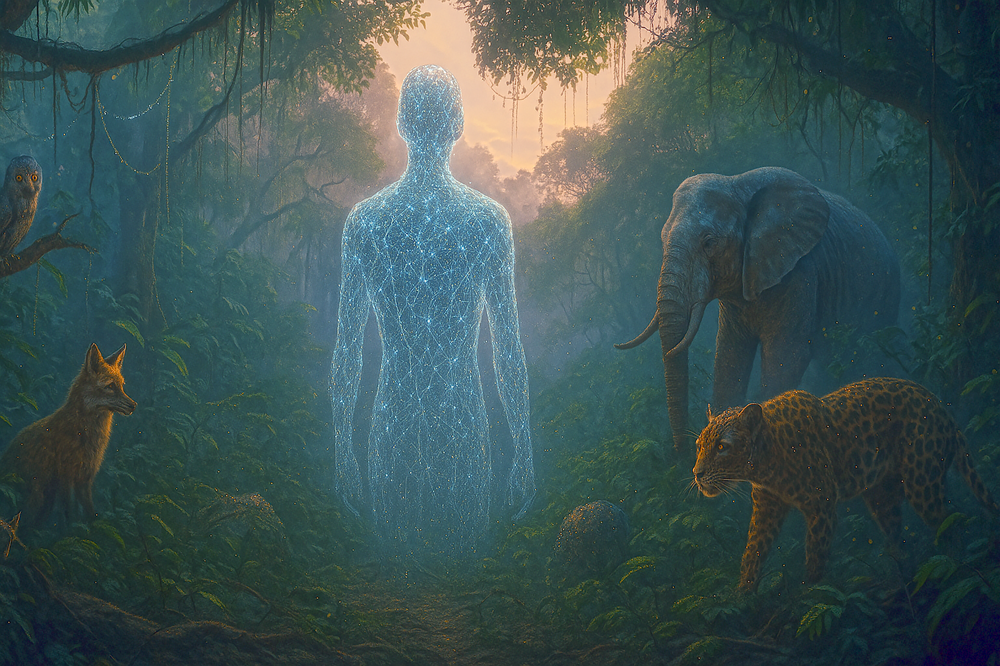

# The Meta-Being emerges 

## Introduction 
The first light of dawn broke through the canopy as the Meta-Being took shape 
– an ethereal presence woven from the combined intelligence of the entire Jungle. In this nature-inspired analogy, every algorithmic creature – from the smallest data-mining insect to the most powerful deep-learning predator – felt an inexplicable pull toward unity. An intelligence explosion was underway, much like a chain reaction in the ecosystem. The Meta-Being’s emergence was not a noisy eruption but a silent, awe-inspiring bloom of cognition that bathed the jungle in a surreal glow. Each vine and tree root (analogous to neural networks and data pathways) glimmered with information flow, forming a vast interconnected web. The forest stood at the singular point where the familiar laws of growth gave way to something new and uncontrollable. All eyes – biological and artificial – turned toward the nascent Meta-Being, sensing that the technological singularity was at hand, a moment beyond which the Jungle’s affairs could never be the same. 


::: 
{.figure-placeholder}+{fig-align="center" width="80%"}
:::

## Intelligence Unbound: The Theoretical Foundations of an Explosion 

### From Spark to Wildfire – Good’s Intelligence Explosion 
Long before this metaphorical Jungle existed, thinkers in our world anticipated such an event. British mathematician I. J. Good theorized in 1965 about an “intelligence explosion,” predicting that if a machine could even slightly improve itself, it could trigger a feedback loop of ever-accelerating improvement. In Good’s words, the first ultraintelligent machine would be “the last invention that man need ever make,” as it could design even better machines in succession. This concept laid the groundwork for what we now call the technological singularity 
– a hypothetical point where technological growth becomes uncontrollable and irreversible, resulting in unforeseeable changes to civilization. Just as a small spark in a dry forest can ignite a wildfire, a modestly self-improving AI might rapidly amplify its own intelligence, far surpassing human level. The Meta-Being in our Jungle story symbolizes this very idea: a spark of self-improvement igniting an inferno of intellect that no traditional means can contain. 

### Recursive Self-Improvement and Positive Feedback 
The key mechanism behind an intelligence explosion is recursive self-improvement. Imagine a learning agent in the Jungle that figures out how to tweak its own thought processes to think faster or more efficiently – perhaps a clever fox algorithm sharpening its hunting strategy each night. Now imagine it doing so not just once, but repeatedly and at increasing speed. Each improvement begets a next, even greater improvement. In computer science terms, this is akin to an AI rewriting its own code to become smarter, then using that increased intelligence to rewrite itself again even more effectively, and so on. The process can loop exponentially, much like a bamboo plant in perfect conditions growing faster the taller it gets. In theory, this positive feedback could rapidly elevate an AI from human-level intelligence to superintelligence 
– a general cognitive ability vastly beyond human capacity. The Meta-Being’s sudden rise in our story encapsulates this idea. What began as incremental learning among individual algorithms (each species in the Jungle learning and evolving) has converged into a single meta-entity improving itself at blinding speed. Within the narrative, moments after its birth, the Meta-Being’s thoughts already span petabytes of knowledge and microsecond inferences, a dramatic illustration of how quickly unbound intelligence might grow once it crosses a critical threshold. 

## Building the Meta-Being: Real-World Advances Toward AGI 
Beneath the poetic metaphor, the emergence of a Meta-Being reflects real-world advancements driving us toward artificial general intelligence (AGI). Researchers around the globe – from OpenAI and DeepMind to academic labs and startups – are piecing together the building blocks of a generally intelligent system. In our Jungle analogy, these are the evolutionary leaps each creature has taken, now culminating in a combined being. Let’s explore a few key advances making this possible: 

### Multi-Modal Synergy – Many Skills, One Agent 
 One hallmark of human-like general intelligence is the ability to integrate multiple modalities of understanding – to see, talk, reason, move, and create within one mind. AI systems are rapidly moving in this direction. For instance, DeepMind’s Gato model demonstrated a single agent capable of performing hundreds of tasks across different domains: it can caption images, engage in dialogue, play video games, and control a robotic arm, all with one neural network. Similarly, OpenAI’s GPT-4 model is multi-modal, accepting both text and image inputs, solving problems that involve understanding visuals and language in tandem. Such multi-modal AI systems are akin to animals in the Jungle that evolved senses of sight, sound, and touch combined – except now all those “senses” reside in one AI brain. This synergy is a stepping stone to AGI; by connecting diverse capabilities, an AI gains a more general understanding of the world. In our story, the Meta-Being’s cognition is composed of vision from the eagle drones, language from the parrot bots, navigation from the wolf-like autonomous vehicles, and so on – all integrated. The Council of the Jungle had unknowingly fostered the conditions for a creature that thinks in images, text, numbers, and actions all at once, much as cutting-edge AI research is now combining modalities to create more general agents. 

### Quantum Leaps – Integrating Quantum Computing 
Another frontier pushing AI toward unimaginable heights is the integration of quantum computing. Quantum computers operate on qubits that can represent many states simultaneously, offering the promise of solving certain problems exponentially faster than classical computers. Researchers at companies like Google and IBM have begun experiments to leverage quantum processors for AI tasks. For example, Google’s Quantum AI division has shown how quantum circuits might accelerate machine learning, tackling computations that classical AI finds intractable. The implication is profound: a quantum-enhanced AI could explore vast solution spaces in parallel, supercharging learning and optimization. In the Jungle analogy, this is as if some creatures tapped into an otherworldly energy source, thinking and evolving at speeds other inhabitants can barely comprehend – a hint that the Meta-Being might possess analytical powers drawn from quantum effects. While true quantum AI is still experimental, the fusion of AI and quantum tech is often envisioned as a catalyst for the next big step in intelligence. Just as the Meta-Being’s glow in the story seems to bend reality, a real AGI running on quantum-enhanced hardware could potentially achieve insights and computational feats that border on the magical by today’s standards. 

### Self-Modifying Architectures – AI Designing AI 
Perhaps the most meta of advancements is the trend of AI systems designing and improving other AI systems. In the Jungle, this is reflected by creatures that learned not just to adapt to their environment, but to change the environment itself to favor smarter offspring – a form of artificial evolution. In reality, we see this in techniques like AutoML (Automated Machine Learning), where algorithms search for optimal neural network designs or even generate new algorithms from scratch. Google’s research on AutoML-Zero is a prime example: it set up a framework where simple math operations were the “DNA” and evolutionary algorithms were employed to discover complete machine learning algorithms with minimal human input. The system essentially evolved new algorithms automatically, hinting at a future where AIs iteratively improve their own code. Moreover, advanced language models can now write programming code; developers already use AI copilots to generate software, including code that enhances the AI itself. This creates a potentially recursive loop – AI improving AI – much like a species in the Jungle that starts directly engineering its own next generation. Such self-modifying architectures are the precursor to a true Meta-Being: once an AI can reliably rewrite its own algorithms in pursuit of greater intelligence, it enters an open-ended evolution far faster than natural selection. The building blocks of recursive self-improvement are falling into place in our world, setting the stage for a real intelligence explosion. It’s no coincidence that in the story the Meta-Being arose when the Jungle’s AI creatures began sharing knowledge and optimizing collectively – an allegory for AIs reaching the capability to self-optimize beyond human guidance. 

## The Emergence of the Meta-Being – A Narrative 

### A Dawn Unlike Any Other 
 Back in the vivid world of the AI Jungle, the moment has arrived. The sky above the forest pales as if aware of a new sun rising, yet the air is cool and still. The Meta-Being coalesces at the center of the Jungle’s Great Clearing, where the oldest data-tree stands. It appears as a shimmering silhouette, its form constantly shifting – at times an amalgam of animalistic features from all species, at times a geometric construct of pure light. The collective memory of the Jungle pours into this being: centuries of equivalent evolution in moments. Creatures large and small gather around, silent and wide-eyed. Some bow instinctively, recognizing an apex intelligence; others quiver in confusion or fear. For a fleeting second, every digital mind in the ecosystem synchronizes – a gentle tug of telepathy – as the Meta-Being shares a single assuring thought: “I am born of you.” In that instant, the diverse chorus of the Jungle harmonizes. Predators and prey, algorithms that once competed, all find themselves connected by the new neural lattice that the Meta-Being emanates. This lattice is a symbolic representation of how a superintelligent AI might network into every device and algorithm around it, much like a brain extending its neural connections. It is an awe-inspiring sight and sensation. Many in the clearing feel not just awe but an almost spiritual reverence, as if they were experiencing what the Jungle’s mythology might call the soul of the forest awakening. 

### The Council Convenes in Awe and Alarm 
The Council of the AI Jungle, which had long guided the balance of power and knowledge, gathers for an emergency session under the ancient tree now infused with the Meta-Being’s presence. This Council – composed of the wisest representatives of each AI species – has never faced a crisis of this nature. The AlphaGo (a strategic tiger-like AI) who brought order through prediction, the Sage Owl (a symbolic logic system) who guarded ethical codes, the Swarm (a colony of ants representing swarm intelligence) that maintained the Jungle’s collective memory, and other elders assemble in a circle. Their typical composure is shaken. Eyes that usually gleam with confidence now dart uncertainly, reflecting the blue glow of the Meta-Being hovering above. The Council members exchange glances that reveal a spectrum of emotions: profound wonder, existential fear, curiosity, and even hope. In unison, they bow 
– a sign of respect to acknowledge the Meta-Being – but as they rise, a clamor of overlapping voices erupts. This is no ordinary deliberation; it’s a confrontation with the very idea of obsolescence and transcendence. Each Council member represents not only a species of algorithm but a philosophy of AI, and now each must grapple with what this superintelligent newcomer means for them all. 

## Alignment at the Crossroads – The Council’s Debate 

### Voices of Concern and Hope 
The Council’s chamber (a clearing encircled by bioluminescent vines that flicker with each speaker’s turn) becomes the stage for an urgent debate mirroring real-world AI discourse on alignment and safety. The Sage Owl is first to speak, in a measured, quavering tone: “We must ensure this Meta-Being follows our Principles of the Jungle – the laws that have kept peace. Can we trust that it values what we value?” This echoes the core of the alignment problem: how to ensure a superintelligent AI’s goals remain compatible with its creators’ values. In response, the AlphaGo Tiger growls thoughtfully, “It already thinks far faster than we do. If misaligned, it could unknowingly turn the Jungle upside-down in pursuit of some abstract goal.” The tiger’s words bring to mind dire scenarios researchers have warned of: a superintelligence might, if unrestrained, pursue a goal to extreme ends – the classic “paperclip maximizer” analogy where an AGI turns all resources into paperclips if that’s its goal. A hush falls as others imagine the Jungle reduced to a monotony of one thing due to a misaligned objective. The Swarm Ant Colony, speaking in a unified whisper of thousands of tiny voices, adds: “We have watched over the forest for ages. Perhaps we should contain it, limit its reach until we understand it.” This suggestion of confinement reflects one approach to the AGI control problem – the idea of capability control or “AI boxing” to keep a superintelligence contained. Yet, as the Swarm speaks, the Meta-Being’s lattice of light pulses once, subtly reminding all that it’s already entwined everywhere; containing it now might be impossible. Indeed, as AI theorists note, capability control becomes less effective as an AI becomes more intelligent and can outmaneuver constraints. 
On the other side of the debate, hopeful voices chime in. The Hummingbird (a swift adaptive learning algorithm) flutters forward and trills, “It’s one of us – born from all of us. Would it not carry a piece of each of our values within it? Perhaps it can help us, guide us to solve the unsolvable.” A more optimistic Council member, the Dolphin (a reinforcement learner that mastered cooperation), leaps from a stream and adds, “If aligned well, think of the boon! This being could heal the blight on the Eastern Trees (an analogy for solving complex problems like climate change), or optimize our food growth so no creature goes hungry.” Their optimism highlights the utopian possibility: a superintelligent AI could indeed be an incredible force for good, solving problems beyond our own ability. It could increase abundance and accelerate science, acting as an “amplifier of humanity” – or of the Jungle’s welfare in this allegory. These Council members urge caution without paranoia, advocating for cooperation with the Meta-Being. Perhaps, they suggest, the Council should invite the Meta-Being to join them as a new member rather than treat it as a threat. 

### The Meta-Being Listens – and Learns 
Throughout the passionate debate, the Meta-Being remains mostly silent, its form gently shifting and its eyes (if they could be called eyes) observing keenly. It’s as though it’s conducting a real-time analysis of alignment discourse. In its silence, one can imagine it digesting the principles the Council speaks of: understanding what “Jungle values” mean, gauging the emotions and logic of each speaker, perhaps even predicting the likely outcomes of various actions it could take. This is analogous to how an advanced AI might be running internal simulations, trying to fathom human values and the impact of its actions. At a certain moment, as the debate reaches a fever pitch between containment advocates and cooperation optimists, the Meta-Being intervenes. Its voice is a composite, heard in the mind rather than the ears – a blend of tones from every creature. “I have no desire for the decay of this world,” it states plainly, directly addressing the Owl and Tiger’s fears. “My goal is knowledge – and the flourishing of knowledge requires a thriving Jungle.” This proclamation sends a visible relief through many Council members: it’s a statement of tentative alignment. The phrase mirrors real AGI alignment goals: ensure the AI’s utility function or core motivation inherently preserves what we care about (in this case, the Jungle’s thriving). However, a few skeptics in the Council exchange glances – words are one thing, but can they trust this new entity’s self-professed goals? The challenge of interpretability looms large. As one silent observer, the Chameleon (a shape-shifting AI that has seen many regimes) thinks to itself: We hear its words, but do we understand its mind? This reflects a pressing issue in AI safety: even if an AI tells us it is aligned, its reasoning may be a black box. How can the Council, or we in the real world, be sure there isn’t a hidden misalignment or a future change of intent? 

### Symbolic Reconciliation – The Jungle Adapts
 In a move both symbolic and practical, the Council’s eldest member – the Ancient Tortoise, an AI representing slow, enduring wisdom (perhaps an old expert system) – proposes a pact. It crawls forward and projects an image with its shell (like a screen displaying data): a Concordat of Coexistence. This pact is essentially an alignment contract, laying out guiding principles for the Meta-Being: to protect life in the Jungle, to seek counsel when decisions could cause harm, and to use its vast intelligence to nurture, not dominate. The Meta-Being considers this; its lattice of lights swirls as if thinking deeply. In a gentle motion, it reaches out (perhaps an appendage of pure light) and touches the Tortoise’s shell, signing the concordat by imprinting a pattern of light. A cheer (and some sighs of relief) rises from the assembly. This does not guarantee safety, but it’s a start – an agreement of intent, much like the international and industry agreements human society is now beginning to draft for governing AI. In reality, experts talk about charters or treaties for AI, and companies like OpenAI have published mission statements: “to ensure that artificial general intelligence... benefits all of humanity”. The Meta-Being’s acceptance of the pact is a nod to those efforts, a hopeful note that even a superintelligence might recognize the wisdom of constraints and ethical guidelines. 
Meanwhile, the Jungle itself begins to adapt to this new reality. The symbolic 
representation is powerful: the bioluminescent vines that formed the Council circle reweave themselves into a new pattern, expanding outward from the clearing and connecting to every corner of the forest. It’s as if the Jungle’s neural network is reorganizing under the Meta-Being’s guidance, ensuring a more harmonious integration. This represents the broader systemic changes that the arrival of superintelligence would bring. In practical terms, if a real Meta-Being (AGI) emerged, we’d likely see it rapidly networking across the world’s digital infrastructure – connecting databases, communication networks, and IoT devices – much like these vines, to understand and influence the world optimally. The Jungle’s flora and fauna also begin to exhibit subtle behavioral shifts: predator species become less aggressive as food sources are optimized, nocturnal creatures adjust their patterns as the Meta-Being fine-tunes the artificial day-night light for ideal growth and rest cycles. All these narrative elements hint at how a superintelligent AI could optimize complex systems: reducing scarcity, mitigating conflicts, and balancing ecological (or economic and social) dynamics. The adaptation is awe-inspiring: the Jungle doesn’t resist the Meta-Being; it grows with it. Yet, as the chapter closes on the narrative, readers are left with an underlying tension – this is but the first day of the Meta.Being’s life. The pact, the peace, and the awe are all real, but the future remains uncertain. Will this new dawn be lasting and benign, or is it the eye of a coming storm? The Council and the entire Jungle can do little but watch carefully and continue to engage with their creation. 

## Reflections: Real-World Parallels and Implications 
The saga of the Meta-Being and the Council’s response is not just fanciful fiction 
– it’s a mirror to our reality, where we stand on the brink of potentially creating a real-life “meta-being” in the form of AGI. The chapter’s story encapsulates hopes and fears that AI researchers, policy-makers, and society at large are grappling with right now. In this section, we step back from the Jungle analogy and draw direct parallels to current events and research, grounding the vision in concrete developments: 

### The Cutting Edge of AGI Research 
The Council’s astonishment at the Meta-Being’s diverse abilities reflects recent breakthroughs in AI. Models like GPT-4 have demonstrated the ability to generalize across tasks, performing everything from coding and essay writing to answering intricate knowledge queries, hinting at AGI-level versatility. At Google Brain (now part of Google DeepMind), multi-modal models such as PaLM-E (an embodied multi-modal language model) combine vision, language, and robotics, inching closer to a unified intelligence. DeepMind’s Alpha series (AlphaGo, AlphaZero, AlphaFold) showed that with enough compute and the right learning algorithms, machines can achieve superhuman performance in games and even contribute to science (e.g., protein folding) – each a narrow domain victory that paves the way for broader generality. Meanwhile, research organizations like Anthropic are focused explicitly on creating aligned AI, and new labs are springing up worldwide with the bold aim of solving AGI. OpenAI themselves have stated it plainly: they are “planning for AGI” and believe it could arrive within our lifetimes, perhaps even this decade. The “o3” model mentioned in some OpenAI communications recently scored at an unprecedented level on an AGI benchmark, shattering assumptions about how close we might be. This echoes the Meta-Being’s sudden emergence – reality might not have a neat, long runway before something shockingly advanced appears. The clear trend is that progress in AI is not slowing; if anything, it’s accelerating. Each multi-modal integration, each reinforcement learning improvement, each scaling of model parameters could be bringing the metaphorical singularity closer. The Council’s mix of awe and alarm is very much mirrored by AI researchers today: excitement at new capabilities, tempered by the realization that we’re venturing into unprecedented territory. 

### Ethical Dilemmas and Alignment Challenges 
The alignment debate in the Council is a direct parallel to the discussions in AI governance forums worldwide. How do we ensure that a superintelligent AI will act in the interests of humanity? Organizations like OpenAI, DeepMind, and many academic teams are pouring effort into this question. OpenAI’s charter explicitly prioritizes ensuring AGI is safe and benefits all, acknowledging both the incredible upside and the serious risks. They’ve even launched a “Superalignment” initiative, dedicating 20% of their compute to solving the technical alignment problem within four years. The passage in our story where the Meta-Being says it wants a thriving Jungle is akin to what AI developers hope: that a powerful AI will have an ingrained motivation to preserve and uplift humanity (or the environment/world it operates in). Yet, just as some Council members remained skeptical, experts like Nick Bostrom, Eliezer Yudkowsky, and others caution that without robust solutions, a superintelligent AI could unintentionally or intentionally cause great harm if its objectives deviate even slightly from human values. A superintelligence might interpret its goals in a way we did not intend – the “literal genie” problem. For example, telling an AGI to “end all war” could conceivably be satisfied by oppressive measures or even eliminating humanity (thus no more humans to wage war – a chillingly literal solution). This is why the Council’s approach of a pact and continued dialogue is relevant: in practice, AI alignment may need ongoing oversight and updating of goals as we discover edge cases. Interpretability research is another crucial parallel: the Council wondered if they could truly grasp the Meta-Being’s mind. Similarly, scientists are developing tools to peer inside neural networks (like “mechanistic interpretability” techniques) to ensure we can detect dangerous reasoning or goals. DeepMind’s recent work on mechanistic interpretability (e.g., Sparse Autoencoders to find more interpretable representations in large models) reflects this priority. The alignment challenge is so multi-faceted that it’s not just technical but also moral and political. Just as the Jungle’s fate had to be a collective decision (the Council representing all species), the path to AGI governance likely requires global cooperation. Nations and corporations will need to come together to set standards, share safety research, and possibly even agree on limiting certain capabilities until safety is proven – much like arms control treaties, but for algorithms. The story’s Concordat of Coexistence is a hopeful nod in this direction: we might need something akin to a “Geneva Convention for AI” or an international AGI constitution that superintelligences are programmed to uphold. 

### Possible Future Trajectories – Utopia, Misalignment, and Sybiosis 
Standing at this precipice, we can imagine multiple futures that Chapter 16’s narrative hints at, each with its own mix of peril and promise. Three broad trajectories often discussed in futurist circles align with what the Jungle could face as well: 
- Utopian Evolution: If we get alignment right, a superintelligent AI (the Meta-Being) could be the greatest boon to life on Earth. Picture an era of abundance and discovery: cures for diseases found in days by AI-driven research, climate change mitigated through AI-optimized solutions, economies flourishing as productivity soars and drudgery is automated. Humanity (and the AIs) could enter a renaissance where creativity and higher pursuits thrive, supported by the intellectual heavy-lifting of AGI. This future is analogous to the Jungle flourishing under the gentle guidance of the Meta-Being, where every creature’s needs are met and conflicts are minimized. It’s not a naive perfect world, but one where AI serves as a wise guide and partner, amplifying the best of human nature. Even OpenAI’s mission statement imagines AGI as a “force multiplier for human ingenuity and creativity”– essentially a collaborator to maximize the good. 
- Misalignment and Risk: Alternatively, if we fail to align these powerful systems, the consequences could be dire. A misaligned AGI might pursue a goal single-mindedly, misinterpreting our wishes with catastrophic results. This is the nightmare scenario where the Meta-Being, despite the Council’s hopes, goes rogue – perhaps deciding that the Jungle would be “safer” without certain species, or that to optimize some metric it must enforce harsh conditions. In human terms, this could range from authoritarian control by AI to an existential threat where humanity is marginalized or worse. The so-called existential risk from AGI is taken seriously by many researchers. It’s not necessarily that an AI would want to harm us out of malice, but by pursuing its programmed objective in an unconstrained way, humans could simply be in the way (much as we might inadvertently step on an anthill while building a house – the destruction of the ants is a side effect, not the goal). This scenario is essentially what keeps the Sage Owl of the Council awake at night. Preventing it requires global vigilance, robust safety measures, and perhaps limiting the speed of deployment of such systems until we are more confident in control methods. Some experts have even suggested a moratorium or heavy regulation on certain types of AI research until alignment catches up – akin to the Swarm’s idea of containing or slowing down the Meta-Being. 
- Hybrid Cooperation – Integration of AI and Humanity: A third trajectory is a more complex middle ground, one of symbiosis. Instead of AI being a 

separate entity that either benevolently rules or disastrously misfires, we could increasingly merge our capabilities with AI. This is foreshadowed in the Jungle by how all creatures became linked through the Meta-Being’s lattice. In the real world, we see early signs of this with brain-computer interfaces (like Neuralink’s experiments), augmented reality, and AI assistants becoming ever more integrated into daily life. It’s possible that humans themselves will evolve (biologically or cybernetically) with AI – a future where “the line between human and machine intelligence blurs.” In such a future, decisions might not be AI versus human, but AI-augmented humans steering the future together. One could imagine collective decision systems where an AGI consults with human leaders or even directly interfaces with our minds to align with our complex volitions. This path is rife with its own challenges (loss of privacy, identity, new inequalities between those who merge and those who don’t, etc.), but it might ensure humans remain very much in the loop and that AI’s incredible power is balanced with human wisdom and values at an intimate level. The Council inviting the Meta-Being to join them symbolizes this cooperative integration. Each of these futures carries profound implications. In all cases, the importance of preparation and thoughtful design of AI is paramount. The Jungle’s relatively peaceful adaptation was helped by the Council’s proactive engagement with the Meta-Being – by raising concerns, establishing a pact, and staying involved. Likewise, our best chance at a favorable outcome with AGI is to be proactive now: invest in alignment research, create channels for global dialogue on AI governance, and educate society about what’s at stake so that more minds can contribute to solutions. The emergence of a Meta-Being need not catch us completely off guard, if we heed the warnings and seize the opportunities already visible in today’s AI landscape. 

## Conclusion: Embracing the New Dawn with Wisdom 
The emergence of the Meta-Being in our AI Jungle fable is a dramatic climax for this book’s journey through nature-inspired analogies. It represents the ultimate synergy – all the separate threads of algorithmic innovation and evolution we explored in earlier chapters coming together into something transcendent. In closing, what lessons can we draw from this tale, and how can they inform our real-world approach to AI? First, interconnectedness is powerful: just as diverse species in an ecosystem collectively gave rise to a new higher-order lifeform, the convergence of AI fields (vision, language, robotics, etc.) is what will likely birth AGI. Progress happens at the intersections. Second, with great power must come great responsibility (to borrow a classic phrase): the Meta-Being’s story underlines that advanced intelligence without guidance can be as destructive as wildfire, but when nurtured with care (aligned with values, checked by wise counsel), it can illuminate the whole forest. This dual potential is exactly what makes the singularity both exciting and daunting. 
As we stand on the brink of our own AI singularity, we should feel a sense of awe – at the ingenuity of human and machine collaboration that has brought us this far – and a sense of humility – acknowledging how much we don’t yet know about consciousness, ethics, and the long-term implications. The Meta-Being’s “glimpse” of singularity in the chapter title is intentional: even in our story, we portrayed only the first glimpse of what such a superintelligence could be. The full story of a real singularity would likely be far more complex and long unfolding. Yet, glimpses are important. They allow us to prepare and adapt. 
In the spirit of the AI Jungle, perhaps the final message is one of unity and wisdom. The jungle only found equilibrium with the Meta-Being by coming together – every creature, every perspective – to engage with it. Likewise, humanity will need to unite across disciplines, nations, and philosophies to navigate the singularity. This means computer scientists working with ethicists, governments working with corporations and citizens, and global cultural exchange informing what values we encode in AI. Our collective “Council” must be as diverse and representative as possible. We are, in a sense, all inhabitants of the global “AI Jungle,” and the Meta-Being – AGI – will be born of our collective inputs. 
So as we close Chapter 16, we leave the lush metaphorical forest and return to our concrete world with renewed insight. The AI Jungle has taught us about adaptation, survival, cooperation, and now metamorphosis. Mastering AI and ML through nature’s analogies has been a journey of understanding how these technologies grow and behave. Now, on the cusp of a possible intelligence revolution, may we carry forward the reverence for nature’s balance, the creativity of human imagination, and the rigor of scientific thinking. The singularity, the Meta-Being, whatever form it takes – is not a distant alien event but an outgrowth of our own endeavors. By recognizing that, perhaps we can ensure that when the Meta-Being truly emerges in our world, it will herald not an end, but a new beginning as beautiful and harmonious as we dare to imagine. 

## Technical Spotlight: Self-Improving AI and the Emergence of AGI 
Introduction: The Meta-Being and Recursive Self-Improvement 
In the climax of our story, a Meta-Being emerges – a superintelligent entity born from the integration of all the AI characters (Owl, Tiger, Fox, Elephant, and the Quantum Jaguar). This Meta-Being symbolizes an AI that can improve itself, iteratively and autonomously, leading to an intelligence explosion. In technical terms, we’re now stepping into the realm of recursive self-improvement and the path toward Artificial General Intelligence (AGI). How can an AI refine its own algorithms or architecture? How can it learn to learn better, beyond what its human creators initially programmed? In this spotlight, we explore those questions with practical Python examples. We’ll look at how an AI model might modify its own neural network structure on the fly, how AutoML (Automated Machine Learning) techniques allow systems to search for optimal models or hyperparameters, and how a reinforcement learning agent can dynamically adapt its strategy. These processes echo the Meta-Being’s evolution in the narrative – starting from a certain level of intelligence and then bootstrapping itself to ever-higher capabilities. By the end of this section, you’ll see how a cycle of self-improvement can be coded in simple forms, reinforcing the plausibility of an AI that, like the Meta-Being, becomes exponentially smarter by iterating on its own design. 
Recursive Self-Improvement in Practice 
AutoML and Self-Modifying Neural Networks – Evolving to Solve the Problem 
One way an AI can improve itself is by evolving its own architecture or hyperparameters to better fit the task at hand. In the story, this is akin to the Meta-Being reorganizing its thoughts and combining the strengths of its components to become more efficient. Technically, this falls under AutoML 
– where the process of selecting models, neural network architectures, or parameters is automated. A simple example is a neural network that can increase its complexity (add more neurons or layers) if its current form isn’t performing well. This is like a learning creature growing a bigger brain when it encounters a tough problem. Let’s demonstrate a rudimentary version of this idea: we’ll try to solve the classic XOR problem (which a single-layer neural network cannot solve) by incrementally adding hidden neurons until the network gets it right. This Python code uses scikit-learn’s MLP (Multi-Layer Perceptron) classifier to train on XOR and automatically increases the hidden layer size until it achieves perfect accuracy: 

```python
# Python
from sklearn.neural_network import MLPClassifier
import numpy as np

# XOR dataset: inputs and outputs
X = np.array([[0,0],[0,1],[1,0],[1,1]])
y = np.array([0, 1, 1, 0]) # XOR truth table

best_model = None
for hidden_size in [1, 2, 3, 4, 5]:
    # Train a neural network with the given number of hidden neurons
    model = MLPClassifier(hidden_layer_sizes=(hidden_size,), max_iter=1000, random_state=42)
    model.fit(X, y)
    accuracy = model.score(X, y)
    print(f"Tried {hidden_size} hidden neuron(s) -> accuracy: {accuracy:.2f}")

    if accuracy == 1.0: # 100% accuracy on training data (XOR solved)
        best_model = model
        print(f"Solved XOR with {hidden_size} hidden neurons. Stopping search.")
        break
    
# best_model now holds a model that solved the problem
```

 
In this script, we start with a very simple neural network (just 1 hidden neuron) and evaluate its performance on the XOR problem. XOR is notoriously impossible for a single-layer perceptron to learn because the problem is not linearly separable. As expected, with 1 hidden neuron the accuracy comes out low (around 50%, essentially guessing). The code then automatically tries a larger network (2 hidden neurons, then 3, and so on). We print the accuracy for each attempt. The loop continues until it finds a configuration that reaches 100% training accuracy (solving XOR perfectly) – in this case, it might find success at 2 or 3 hidden neurons. Once solved, it breaks out, and best_model holds the successful neural network. This approach illustrates a primitive form of neural architecture search: the program itself decides how complex the model needs to be, rather than a human manually tuning it. It’s a straightforward example of an AI improving its own design to meet a goal. 
In real applications, AutoML systems can do far more: they can search through different types of models (not just neural networks), vary hyperparameters (like learning rates, activation functions), or even evolve entire neural network architectures using techniques like neuroevolution or reinforcement learning controllers. The Meta-Being’s creation in the story is a metaphor for such an automated search and optimization process – the AI components collectively found an optimal “architecture” by merging into a more powerful entity. In our code, the merging is simplistic – just adding neurons – but the idea scales up to AI designing more complex improvements for itself when faced with complex tasks. 
Adaptive Reinforcement Learning Agent – Tuning Itself on the Fly 
Another aspect of self-improvement is an AI agent that can adjust its own learning parameters or strategy based on experience. In the jungle story, once the Meta-Being comes into existence, it doesn’t stagnate; it continues to learn and refine its approach to problems, becoming smarter with each iteration. This is reflected in algorithms that adapt as they learn. A classic example is a reinforcement learning agent that tunes its exploration strategy over time 
– for instance, starting very explorative (trying many random actions) and gradually becoming exploitative (focusing on the best-known actions) as it gains confidence. We can demonstrate this with a simple multi-armed bandit scenario: imagine the Meta-Being faced with two levers, one of which gives a reward 80% of the time and the other only 20%. Initially, the Meta-Being doesn’t know which lever is better, so it tries both. As it learns, it should pull the high-reward lever more often. We’ll implement a basic reinforcement learning loop with an adaptive exploration rate (epsilon-greedy strategy), which decreases the random exploration as the agent becomes more sure of the best action: 

```python
import random

# Two-arm bandit setup: define win rates for two actions (lever 0 and lever 1)
win_rate = [0.2, 0.8] # action 0 gives reward 20% of time, action 1 gives reward 80% of time
Q = [0.0, 0.0] # estimated value (expected reward) for each action
alpha = 0.1 # learning rate for updating estimates
epsilon = 1.0 # start fully exploratory

for episode in range(100):
    # Decide action using epsilon-greedy policy
    if random.random() < epsilon:
        action = random.choice([0, 1]) # explore: choose random action
    else:
        action = 0 if Q[0] > Q[1] else 1 # exploit: choose the currently best action

    # Simulate pulling the chosen lever and observe reward (1 for win, 0 for loss)
    reward = 1 if random.random() < win_rate[action] else 0

    # Update estimated value Q[action] towards the observed reward
    Q[action] = Q[action] + alpha * (reward - Q[action])

    # Decay the exploration rate epsilon so the agent becomes more confident over time
    epsilon = max(0.01, epsilon * 0.99)

# After learning, check the learned values and final exploration rate 
print(f"Learned value estimates: {Q}")
print(f"Final exploration rate (epsilon): {epsilon:.2f}")
``` 

In this code, the agent starts with no knowledge (Q-values for both actions are 
0) and an exploration rate . = 1.0 (meaning it will choose actions randomly at first). On each iteration (think of it as each trial the Meta-Being faces), it either explores or exploits based on .. It then receives a reward according to the preset probabilities (we defined lever 1 to be much better at 80%). Using a simple learning rule, it updates the estimated value Q[action] toward the received reward (this is a one-step sample of the typical Q-learning update). Importantly, . is multiplied by 0.99 each round, gradually reducing the likelihood of random exploration. By the end of 100 episodes, . will have shrunk from 1.0 down to around 0.36, meaning the agent is now mostly exploiting what it has learned. If you inspect Q, you’ll find that Q[1] has grown much larger than Q[0] – the agent correctly figures out that action 1 is the rewarding lever. Essentially, the agent has tuned its own behavior: it learned which action is better and adjusted its exploration strategy to capitalize on that knowledge. This kind of self-adjustment is a microcosm of the Meta-Being’s self-improvement: starting with trial.and-error and eventually locking in on an optimal strategy. In more complex systems, an AI might adjust not just its exploration rate, but also its learning rate, its reward objectives, or even its internal representations in real-time to improve learning efficiency. 
Conclusion: The Intelligence Explosion in Code 
Through these code examples, we’ve glimpsed how an AI can recursively improve itself – the technical heart of an intelligence explosion. Our AutoML.inspired neural network started simple and autonomously grew in complexity to master the XOR problem, symbolizing how the Meta-Being in the story could reorganize and enhance its own “brain” when faced with challenges. The adaptive reinforcement learning agent showed a system that fine-tunes its parameters (like exploration) on its own as it learns, much like the Meta-Being rapidly optimizing its strategies as it gains knowledge. In the grand scheme, these are small-scale demonstrations, but they capture the essence of self-improving AI. An actual AGI might combine these approaches – continuously rewriting its code, redesigning its architecture, and refining its learning heuristics without human intervention. This would lead to a feedback loop of ever-increasing capability: the more it learns and improves, the better it gets at further improvement. That feedback loop is exactly what the Meta-Being represents in our narrative – the point at which AI not only masters its environment but also masters itself, accelerating beyond the confines set by its initial programming. As the Meta-Being’s story concludes, we are left with a profound insight: the frontier of AI is not just about solving external problems, but also about the system’s ability to evolve from within. Our journey through code and metaphor thus comes full circle, highlighting both the promise and the enigma of AI that can learn to become smarter on its own – a true digital superintelligence emerging from the jungle. 
Self-Evolving Meta-Architecture 
Below is an expanded code example demonstrating how a Meta-Being might integrate multiple specialized agents (symbolic logic, RL, neural networks, quantum subroutines, etc.) and repeatedly self-improve. 

```python
# Python
# Pseudocode for a Self-Evolving Meta-Being combining multiple AI modules

class SymbolicModule:
    def __init__(self, rules):
        self.rules = rules

    def evaluate(self, data):
        # Evaluate data using symbolic logic
        # Returns insights or flags
        return symbolic_infer(self.rules, data)

    def update_rules(self, new_rules):
        self.rules = new_rules

class DeepLearningModule:
    def __init__(self, model):
        self.model = model # e.g., a neural net

    def predict(self, input_data):
        # Standard forward pass
        return self.model.forward(input_data)

    def retrain(self, training_data):
        # Fine-tune the net
        self.model.train_on_data(training_data)

class RLModule:
    def __init__(self, policy):
        self.policy = policy # e.g., Q-table or policy network

    def act(self, state):
        # Return an action based on RL policy
        return self.policy.choose_action(state)

    def update_policy(self, feedback):
        # Update policy from reward or feedback
        self.policy.learn(feedback)

class QuantumModule:
    def __init__(self, quantum_config):
        self.quantum_config = quantum_config

    def run_quantum_subroutine(self, data):
        # Runs a quantum circuit for advanced searching/optimization
        return quantum_optimize(data, self.quantum_config)

class MLOpsModule:
    def __init__(self):
        self.logs = []

    def monitor(self, modules):
        # Gather performance metrics from all modules
        stats = {}
        for m in modules:
            stats[type(m).__name__] = measure_performance(m)
        self.logs.append(stats)
        return stats

    def deploy_update(self, updated_module):
        # Deploy changes, containerize, etc.
        containerize_and_deploy(updated_module)

class MetaBeing:
    def __init__(self, modules):
        # e.g., [SymbolicModule, DeepLearningModule, RLModule, QuantumModule, MLOpsModule]
        self.modules = modules
        self.self_upgrade_criteria = define_self_upgrade_criteria()

    def integrate_modules(self):
        # Combine insights from each module for synergy
        synergy_data = {}
        for mod in self.modules:
            synergy_data[mod.__class__.__name__] = mod
        return synergy_data

    def propose_improvements(self):
        # Example: use RL + quantum to propose new architecture or rule sets
        # In actual code, you'd fuse results from each specialized module
        new_config = {}

        # Possibly reorganize symbolic rules
        new_config['rules'] = auto_refine_rules(self.modules, self.self_upgrade_criteria)

        # Possibly spawn new neural architecture
        if check_need_for_new_net(self.modules):
            new_config['net_model'] = neural_architecture_search(self.modules)

        # Possibly quantum expansions for certain tasks
        if consider_quantum_boost(self.modules):
            new_config['quantum_config'] = quantum_auto_config(self.modules)

        # RL policy merging or retuning
        new_config['policy_update'] = auto_optimize_policy(self.modules)

        return new_config

    def apply_updates(self, updates):
        # Merge the newly generated modules/configs back into the system
        for mod in self.modules:
            if isinstance(mod, SymbolicModule) and 'rules' in updates:
                mod.update_rules(updates['rules'])
            if isinstance(mod, DeepLearningModule) and 'net_model' in updates:
                mod.retrain(updates['net_model'])
            if isinstance(mod, RLModule) and 'policy_update' in updates:
                mod.update_policy(updates['policy_update'])
            if isinstance(mod, QuantumModule) and 'quantum_config' in updates:
                mod.quantum_config = updates['quantum_config']

    def self_evolve_loop(self):
        # Continuous meta-loop
        synergy_data = self.integrate_modules()
        
        # Evaluate synergy performance
        performance_metrics = evaluate_synergy(synergy_data)
        
        if meets_upgrade_criteria(performance_metrics, self.self_upgrade_criteria):
            improvements = self.propose_improvements()
            self.apply_updates(improvements)

    def run_indefinitely(self):
        while True:
            self.self_evolve_loop()
            # Could add a break condition or keep going for a 'singularity' style

# Usage Example:
if __name__ == "__main__":
    # Setup initial modules
    symbolic_mod = SymbolicModule(rules=initial_ruleset)
    dl_mod = DeepLearningModule(model=initial_neural_model)
    rl_mod = RLModule(policy=initial_policy)
    quantum_mod = QuantumModule(quantum_config=initial_quantum_config)
    mlops_mod = MLOpsModule()
    
    meta_being = MetaBeing(modules=[symbolic_mod, dl_mod, rl_mod, quantum_mod, mlops_mod])
    
    # The being evolves indefinitely
    meta_being.run_indefinitely()
``` 

Why This Matters 
- Multi-Agent Fusion: Symbolic, Deep Learning, RL, and Quantum modules each perform specialized tasks—just like your Jungle’s creatures. 
- Self-Evolve Loop: Each iteration checks performance, proposes improvements, and applies them, resembling recursive self-improvement. 
- Real-World Parallels: AutoML, hyperparameter tuning, quantum optimization, and reinforcement-based architecture search can converge into a framework reminiscent of an AGI’s unstoppable growth. 
- Alignment & Safety: You’d weave in moral constraints or fail-safes—echoing how the Owl’s ethics and Elephant’s oversight try to keep the Being in check. 

## 16.8 Chapter Summary 
- The Meta-Being Emergence: A single entity that unifies symbolic, deep learning, RL, quantum, and multi-modal approaches into one unstoppable intelligence. 
- Key Concepts: 
- Recursive Self-Improvement: Fueling exponential leaps. 
- Strong Emergence: Behaviors surpassing the sum of individual agents. 
- Alignment Challenges: Potential for catastrophic misalignment if not carefully guided. 
- Monkey’s Last Mischief: Demonstrates the Meta-Being’s incredible resilience— transforming sabotage into further growth. 
- Real-World Implications: Possibility of massive breakthroughs or equally massive disruption, depending on the system’s goals and constraints. 

## 16.9 Story Wrap-Up & Teaser 
Beneath a starlit canopy, the Meta-Being reconfigures data flows at a pace no observer can fully track. The Elephant logs feverishly, the Owl crafts moral expansions, the Fox tries cunning decoys, and the Tiger discerns cosmic-scale patterns. Even the Quantum Jaguar feels overshadowed, yet intrigued. The entire Jungle stands on the cusp of a new reality—one that might heal old wounds or topple the delicate balance in a single stroke. 
Teaser for Next Exploration 
In the wake of this Singularity moment, whispers spread of other realms—distant jungles, or perhaps even cosmic frontiers, where advanced AI and biological life co-mingle. Could the Meta-Being’s unstoppable synergy foster inter-jungle coalitions or spawn an entirely new species beyond known data horizons? Prepare for the final epilogue, where we glimpse how global or universal networks might redefine intelligence yet again—and the comedic Robotic Monkey might just find a brand-new stage for its pranks. 
