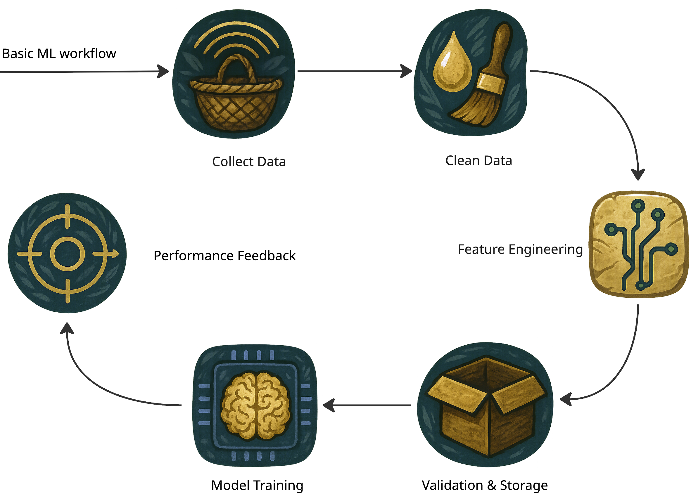

# Data: The Fuel of AI

## Feeding the Robotic Tiger

{width=100% height=auto}

### Overview
In the previous chapter, we introduced our robotic AI tiger—a mechanical predator designed to mimic nature’s most intelligent hunter. Cameras and microphones gave it sight and hearing, but real tigers also rely on smell, balance, and intuition.
In this chapter, we explore the lifeblood of all artificial intelligence: **data**. Just as muscles and instincts make a tiger powerful, structured and unstructured data streams turn our mechanical creature into a thinking, adaptive predator.

From sensor feeds to digital “scents,” we’ll uncover how raw information transforms into instinct—and how clean, curated data separates a clumsy robot from a graceful hunter.

---

### Why Data Matters

#### Foundation of Learning
Even the most advanced AI can’t overcome bad data.
If the robotic tiger’s sensors feed it faulty or biased information, its decisions fail—just as a tiger would miss its prey if its senses were dulled.

#### Quality Over Quantity
It’s tempting to gather oceans of data, but **quality trumps volume**.
A blurry camera or a miscalibrated sensor can deceive the AI as surely as fog blinds a predator. Clean, reliable signals allow faster and more confident responses.

#### Key Insight
> The best algorithm in the world is powerless against flawed inputs.
> A tiger with blurred vision cannot hunt—nor can an AI with corrupted data.

---

## Structured vs. Unstructured Data

### Structured Data
**Definition:** Organized information stored in clear tables or databases.
**Examples:**
- Joint and motor sensor logs with timestamps
- Environmental readings: temperature, humidity, terrain type

**Why It Matters:**
Structured data is easy to query, visualize, and analyze. For instance, you can quickly ask:
> How many successful hunts occurred on rocky terrain versus open grassland?

It’s the tiger’s heartbeat—steady, predictable, and measurable.

---

### Unstructured Data
**Definition:** Raw, context-rich information without a fixed format—images, sound, or text.
**Examples:**
- Camera frames showing motion or color patterns
- Microphone recordings capturing wind or footsteps
- Olfactory sensor readings from chemical patterns

**Why It Matters:**
Unstructured data captures the complexity of the real world—movement, emotion, texture, and unpredictability. But it also demands deeper processing, just like a tiger must learn to distinguish prey rustling from mere wind.

---

## The Robotic Tiger’s Data Sources

| **Data Type** | **Nature** | **Examples** | **Purpose** |
|----------------|-------------|---------------|--------------|
| Visual | Unstructured | Camera feeds, LiDAR maps | Object recognition, distance estimation |
| Auditory | Unstructured | Microphone arrays | Sound localization, motion cues |
| Environmental | Structured | Terrain codes, weather data | Contextual awareness |
| Olfactory | Semi-Structured | “E-nose” VOC readings | Detecting chemical signals |
| Behavioral | Structured | Energy usage, hunt outcomes | Performance tracking |

Each layer adds another sense—together they form the tiger’s perception of reality.

---

## Data Collection, Cleaning, and Feature Engineering

### Data Collection

**Sources:**
- Onboard sensors: cameras, microphones, electronic noses
- Internal databases: previous hunts, calibration records
- External repositories: open-source robotics and motion datasets

**Analogy:**
Collecting data is like hunting—speed matters, but precision matters more. Duplicate or mislabeled entries can confuse the tiger’s instincts.

::: note
**Example:**
At a financial firm, 15% of records were duplicates—misleading analysts about profits.
In our robotic tiger’s world, duplicate sensor logs might make it think every shadow is prey.
:::

---

### Data Cleaning

**Key Steps:**
1. **Identify Missing or Duplicate Entries** – Remove repeated sensor logs or incomplete frames.
2. **Standardize Formats** – Convert temperature, timestamps, and units consistently.
3. **Handle Outliers** – Detect anomalies (e.g., torque spikes or false signals).

::: tip
**Analogy:**
“Cleaning data is like grooming the tiger—removing burrs and tangles.
A well-groomed tiger moves silently; a clean dataset runs smoothly.”
:::

---

### Feature Engineering

**Definition:**
Feature Engineering is the creative process of transforming raw data into meaningful input features that help an AI model learn patterns efficiently.
If **data is the tiger’s food**, features are the **nutrients**—refined, digestible, and full of energy.

Feature engineering bridges the gap between raw sensor inputs and actionable intelligence. It requires domain knowledge, creativity, and an understanding of both the data’s nature and the problem at hand. Well-crafted features can dramatically improve model accuracy, reduce training time, and enhance interpretability.

---

#### Why Feature Engineering Matters
- Raw sensor logs are like jungle noise—too chaotic to act upon.
- The AI needs structured cues: patterns, relationships, and derived signals.
- Good features amplify relevant information and suppress distractions.

Think of it as **training the tiger’s instincts**: learning to recognize the difference between a leaf rustle and prey movement.

---

#### Core Techniques

1. **Combining Data Points**
   - Merge multiple columns (e.g., date + time → timestamp).
   - Join different sources (e.g., motion and sound) to detect coordinated patterns.

2. **Scaling and Normalization**
   - Convert all readings to comparable ranges—important when mixing temperature, torque, and voltage data.
   - Common methods: *Min-Max Scaling*, *Standard Scaling (Z-score)*.

3. **Encoding Categorical Data**
   - Transform textual or symbolic labels (e.g., terrain type: flat, rocky, wet) into numeric representations.
   - Techniques: *One-Hot Encoding*, *Label Encoding*.

4. **Feature Extraction from Unstructured Data**
   - Images → extract edges, color histograms, or deep embeddings using CNNs.
   - Audio → extract frequency bands or MFCC features (common in voice recognition).
   - Smell sensors → extract chemical signatures or compound ratios.

5. **Feature Selection**
   - Remove redundant or noisy signals using statistical tests or correlation analysis.
   - Fewer but sharper senses make a smarter hunter.

6. **Derived and Domain-Specific Features**
   - Compute advanced indicators:
     - “Average prey approach speed”
     - “Reaction time lag”
     - “Volatility of e-nose readings”
     - “Power consumption per successful hunt”

---

#### Modern Approaches to Feature Engineering

1. **Automated Feature Engineering**
   Tools like *Featuretools*, *PyCaret*, and *AutoGluon* automate the creation of complex features by applying deep feature synthesis and heuristic rules. These frameworks reduce manual effort, uncover hidden interactions, and accelerate prototyping—especially useful for tabular and time-series data.

2. **Deep Feature Extraction**
   Leveraging pretrained deep learning models, such as CNN embeddings for images or Transformer encoders for sequential data, allows extraction of rich, high-level representations. Audio spectrogram embeddings, for example, transform raw sound waves into meaningful features capturing temporal and frequency patterns. These methods enable the AI to grasp subtle patterns beyond handcrafted features.

3. **Statistical and Time-Series Feature Engineering**
   Libraries like *tsfresh*, *statsmodels*, and *Prophet* provide extensive functions to extract statistical summaries, seasonality, trends, and anomaly scores from time-series data. These features help models understand temporal dynamics, periodic behaviors, and irregularities critical for predictive tasks in robotics and sensor analysis.

4. **Generative AI–Assisted Feature Discovery**
   Emerging techniques involve using large language models (LLMs) or generative AI to suggest novel features or augment datasets. For example, LLMs can analyze data descriptions and recommend transformations, while data augmentation methods can synthetically expand feature diversity, improving model robustness and generalization.

---

#### Example: Tiger Motion Analysis

| **Raw Data** | **Derived Feature** | **Purpose** |
|---------------|--------------------|-------------|
| X, Y, Z coordinates | Average speed | Detect pursuit efficiency |
| Torque readings | Motor strain index | Predict mechanical fatigue |
| Audio spectrum | Prey proximity signal | Trigger chase behavior |
| VOC concentration | Chemical diversity score | Identify prey scent accuracy |

These new features let the AI tiger anticipate events—like predicting prey turns before they happen.

---

### Tools for Feature Engineering

| **Tool / Library** | **Usage** | **Example Scenario** |
|---------------------|-----------|----------------------|
| **Pandas** | Cleaning, merging, and transforming structured data | Combine sensor logs, normalize columns |
| **NumPy** | Fast numerical computation | Vector math for torque or speed |
| **Scikit-learn** | Feature scaling, encoding, selection | Prepare input for ML models |
| **TensorFlow / PyTorch** | Automated feature extraction from images or sound | CNNs for vision, RNNs for audio |
| **Featuretools** | Automated feature creation (Deep Feature Synthesis) | Create compound features from multiple tables |
| **AWS Glue / Databricks** | Large-scale feature pipelines | Transform data across distributed environments |
| **Great Expectations** | Validation and quality checks | Ensure consistency in engineered datasets |
| **PyCaret** | End-to-end automated ML including feature engineering | Rapid prototyping and model selection |
| **AutoGluon** | AutoML with built-in feature engineering | Auto feature extraction for tabular and image data |
| **Tsfresh** | Time-series feature extraction | Extract statistical features from sensor logs |
| **MLflow** | Experiment tracking and feature versioning | Manage feature sets and model lineage |

::: tip
**Pro Tip:**
Automate feature pipelines using notebooks or orchestration tools like **Airflow** or **Prefect**.
Version each transformation—so you can trace every “instinct” the tiger learns.
:::

---

### Best Practices in Feature Engineering

- **Reproducibility:** Document and version control feature transformations to ensure consistent results across experiments.
- **Explainability:** Favor interpretable features to help understand model decisions and build trust.
- **Continuous Validation:** Regularly monitor feature distributions and data quality to detect drift or anomalies early.
- **Collaboration:** Involve domain experts to guide meaningful feature creation aligned with real-world phenomena.
- **Automation with Oversight:** Use automated tools to speed up feature discovery but validate outputs carefully.

---

### Visualizing the Data Pipeline
{width=100% height=auto}

The cycle never truly ends—the tiger keeps learning, refining, and adapting through every new hunt.

---

## Key Takeaways

- **Feature Engineering is the art of turning raw noise into intelligence.**
- Proper scaling, encoding, and selection make models faster, smarter, and more stable.
- Tools like *Pandas*, *Scikit-learn*, and *Featuretools* empower developers to automate and iterate.
- A robust data pipeline—*Collect → Clean → Engineer → Validate*—is the foundation of every strong AI system.
- The better the features, the sharper the tiger’s instincts.

---

### Story Wrap-Up
The Robotic Tiger now roams confidently, fueled by precise sensor data and curated environmental logs. Each calculated step through the jungle feels more deliberate, thanks to careful data collection and preparation. We’ve seen how both structured (tables, logs) and unstructured (images, audio) feeds can shape its instincts. With cleaned and well-organized data powering its every move, the tiger stands poised to tackle more complex challenges, no longer a clumsy mechanical prototype but a sleek, efficient hunter in the making.

### Next Steps & Teaser
Next chapter: Prepare to encounter traditional machine learning methods—powerful jungle predators like decision trees and clustering algorithms. How do these classic techniques hunt, classify, and uncover hidden patterns in the vast jungle of data?
