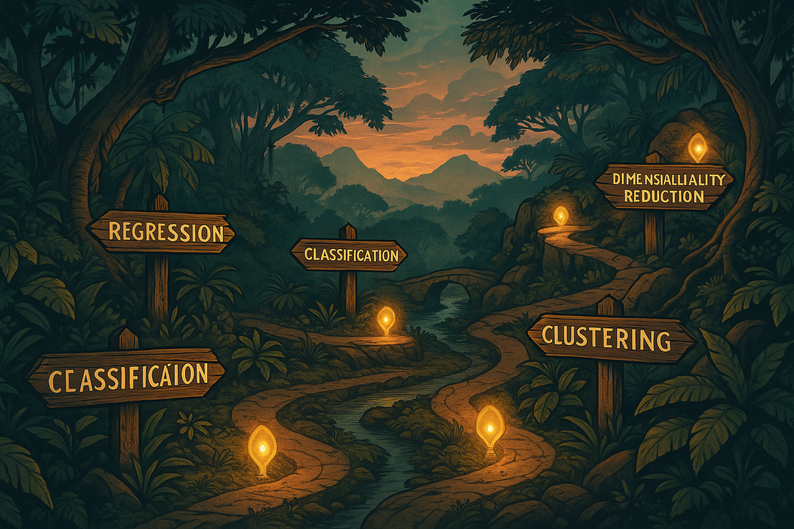

# Traditional Machine Learning Methods

## The Tiger’s Foundational Instincts

### The First Hunting Strategies

In the previous chapters, we explored our robotic tiger’s journey—how data becomes sensory input and how AI systems learn and adapt. In this chapter, we step back to the foundational techniques that paved the way for modern AI. These “traditional” machine learning (ML) methods solve everyday problems: predicting numbers, classifying objects, grouping patterns, and reducing complexity—skills that form the Tiger’s foundational instincts.

In the pale glow of dawn, a Tiger made of circuits and steel prowls through the mist-laden jungle. The air is alive with subtle signals—each rustling leaf and distant bird call carries data that the Tiger’s honed sensors perceive as clearly as if they were sights and sounds. Not long ago, this mechanical predator was merely learning to sense its world; then it spent time distilling those raw sensations into something like instinct. Now, as morning light filters through ancient trees, the Tiger moves with new purpose. Under its synthetic skin, simple algorithms stir: the first whispers of machine learning that have settled into its mind. These are the Tiger’s foundational instincts—straightforward yet potent strategies quietly guiding its hunt.

Memory flickers in the Tiger’s electronic mind. It recalls learning in two fundamental ways, each shaping its instincts differently. Some lessons came with guidance—as if a wise elder had shown the way, each success reinforced and each mistake corrected. In essence, the Tiger was supervised by example, learning from clear feedback (like a cub being taught which tracks lead to prey and which to mere shadows). But other lessons emerged in solitude. Often there was no teacher at all—the Tiger simply roamed and observed, finding its own patterns in the chaos of the jungle. It grouped the scents, sounds, and shapes of the wild into meaningful clusters without any labels or hints. This was unsupervised discovery, an instinct born of curiosity and necessity. Together, these two modes of learning—one guided by experience, the other exploratory—laid the groundwork for the Tiger’s prowess.

A soft breeze carries the musky hint of deer. The Tiger’s eyes narrow as it identifies the scent instantly, an action powered by one of its learned instincts. It has been trained to recognize that aroma as prey, much as a machine learning model classifies a familiar pattern it has seen before. In a heartbeat, the Tiger recalls countless past encounters confirming that this particular scent leads to a herd of deer. Heart thumping with quiet intensity, it predicts the likely path the herd will take through the trees. This predictive sense is another instinct: a simple foresight that allows the Tiger to estimate where its quarry will be in a few moments. It is as if an invisible line has been drawn from cause to effect—the kind of linear intuition a regression model would use to connect variables and foretell an outcome. Armed with this instinct, the Tiger slinks toward where the probabilities converge, each step a calculation in survival.

Step by careful step, the Tiger advances, and each pawfall lands according to a silent decision logic unfolding in its brain. Every situation presents a choice: follow the fresher tracks toward the riverbank, or veer into denser foliage for better cover. The Tiger’s mind splits these options like the branches of a great tree, testing each route in turn. This internal decision tree of if-then rules formed as a simple, logical instinct over time. It’s as if the Tiger carries a flowchart of the hunt in its head—a branching blueprint of decisions that channels its actions down the most promising path. At the same time, the Tiger remembers moments when it encountered entirely new creatures and had to rely on a different faculty: the ability to group the unknown into the known. When it first stumbled upon a watering hole teeming with unfamiliar beasts, the Tiger quietly clustered them by their traits—size, shape, the sound of their calls—discerning which moved in herds and which prowled alone, which calls were cries of alarm and which were gentle night songs. Even without names or labels, it found order in the confusion. This clustering instinct—finding structure amid uncertainty—gave the Tiger a rudimentary map of the jungle’s inhabitants, purely from noticing natural groupings.

Though these methods are humble compared to the flashy feats of more advanced AI creatures, they are the bedrock of intelligence in the jungle. Long before the Artistic Bird painted dreams in the canopy or the Cunning Fox learned elaborate tricks, creatures like the Tiger survived on these basic algorithms. In our world, too, early machine learning relied on such simple approaches—straightforward rules and pattern-finding techniques that formed the first toolkit of artificial intelligence. So it is in the AI Jungle: the Tiger’s first hunting strategies, born of supervised guidance and unsupervised discovery, form the solid ground upon which all later learning is built. In their clarity and simplicity, these instincts carry a timeless wisdom—a reminder that even in a realm bristling with high-tech wonders, sometimes the simplest instincts are the most essential for survival.

Now it is time to peer closer at these instinctual algorithms themselves. In the pages ahead, we will follow the Tiger’s footsteps as it masters each classical skill: learning under guidance versus learning through exploration (the dance of supervised vs. unsupervised learning), drawing lines through data to make predictions (regression’s foresight), branching decisions with if-then logic (decision trees), and gathering the unknown into groups (clustering). Let us begin by contrasting the Tiger’s two ways of learning: guidance with labels versus discovery without them.


---

## Supervised vs. Unsupervised Learning


::: {.callout-tip}
**Key Analogy**

Training the tiger with **labels** is like giving it a field guide: *prey / not-prey*.
Letting it explore **without labels** is like sending it into a new jungle to discover patterns on its own.
:::


| Aspect | **Supervised Learning** | **Unsupervised Learning** |
|---|---|---|
| Goal | Learn mapping from inputs → output(labels) | Discover structure in data without labels |
| Example Tasks | Regression, classification (predict known outcomes)  | Clustering, anomaly detection, dimensionality reduction (find hidden patterns) |
| Tiger Analogy | Flashcards with answers: *gazelle / rock* | Grouping creatures by similarity: size, speed, sounds |


**Examples**

- **Regression** (Supervised): Predict a continuous value. E.g., forecasting housing price from location, size, age.
- **Classification** (Supervised): Predict a category. E.g., classify email as spam vs. not spam.
- **Clustering** (Unsupervised): Discover groups in data. E.g., group shoppers with similar behavior.
- **Anomaly Detection** (Unsupervised):  Detect outliers. E.g., flag unusual sensor readings.

Supervised learning relies on labeled data, which guides the tiger’s hunting instincts—each label acts as a clue to distinguish prey from non-prey . The model learns the relationship between inputs and outputs so it can predict new outcomes (like identifying an email as spam from its features). Unsupervised learning, on the other hand, allows the tiger to roam freely, discovering hidden patterns and structures in its environment without explicit guidance. It finds natural groupings or signals in data (for example, grouping customers by purchasing habits or finding unusual network activity) without anyone saying what to look for. This exploratory behavior is crucial when labels are scarce or unavailable, enabling discovery of new prey patterns the tiger might otherwise miss.

{width=100% height=auto}

---

## Common Algorithms

### Choosing the Right Method (Field Guide)

Use this quick map when you’re unsure where to start:

| Problem Type | Typical Baselines | When to Prefer | Watch-outs |
|---|---|---|---|
| Numeric prediction (regression) | Linear Regression; Ridge/Lasso (regularized linear) | Interpretable coefficients, fast to train | Scale features; check residuals for patterns |
| Binary/multi-class classification | Logistic Regression, Decision Tree | Fast baseline, clear decision boundaries | Calibrate probabilities; watch class imbalance |
| Tabular data with interactions | Random Forest, Gradient Boosting (XGBoost/LightGBM) | Strong accuracy with minimal feature engineering | Tune depth & learning rate; avoid data leakage |
| Unlabeled data exploration | K-Means clustering; PCA | Discover latent groups or reduce noise | Choose k (clusters) wisely; standardize features first |
| Structure visualization | t‑SNE, UMAP | Reveal clusters/manifolds in high-dim data | For insight only (not supervised training); sensitive to parameters |

**Rule of Thumb:** Start simple, measure honestly, then graduate to ensembles or more complex models. Let the tiger learn to walk before it sprints.

{width=100% height=auto}


### Linear Regression *(Supervised)*
- **Purpose:** Predicts continuous values (e.g., temperature, price).
- **Key Idea:** Fit a line to minimize error between predictions and reality.
- **Tiger Analogy:** Predict future **battery level** from *terrain + speed*.
- **Modern Note:** Still used widely as baseline and for interpretability.

### Logistic Regression *(Supervised)*
- **Purpose:** Binary classification (e.g., spam vs. not spam).
- **Key Idea:** Outputs probability via sigmoid (0–1).
- **Tiger Analogy:** “Is this **likely prey**?” *(P > 0.5)*.
- **Modern Note:** Strong, simple baseline for many classification tasks.

### Decision Trees *(Supervised)*
- **Purpose:** Classification or regression via a hierarchy of rules.
- **Key Idea:** Split features into branches (if-then rules) until a leaf decision.
- **Tiger Analogy:** *If small → left; if fast → right; then “chase/ignore”.*
- **Modern Note:** Interpretable; forms the basis for **ensembles**.

### Random Forest *(Supervised)*
- **Purpose:** Combine many trees for **higher accuracy** and less overfitting.
- **Key Idea:** Each tree sees a sample of data/features; predictions are averaged.
- **Tiger Analogy:** A **council of rangers**—follow the consensus.
- **Modern Note:** Strong default choice for tabular data.

### Ensemble Methods Beyond Random Forests

While Random Forests aggregate decision trees by averaging, more advanced ensemble methods like **Gradient Boosting**, **XGBoost**, and **LightGBM** take a sequential approach. They build trees one after another, each correcting the errors of the previous, like a team of expert trackers learning from past mistakes to sharpen the hunt.

- **Gradient Boosting:** Sequentially improves weak learners, focusing on difficult cases.
- **XGBoost:** An optimized, scalable implementation with regularization and parallelism.
- **LightGBM:** Efficient for large datasets, uses leaf-wise tree growth for accuracy.

These methods have become the **predators of tabular data**, winning many machine learning competitions due to their power and flexibility.

### Regularization Techniques: Taming Complexity

To avoid the tiger overfitting to past prey and failing in new jungles, regularization techniques constrain model complexity:

- **L1 Regularization (Lasso):** Encourages sparsity by shrinking some coefficients to zero, simplifying the model.
- **L2 Regularization (Ridge):** Penalizes large coefficients, smoothing the model.
- **ElasticNet:** Combines L1 and L2, balancing sparsity and smoothness.

Regularization is like teaching the tiger to focus on the most meaningful signals, ignoring noise and irrelevant distractions.

### K-Means Clustering *(Unsupervised)*
- **Purpose:** Group similar data into *k* clusters.
- **Key Idea:** Assign points to nearest center, then update centers iteratively.
- **Tiger Analogy:** Group small fast animals vs. large slow ones **without labels**.
- **Modern Note:** Often a first pass for structure discovery.

### Principal Component Analysis (PCA) *(Unsupervised)*
- **Purpose:** Reduce dimensionality while preserving the most variance.
- **Key Idea:** Find new axes (**principal components**) that explain the data best.
- **Tiger Analogy:** The tiger’s lens condenses dozens of signals into a few **essential traits**.
- **Modern Note:** Useful for visualization, denoising, and preprocessing.

### Advanced Dimensionality Reduction: t-SNE & UMAP

Beyond PCA, nonlinear techniques like **t-SNE** and **UMAP** uncover complex structures in high-dimensional data by preserving local neighborhoods:

- **t-SNE:** Maps data to 2D/3D preserving local similarities, revealing clusters like hidden animal tribes.
- **UMAP:** Faster and scalable, captures both local and global structure, like the tiger’s map of the entire jungle terrain.

These methods help visualize intricate relationships that linear methods may miss, offering deeper insights into the tiger’s sensory world.

### AI-generated image prompt
```text
PROMPT: A robotic tiger surrounded by holographic decision trees, gradient boosting models, and multidimensional data projections (PCA, t-SNE, UMAP) merging into a glowing network of knowledge. Cinematic 16:9, futuristic, ultra-detailed.
NEGATIVE: no text, no watermark, lowres, blur
SIZE: 1664x928
```

### Feature Scaling & Pipelines (Keep the Hunt Clean)

Many algorithms assume features on comparable scales. Standardize or normalize to keep the tiger’s senses aligned.

- **Standardization:** zero mean, unit variance (good for linear/logistic regression, K‑Means, PCA).
- **Min‑Max Scaling:** 0–1 range (useful for bounded features or distance-based models).
- **Pipelines:** bundle preprocessing + model to avoid leakage and ensure reproducibility.

```python
from sklearn.pipeline import Pipeline
from sklearn.preprocessing import StandardScaler
from sklearn.linear_model import LogisticRegression
clf = Pipeline([
    ("scale", StandardScaler()),
    ("clf", LogisticRegression(max_iter=200))
])
clf.fit(X_train, y_train)
```


---

## Common Pitfalls & Considerations

::: warning
**Overfitting**
The tiger memorizes past rustles and fails to adapt to new prey.
**Mitigation:** Cross-validation, regularization, early stopping, more diverse data.
:::

::: warning
**Underfitting**
The model is too simple; it misses important patterns.
**Mitigation:** Add relevant features, deepen the model, use ensembles.
:::

::: warning
**Data Leakage**
Information from outside training data sneaks in, inflating results.
**Mitigation:** Strict train/validation/test hygiene; fit scalers only on training folds; use pipelines.
:::

::: warning
**Biased Data**
Non-representative training data yields unfair or brittle predictions.
**Mitigation:** Diversify sources; monitor subgroup metrics; audit for drift.
:::

### Handling Class Imbalance
- **Reweighting:** class weights in loss functions (e.g., `class_weight="balanced"`).
- **Resampling:** undersample majority or oversample minority (e.g., SMOTE).
- **Metrics:** prefer **Precision‑Recall**, **F1**, and **ROC‑AUC** over accuracy.

### Evaluation & Metrics (Measure Like a Scientist)
- **Classification:** confusion matrix, Precision/Recall/F1, ROC‑AUC, PR‑AUC, calibration curves.
- **Regression:** MAE (robust), RMSE (penalizes large errors), R² (variance explained), residual plots.
- **Unsupervised:** silhouette score, Davies–Bouldin; for anomaly detection, use precision@k on labeled anomalies.

```python
from sklearn.metrics import classification_report, RocCurveDisplay, PrecisionRecallDisplay
y_pred = clf.predict(X_test)
print(classification_report(y_test, y_pred))
RocCurveDisplay.from_estimator(clf, X_test, y_test)
PrecisionRecallDisplay.from_estimator(clf, X_test, y_test)
```

### Validation You Can Trust
- **K‑Fold / Stratified K‑Fold** for iid data; **TimeSeriesSplit** for temporal data.
- Keep the jungle realistic: validate on data that matches deployment conditions.

### Model Calibration (Trust the Tiger’s Confidence)
Convert scores to reliable probabilities:
- **Platt scaling** (logistic on scores)
- **Isotonic regression** (non‑parametric)

---

## Real-World Applications

### Healthcare
- **Diagnosis Assistance:** Logistic regression / decision trees for class probabilities (e.g., pneumonia).
- **Genomics Clustering:** Unsupervised methods to group genes or mutations for personalized treatments.
- **Hybrid AI:** Combining ML with deep learning for medical imaging and predictive analytics.

### Finance
- **Risk Assessment:** Logistic/linear models for default risk.
- **Fraud Detection:** Random forests flag suspicious patterns in transactions.
- **Hybrid AI:** Reinforcement learning combined with ML for adaptive trading strategies.

### Marketing & Retail
- **Customer Segmentation:** K-Means finds behavior-based groups.
- **Demand Forecasting:** Linear regression predicts product demand for inventory planning.
- **Hybrid AI:** ML models integrated with recommendation engines powered by deep learning.

### Manufacturing & IoT
- **Predictive Maintenance:** Regression models anticipate equipment failure.
- **Anomaly Detection:** Unsupervised methods detect production deviations.
- **Hybrid AI:** Sensor fusion with ML and AI for real-time quality control.

These applications show how traditional ML methods remain vital, often working hand-in-hand with modern AI to tackle complex, real-world challenges.

**Field Evidence:** In tabular problems across healthcare, finance, and operations, calibrated gradient-boosted trees routinely outperform deep models with modest data. Simple models remain unbeatable for transparency and speed; ensembles shine when stakes and complexity rise.

---

## Reproducibility & Experiment Tracking

Keep the hunt reproducible: set seeds, version data, and track runs.

```python
import numpy as np, random, torch
seed = 42
random.seed(seed); np.random.seed(seed)
try: torch.manual_seed(seed)
except: pass
```

```python
# (Optional) Track experiments with MLflow
import mlflow
mlflow.start_run()
mlflow.log_params({"model":"LogReg","scale":"StandardScaler"})
mlflow.log_metric("f1", 0.87)
mlflow.end_run()
```

### AI-generated image prompt
```text
PROMPT: A field journal in the jungle—timestamps, footprints, and labeled trails—symbolizing experiment tracking and reproducibility. Cinematic 16:9, ultra-detailed.
NEGATIVE: no text, no watermark, lowres, blur
SIZE: 1664x928
```

---

## Try It Yourself (Optional)

::: info
**Visualize a Small Decision Tree**
```python
from sklearn.tree import DecisionTreeClassifier, plot_tree
import matplotlib.pyplot as plt
X, y = ...  # your data
clf = DecisionTreeClassifier(max_depth=3, random_state=42)
clf.fit(X, y)
plot_tree(clf, filled=True, feature_names=['f1','f2'])
plt.show()
```
:::

---

## Key Takeaways
- **Multiple approaches:** Supervised & unsupervised methods, each with strengths.
- **Data‑centric:** High-quality, well-prepared data remains critical.
- **Foundational + Modern:** Linear/logistic, trees, and ensembles form a practical core.
- **Measure well:** Prefer F1/PR‑AUC for imbalance; calibrate probabilities.
- **Prevent leakage:** Use pipelines; validate with Stratified K‑Fold or TimeSeriesSplit.
- **Reduce wisely:** Use PCA for speed/denoising; t‑SNE/UMAP for insight.
- **Reproducibility:** Seeds, versioning, and experiment tracking pay off.


{width=100% height=auto}

---

::: caution
**Ethics & Safety in the Jungle**
Models influence real lives. Track subgroup performance, explain decisions where possible, and prefer calibrated, conservative thresholds when costs of error are high.
:::

---

## Story Wrap-Up & Teaser

**Story Wrap-Up**
With newfound confidence, our Robotic Tiger explores deeper into the jungle, effortlessly classifying and predicting patterns from its surroundings. Using decision trees and clustering like a seasoned predator, it identifies valuable insights hidden within the dense foliage of data.

**Next Steps & Teaser**
In the next chapter, we'll soar above the jungle canopy to meet the wise **Robotic Owl**—symbolizing the power and depth of **Neural Networks and Deep Learning**. How do these intricate systems perceive complex patterns and tackle challenges beyond traditional methods?
