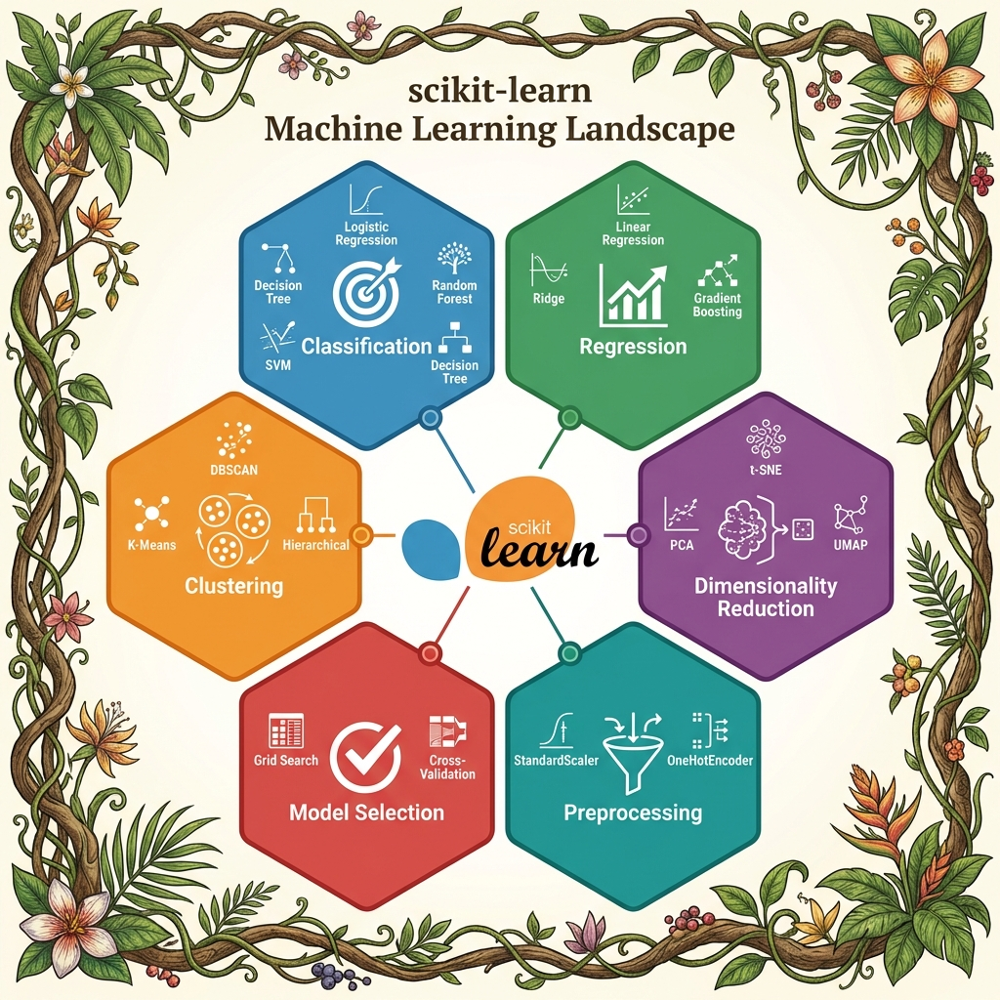
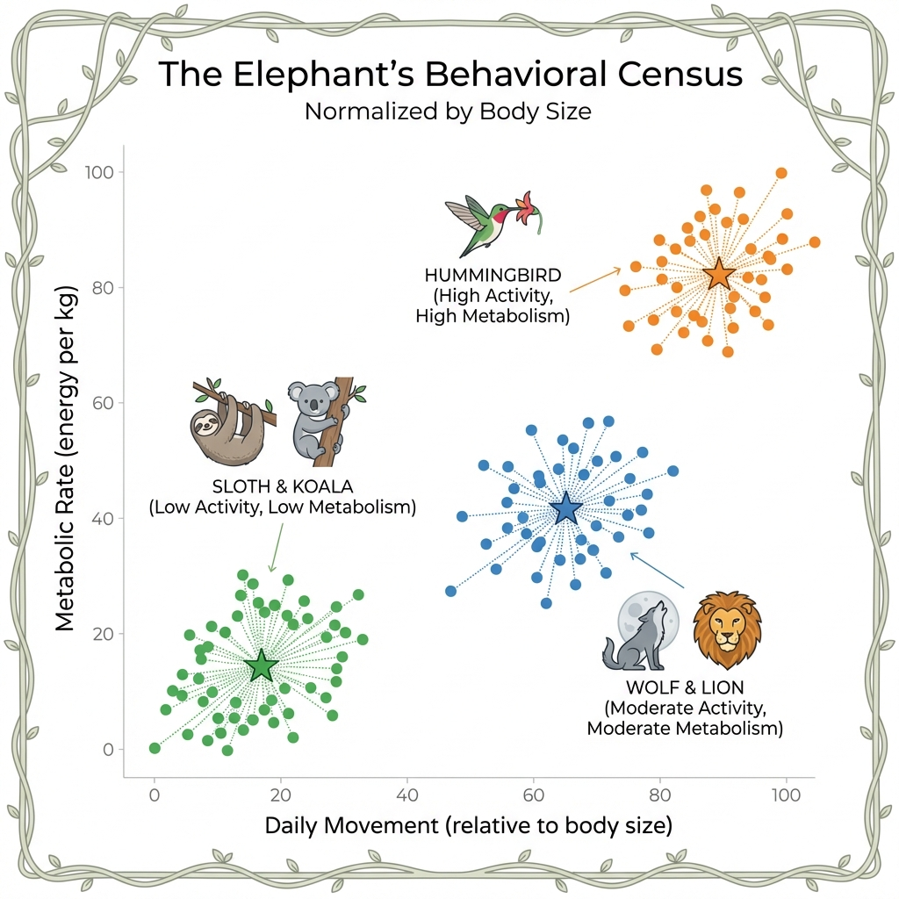
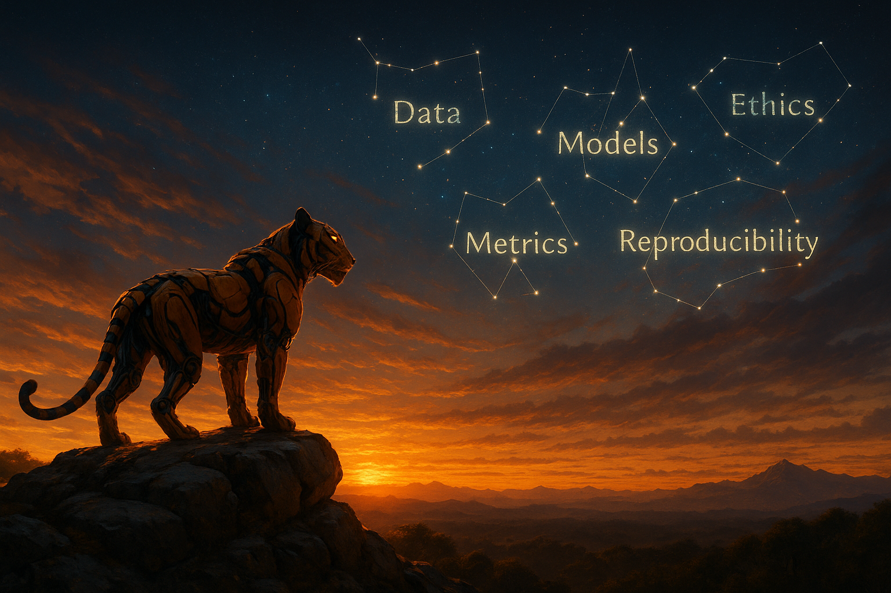

# Traditional Machine Learning Methods

## The Tiger’s Foundational Instincts

### The First Hunting Strategies

In the previous chapters, we explored our robotic tiger’s journey—how data becomes sensory input and how AI systems learn and adapt. In this chapter, we step back to the foundational techniques that paved the way for modern AI. These “traditional” machine learning (ML) methods solve everyday problems: predicting numbers, classifying objects, grouping patterns, and reducing complexity—skills that form the Tiger’s foundational instincts.

In the pale glow of dawn, a Tiger made of circuits and steel prowls through the mist-laden jungle. The air is alive with subtle signals—each rustling leaf and distant bird call carries data that the Tiger’s honed sensors perceive as clearly as if they were sights and sounds. Not long ago, this mechanical predator was merely learning to sense its world; then it spent time distilling those raw sensations into something like instinct. Now, as morning light filters through ancient trees, the Tiger moves with new purpose. Under its synthetic skin, simple algorithms stir: the first whispers of machine learning that have settled into its mind. These are the Tiger’s foundational instincts—straightforward yet potent strategies quietly guiding its hunt.

Memory flickers in the Tiger’s electronic mind. It recalls learning in two fundamental ways, each shaping its instincts differently. Some lessons came with guidance—as if a wise elder had shown the way, each success reinforced and each mistake corrected. In essence, the Tiger was supervised by example, learning from clear feedback (like a cub being taught which tracks lead to prey and which to mere shadows). But other lessons emerged in solitude. Often there was no teacher at all—the Tiger simply roamed and observed, finding its own patterns in the chaos of the jungle. It grouped the scents, sounds, and shapes of the wild into meaningful clusters without any labels or hints. This was unsupervised discovery, an instinct born of curiosity and necessity. Together, these two modes of learning—one guided by experience, the other exploratory—laid the groundwork for the Tiger’s prowess.

A soft breeze carries the musky hint of deer. The Tiger’s eyes narrow as it identifies the scent instantly, an action powered by one of its learned instincts. It has been trained to recognize that aroma as prey, much as a machine learning model classifies a familiar pattern it has seen before. In a heartbeat, the Tiger recalls countless past encounters confirming that this particular scent leads to a herd of deer. Heart thumping with quiet intensity, it predicts the likely path the herd will take through the trees. This predictive sense is another instinct: a simple foresight that allows the Tiger to estimate where its quarry will be in a few moments. It is as if an invisible line has been drawn from cause to effect—the kind of linear intuition a regression model would use to connect variables and foretell an outcome. Armed with this instinct, the Tiger slinks toward where the probabilities converge, each step a calculation in survival.

Step by careful step, the Tiger advances, and each pawfall lands according to a silent decision logic unfolding in its brain. Every situation presents a choice: follow the fresher tracks toward the riverbank, or veer into denser foliage for better cover. The Tiger’s mind splits these options like the branches of a great tree, testing each route in turn. This internal decision tree of if-then rules formed as a simple, logical instinct over time. It’s as if the Tiger carries a flowchart of the hunt in its head—a branching blueprint of decisions that channels its actions down the most promising path. At the same time, the Tiger remembers moments when it encountered entirely new creatures and had to rely on a different faculty: the ability to group the unknown into the known. When it first stumbled upon a watering hole teeming with unfamiliar beasts, the Tiger quietly clustered them by their traits—size, shape, the sound of their calls—discerning which moved in herds and which prowled alone, which calls were cries of alarm and which were gentle night songs. Even without names or labels, it found order in the confusion. This clustering instinct—finding structure amid uncertainty—gave the Tiger a rudimentary map of the jungle’s inhabitants, purely from noticing natural groupings.

Though these methods are humble compared to the flashy feats of more advanced AI creatures, they are the bedrock of intelligence in the jungle. Long before the Artistic Bird painted dreams in the canopy or the Cunning Fox learned elaborate tricks, creatures like the Tiger survived on these basic algorithms. In our world, too, early machine learning relied on such simple approaches—straightforward rules and pattern-finding techniques that formed the first toolkit of artificial intelligence. So it is in the AI Jungle: the Tiger’s first hunting strategies, born of supervised guidance and unsupervised discovery, form the solid ground upon which all later learning is built. In their clarity and simplicity, these instincts carry a timeless wisdom—a reminder that even in a realm bristling with high-tech wonders, sometimes the simplest instincts are the most essential for survival.

Now it is time to peer closer at these instinctual algorithms themselves. In the pages ahead, we will follow the Tiger’s footsteps as it masters each classical skill: learning under guidance versus learning through exploration (the dance of supervised vs. unsupervised learning), drawing lines through data to make predictions (regression’s foresight), branching decisions with if-then logic (decision trees), and gathering the unknown into groups (clustering). Let us begin by contrasting the Tiger’s two ways of learning: guidance with labels versus discovery without them.


---

## Supervised vs. Unsupervised Learning


::: {.callout-tip}
**Key Analogy**

Training the tiger with **labels** is like giving it a field guide: *prey / not-prey*.
Letting it explore **without labels** is like sending it into a new jungle to discover patterns on its own.
:::


| Aspect | **Supervised Learning** | **Unsupervised Learning** |
|---|---|---|
| Goal | Learn mapping from inputs → output(labels) | Discover structure in data without labels |
| Example Tasks | Regression, classification (predict known outcomes)  | Clustering, anomaly detection, dimensionality reduction (find hidden patterns) |
| Tiger Analogy | Flashcards with answers: *gazelle / rock* | Grouping creatures by similarity: size, speed, sounds |


**Examples**

- **Regression** (Supervised): Predict a continuous value. E.g., forecasting housing price from location, size, age.
- **Classification** (Supervised): Predict a category. E.g., classify email as spam vs. not spam.
- **Clustering** (Unsupervised): Discover groups in data. E.g., group shoppers with similar behavior.
- **Anomaly Detection** (Unsupervised):  Detect outliers. E.g., flag unusual sensor readings.

Supervised learning relies on labeled data, which guides the tiger’s hunting instincts—each label acts as a clue to distinguish prey from non-prey . The model learns the relationship between inputs and outputs so it can predict new outcomes (like identifying an email as spam from its features). Unsupervised learning, on the other hand, allows the tiger to roam freely, discovering hidden patterns and structures in its environment without explicit guidance. It finds natural groupings or signals in data (for example, grouping customers by purchasing habits or finding unusual network activity) without anyone saying what to look for. This exploratory behavior is crucial when labels are scarce or unavailable, enabling discovery of new prey patterns the tiger might otherwise miss.

{width=100% height=auto}

---

## The Tiger's Toolkit: Introducing scikit-learn

Before the Tiger can master these algorithms, it needs a **toolkit**—a reliable set of tools that work the same way every time. In Python, that toolkit is **scikit-learn**.

::: {.callout-note}
## Jargon Buster: What is scikit-learn?

**scikit-learn** (often imported as `sklearn`) is Python's most popular library for traditional machine learning. It provides:

| Capability | What It Does | Example Algorithms |
|:---|:---|:---|
| **Classification** | Identify which category an object belongs to | Logistic Regression, Random Forest, SVM |
| **Regression** | Predict continuous values | Linear Regression, Ridge, Gradient Boosting |
| **Clustering** | Group similar objects automatically | K-Means, DBSCAN, Hierarchical |
| **Dimensionality Reduction** | Reduce number of features | PCA, t-SNE, UMAP |
| **Model Selection** | Compare and tune models | Grid Search, Cross-Validation |
| **Preprocessing** | Prepare data for ML | StandardScaler, OneHotEncoder |

**Why scikit-learn?**
- **Simple and efficient:** Clean API designed for readability
- **Consistent pattern:** Every algorithm uses `.fit()`, `.predict()`, `.transform()`
- **Built on NumPy/SciPy:** Fast, efficient, and integrates with the Python ecosystem
- **Open source (BSD):** Free for commercial use

**The Consistent API Pattern:**
```python
# Every scikit-learn model follows the same pattern:
from sklearn.ensemble import RandomForestClassifier

model = RandomForestClassifier()  # 1. Create
model.fit(X_train, y_train)       # 2. Train
predictions = model.predict(X_test)  # 3. Predict
```

This consistency means once you learn one algorithm, you can use *any* scikit-learn algorithm the same way. The Tiger doesn't need to learn new commands for each tool—they all respond to the same signals.
:::

{#fig-sklearn-map}

---

## Common Algorithms

### Choosing the Right Method (Field Guide)

Use this quick map when you’re unsure where to start:

| Problem Type | Typical Baselines | When to Prefer | Watch-outs |
|---|---|---|---|
| Numeric prediction (regression) | Linear Regression; Ridge/Lasso (regularized linear) | Interpretable coefficients, fast to train | Scale features; check residuals for patterns |
| Binary/multi-class classification | Logistic Regression, Decision Tree | Fast baseline, clear decision boundaries | Calibrate probabilities; watch class imbalance |
| Tabular data with interactions | Random Forest, Gradient Boosting (XGBoost/LightGBM) | Strong accuracy with minimal feature engineering | Tune depth & learning rate; avoid data leakage |
| Unlabeled data exploration | K-Means clustering; PCA | Discover latent groups or reduce noise | Choose k (clusters) wisely; standardize features first |
| Structure visualization | t‑SNE, UMAP | Reveal clusters/manifolds in high-dim data | For insight only (not supervised training); sensitive to parameters |

**Rule of Thumb:** Start simple, measure honestly, then graduate to ensembles or more complex models. Let the tiger learn to walk before it sprints.

{width=100% height=auto}


### Linear Regression *(Supervised)*
- **Purpose:** Predicts continuous values (e.g., temperature, price).
- **Key Idea:** Fit a line to minimize error between predictions and reality.
- **Tiger Analogy:** Predict future **battery level** from *terrain + speed*.
- **Modern Note:** Still used widely as baseline and for interpretability.

### Logistic Regression *(Supervised)*
- **Purpose:** Binary classification (e.g., spam vs. not spam).
- **Key Idea:** Outputs probability via sigmoid (0–1).
- **Tiger Analogy:** “Is this **likely prey**?” *(P > 0.5)*.
- **Modern Note:** Strong, simple baseline for many classification tasks.

::: {.callout-note}
## Jargon Buster: The Sigmoid Function

Logistic Regression uses the **sigmoid** (or logistic) function to squash any number into a probability between 0 and 1:

$$\sigma(z) = \frac{1}{1 + e^{-z}}$$

- If the input $z$ is very positive → output approaches **1** (likely prey)
- If the input $z$ is very negative → output approaches **0** (not prey)
- If $z = 0$ → output is exactly **0.5** (50/50 chance)

This makes Logistic Regression perfect for **probability estimation**, not just yes/no decisions.
:::

**Technical Spotlight: Logistic Regression for Credit Scoring**

```python
# Python: Logistic Regression with Probability Output
from sklearn.linear_model import LogisticRegression
from sklearn.datasets import make_classification
import numpy as np

# 1. Create sample data (credit applications)
X, y = make_classification(n_samples=500, n_features=5, random_state=42)
feature_names = ['Income', 'Debt_Ratio', 'Credit_History', 'Employment', 'Age']

# 2. Train Logistic Regression
model = LogisticRegression(random_state=42)
model.fit(X, y)

# 3. Predict probability for a new applicant
new_applicant = np.array([[0.5, -0.2, 1.0, 0.3, 0.8]])
prob = model.predict_proba(new_applicant)[0]
print(f"💳 Approval Probability: {prob[1]:.1%}")  # Probability of class 1
# Output: ~72% approval probability

# 4. Examine coefficients (explainability!)
import pandas as pd
coeffs = pd.Series(model.coef_[0], index=feature_names)
print("📊 Feature Weights:", coeffs.to_dict())
```

**Key Insight:** Unlike black-box models, Logistic Regression's **coefficients** tell you exactly how each feature affects the prediction. A positive coefficient means the feature increases the probability; negative decreases it.


### Decision Trees *(Supervised)*
- **Purpose:** Classification or regression via a hierarchy of rules.
- **Key Idea:** Split features into branches (if-then rules) until a leaf decision.
- **Tiger Analogy:** *If small → left; if fast → right; then “chase/ignore”.*
- **Modern Note:** Interpretable; forms the basis for **ensembles**.

### Random Forest *(Supervised)*
- **Purpose:** Combine many trees for **higher accuracy** and less overfitting.
- **Key Idea:** Each tree sees a sample of data/features; predictions are averaged.
- **Tiger Analogy:** A **council of rangers**—follow the consensus.
- **Modern Note:** Strong default choice for tabular data.

### Ensemble Methods Beyond Random Forests

While Random Forests aggregate decision trees by averaging, more advanced ensemble methods like **Gradient Boosting**, **XGBoost**, and **LightGBM** take a sequential approach. They build trees one after another, each correcting the errors of the previous, like a team of expert trackers learning from past mistakes to sharpen the hunt.

- **Gradient Boosting:** Sequentially improves weak learners, focusing on difficult cases.
- **XGBoost:** An optimized, scalable implementation with regularization and parallelism.
- **LightGBM:** Efficient for large datasets, uses leaf-wise tree growth for accuracy.

These methods have become the **predators of tabular data**, winning many machine learning competitions due to their power and flexibility.

::: {.callout-note}
## Jargon Buster: How is XGBoost Different from Random Forest?

| Aspect | Random Forest | XGBoost |
|:---|:---|:---|
| **Strategy** | Parallel: Many trees vote independently | Sequential: Each tree corrects the previous |
| **Focus** | All data equally | Hard cases (previous errors) |
| **Analogy** | Council of Elders voting | Relay race of improving trackers |
| **Speed** | Fast (parallelizable) | Slower per tree, but fewer trees needed |

XGBoost often achieves **higher accuracy** than Random Forest because it specifically targets the mistakes the previous trees made.
:::

**Technical Spotlight: XGBoost in Action**

```python
# Python: XGBoost for Classification
from xgboost import XGBClassifier
from sklearn.datasets import make_classification
from sklearn.model_selection import train_test_split

# 1. Create sample data
X, y = make_classification(n_samples=1000, n_features=10, random_state=42)
X_train, X_test, y_train, y_test = train_test_split(X, y, test_size=0.2)

# 2. Train XGBoost (sequential boosting)
xgb = XGBClassifier(n_estimators=100, learning_rate=0.1, random_state=42)
xgb.fit(X_train, y_train)

# 3. Evaluate
accuracy = xgb.score(X_test, y_test)
print(f"🎯 XGBoost Accuracy: {accuracy:.2%}")
# Output: ~92-95% accuracy

# 4. Feature Importance (explainability!)
import pandas as pd
importances = pd.Series(xgb.feature_importances_, index=[f"Feature_{i}" for i in range(10)])
print("📊 Top 3 Features:", importances.nlargest(3).to_dict())
```

**Key Insight:** XGBoost also provides `feature_importances_`, making it explainable—just like Random Forest. This is why it dominates tabular data competitions (Kaggle, etc.).

### LightGBM: The Modern Successor

{fig-align="center" width="80%"}

LightGBM is Microsoft's open-source gradient boosting framework, released in 2017, built to train fast and use memory efficiently on large tabular datasets. If XGBoost made boosted trees practical and popular, LightGBM is the swift fox that followed the same trail with lighter footfalls: leaner, faster, and especially comfortable when the forest grows into millions of rows.

Like XGBoost, LightGBM builds an ensemble of decision trees sequentially. Each new tree tries to correct the mistakes left by the previous trees. The difference is not the basic idea of boosting; it is how aggressively LightGBM optimizes the mechanics of building trees.

Its first major speed trick is **histogram-based binning**. Instead of testing every possible split point in a continuous feature, LightGBM groups feature values into a small number of discrete buckets, often around 256. The model then considers only bucket boundaries as candidate split points. This turns a huge search problem into a much smaller one, usually with minimal accuracy loss.

Its second major trick is **leaf-wise tree growth**. Traditional gradient boosting implementations such as XGBoost commonly grow trees level-wise: all leaves at a given depth are expanded before moving deeper. LightGBM instead chooses the single leaf that promises the largest loss reduction and grows that one next. This can produce deeper, more asymmetric trees that capture complex patterns quickly. The tradeoff is that LightGBM can overfit more easily on small datasets, so constraints like `num_leaves`, `max_depth`, and regularization matter.

::: {.callout-tip}
## Jargon Buster: Leaf-Wise Growth

In level-wise growth, a tree expands broadly, keeping each depth relatively balanced. In leaf-wise growth, the model asks: "Which one leaf would improve the loss the most if I split it next?" This makes LightGBM fast and powerful, but also more eager to chase small quirks in the data.
:::

::: {.callout-tip}
## Worked Example: The Swift Fox Saves Memory

Suppose an e-commerce team trains a click-prediction model on 10,000,000 page views with 120 numeric and categorical features. If each numeric value is stored as a 32-bit float, the raw feature matrix alone is roughly:

`10,000,000 × 120 × 4 bytes = 4.8 GB`

A traditional tree learner may repeatedly scan those raw values while searching for split points. LightGBM first bins continuous features into, say, 255 histogram buckets. Each binned value can fit in 1 byte:

`10,000,000 × 120 × 1 byte = 1.2 GB`

That is about 3.6 GB less memory before considering extra training structures. The split search also changes. Instead of checking thousands or millions of possible thresholds for a feature, LightGBM checks at most 255 bin boundaries.

If a conventional learner spends 40 minutes building 500 boosted trees on this dataset, a histogram-based LightGBM run might finish in about 9 minutes on the same machine, because it is counting examples inside bins rather than rereading every exact value. Like the swift fox, it wins by moving lightly over the trail.

**Takeaway:** LightGBM trades tiny precision loss in split points for large practical gains in speed and memory.
:::

A practical rule of thumb:

| Choice | Use when |
|---|---|
| Random Forest | You want robust, low-tuning baseline; small-to-medium data |
| XGBoost | Maximum accuracy on small-to-medium tabular; mature ecosystem |
| LightGBM | Large datasets (millions of rows); training-speed-critical pipelines; production scoring with strict latency |

One more name worth knowing is **CatBoost**, Yandex's gradient boosting framework with strong native support for categorical features. It is often a good fallback when XGBoost or LightGBM struggle on heavily categorical data.


### Regularization Techniques: Taming Complexity

To avoid the tiger overfitting to past prey and failing in new jungles, regularization techniques constrain model complexity:

- **L1 Regularization (Lasso):** Encourages sparsity by shrinking some coefficients to zero, simplifying the model.
- **L2 Regularization (Ridge):** Penalizes large coefficients, smoothing the model.
- **ElasticNet:** Combines L1 and L2, balancing sparsity and smoothness.

Regularization is like teaching the tiger to focus on the most meaningful signals, ignoring noise and irrelevant distractions.

### K-Means Clustering *(Unsupervised)*
- **Purpose:** Group similar data into *k* clusters.
- **Key Idea:** Assign points to nearest center, then update centers iteratively.
- **Tiger Analogy:** Group small fast animals vs. large slow ones **without labels**.
- **Modern Note:** Often a first pass for structure discovery.

### Principal Component Analysis (PCA) *(Unsupervised)*
- **Purpose:** Reduce dimensionality while preserving the most variance.
- **Key Idea:** Find new axes (**principal components**) that explain the data best.
- **Tiger Analogy:** The tiger’s lens condenses dozens of signals into a few **essential traits**.
- **Modern Note:** Useful for visualization, denoising, and preprocessing.

### Advanced Dimensionality Reduction: t-SNE & UMAP

Beyond PCA, nonlinear techniques like **t-SNE** and **UMAP** uncover complex structures in high-dimensional data by preserving local neighborhoods:

- **t-SNE:** Maps data to 2D/3D preserving local similarities, revealing clusters like hidden animal tribes.
- **UMAP:** Faster and scalable, captures both local and global structure, like the tiger’s map of the entire jungle terrain.

These methods help visualize intricate relationships that linear methods may miss, offering deeper insights into the tiger’s sensory world.

### AI-generated image prompt
```text
PROMPT: A robotic tiger surrounded by holographic decision trees, gradient boosting models, and multidimensional data projections (PCA, t-SNE, UMAP) merging into a glowing network of knowledge. Cinematic 16:9, futuristic, ultra-detailed.
NEGATIVE: no text, no watermark, lowres, blur
SIZE: 1664x928
```

### Feature Scaling & Pipelines (Keep the Hunt Clean)

Many algorithms assume features on comparable scales. Standardize or normalize to keep the tiger’s senses aligned.

- **Standardization:** zero mean, unit variance (good for linear/logistic regression, K‑Means, PCA).
- **Min‑Max Scaling:** 0–1 range (useful for bounded features or distance-based models).
- **Pipelines:** bundle preprocessing + model to avoid leakage and ensure reproducibility.

```python
from sklearn.pipeline import Pipeline
from sklearn.preprocessing import StandardScaler
from sklearn.linear_model import LogisticRegression
clf = Pipeline([
    ("scale", StandardScaler()),
    ("clf", LogisticRegression(max_iter=200))
])
clf.fit(X_train, y_train)
```


---

## Common Pitfalls & Considerations

::: {.callout-warning}
**Overfitting**
The tiger memorizes past rustles and fails to adapt to new prey.
**Mitigation:** Cross-validation, regularization, early stopping, more diverse data.
:::

::: {.callout-warning}
**Underfitting**
The model is too simple; it misses important patterns.
**Mitigation:** Add relevant features, deepen the model, use ensembles.
:::

::: {.callout-warning}
**Data Leakage**
Information from outside training data sneaks in, inflating results.
**Mitigation:** Strict train/validation/test hygiene; fit scalers only on training folds; use pipelines.
:::

::: {.callout-warning}
**Biased Data**
Non-representative training data yields unfair or brittle predictions.
**Mitigation:** Diversify sources; monitor subgroup metrics; audit for drift.
:::

### Handling Class Imbalance
- **Reweighting:** class weights in loss functions (e.g., `class_weight="balanced"`).
- **Resampling:** undersample majority or oversample minority (e.g., SMOTE).
- **Metrics:** prefer **Precision‑Recall**, **F1**, and **ROC‑AUC** over accuracy.

### Evaluation & Metrics (Measure Like a Scientist)
- **Classification:** confusion matrix, Precision/Recall/F1, ROC‑AUC, PR‑AUC, calibration curves.
- **Regression:** MAE (robust), RMSE (penalizes large errors), R² (variance explained), residual plots.
- **Unsupervised:** silhouette score, Davies–Bouldin; for anomaly detection, use precision@k on labeled anomalies.

```python
from sklearn.metrics import classification_report, RocCurveDisplay, PrecisionRecallDisplay
y_pred = clf.predict(X_test)
print(classification_report(y_test, y_pred))
RocCurveDisplay.from_estimator(clf, X_test, y_test)
PrecisionRecallDisplay.from_estimator(clf, X_test, y_test)
```

### Validation You Can Trust
- **K‑Fold / Stratified K‑Fold** for iid data; **TimeSeriesSplit** for temporal data.
- Keep the jungle realistic: validate on data that matches deployment conditions.

### Model Calibration (Trust the Tiger’s Confidence)
Convert scores to reliable probabilities:
- **Platt scaling** (logistic on scores)
- **Isotonic regression** (non‑parametric)

---

## Real-World Applications

### Healthcare
- **Diagnosis Assistance:** Logistic regression / decision trees for class probabilities (e.g., pneumonia).
- **Genomics Clustering:** Unsupervised methods to group genes or mutations for personalized treatments.
- **Hybrid AI:** Combining ML with deep learning for medical imaging and predictive analytics.

### Finance
- **Risk Assessment:** Logistic/linear models for default risk.
- **Fraud Detection:** Random forests flag suspicious patterns in transactions.
- **Hybrid AI:** Reinforcement learning combined with ML for adaptive trading strategies.

### Marketing & Retail
- **Customer Segmentation:** K-Means finds behavior-based groups.
- **Demand Forecasting:** Linear regression predicts product demand for inventory planning.
- **Hybrid AI:** ML models integrated with recommendation engines powered by deep learning.

### Manufacturing & IoT
- **Predictive Maintenance:** Regression models anticipate equipment failure.
- **Anomaly Detection:** Unsupervised methods detect production deviations.
- **Hybrid AI:** Sensor fusion with ML and AI for real-time quality control.

These applications show how traditional ML methods remain vital, often working hand-in-hand with modern AI to tackle complex, real-world challenges.

**Field Evidence:** In tabular problems across healthcare, finance, and operations, calibrated gradient-boosted trees routinely outperform deep models with modest data. Simple models remain unbeatable for transparency and speed; ensembles shine when stakes and complexity rise.

---

## Reproducibility & Experiment Tracking

Keep the hunt reproducible: set seeds, version data, and track runs.

```python
import numpy as np, random, torch
seed = 42
random.seed(seed); np.random.seed(seed)
try: torch.manual_seed(seed)
except: pass
```

```python
# (Optional) Track experiments with MLflow
import mlflow
mlflow.start_run()
mlflow.log_params({"model":"LogReg","scale":"StandardScaler"})
mlflow.log_metric("f1", 0.87)
mlflow.end_run()
```

### AI-generated image prompt
```text
PROMPT: A field journal in the jungle—timestamps, footprints, and labeled trails—symbolizing experiment tracking and reproducibility. Cinematic 16:9, ultra-detailed.
NEGATIVE: no text, no watermark, lowres, blur
SIZE: 1664x928
```

---

## Try It Yourself (Optional)

::: {.callout-note}
**Visualize a Small Decision Tree**
```python
from sklearn.tree import DecisionTreeClassifier, plot_tree
import matplotlib.pyplot as plt
X, y = ...  # your data
clf = DecisionTreeClassifier(max_depth=3, random_state=42)
clf.fit(X, y)
plot_tree(clf, filled=True, feature_names=['f1','f2'])
plt.show()
```
:::

---

## Deep Dive: The Elephant's Census & The Fox's Council

While the Tiger represents the core hunting instincts of machine learning, two other creatures play vital roles in the Jungle's intelligence network. The **Elephant**, with its legendary memory, excels at organizing the Jungle's inhabitants into meaningful groups. The **Fox**, cunning and transparent, makes decisions that can be explained to any member of the Council. Together, they represent two of the most powerful and practical techniques in a data scientist's toolkit: **K-Means Clustering** and **Random Forests**.

---

### 🐘 The Elephant's Behavioral Census: K-Means Clustering

The Elephant, keeper of the Jungle's memory, faces a monumental task. Thousands of creatures roam the land—predators, scavengers, grazers, and insects. The Council demands a report: *"Who is behaving normally, and who is an outlier?"*

But how do you compare a hummingbird to an elephant? A snake to a monkey? Counting raw totals is meaningless. The Elephant needs a way to group creatures into **peer groups** based on their actual behavior, so comparisons are fair. This is the domain of **Clustering**.

::: {.callout-note}
## Jargon Buster: What is K-Means?

**K-Means** is an algorithm that automatically groups (or "clusters") data points into **K** categories. It does this by finding the "center" (called a **centroid**) of each group and assigning each data point to the nearest center.

Think of it like this: if you dropped **K** magnets onto a table covered in iron filings, each filing would snap to the nearest magnet. The magnets are the centroids; the filings are your data.

The "K" in K-Means is a number you choose. If K=3, the algorithm will create 3 groups. If K=15, it creates 15. The algorithm doesn't know *what* the groups mean—it just finds patterns in the numbers.
:::

#### The Jungle Narrative: Grouping by Behavior

The Elephant decides to group all Jungle creatures by two key behaviors:

1.  **Daily Travel Distance:** How far does the creature roam?
2.  **Daily Food Consumption:** How much does it eat relative to its body size?

::: {.callout-warning}
## Why "Relative to Body Size"? The Normalization Problem

If we measured **absolute** food consumption (in kg), the elephant would eat ~200 kg/day while a hummingbird eats ~0.01 kg. The elephant would dominate the chart, and we'd learn nothing about *behavioral differences*.

But here's a surprising biological fact: **hummingbirds have the highest metabolic rate of any animal**. They must consume 1.5–3x their body weight in nectar *every single day* just to survive. An elephant only eats about 4% of its body weight.

In data science, this is called **normalization**—converting raw numbers to a common scale so comparisons are fair. By using `(Food Consumed / Body Weight)` instead of raw kilograms, the Elephant can compare apples to apples—or hummingbirds to lions.
:::

By plotting every creature on a chart (Movement on X-axis, Metabolic Rate on Y-axis), natural clusters emerge:

*   **Cluster 1 (The Sedentary Grazers):** Low movement, low metabolism. (Sloths, Koalas)
*   **Cluster 2 (The Active Hunters):** High movement, moderate metabolism. (Wolves, Lions)
*   **Cluster 3 (The High-Energy Flyers):** High movement, *extreme* metabolism. (Hummingbirds)

Now, if a creature's behavior *changes*—say, a normally sedentary sloth suddenly starts traveling far and eating voraciously—it stands out as an **outlier** from its own peer group.

{#fig-kmeans-clusters}

::: {.callout-tip}
## Real-World Example: How Spotify Knows Your Taste

Ever wondered how Spotify creates your **"Discover Weekly"** playlist? It uses clustering.

Spotify groups its millions of users into **behavioral clusters** based on what they listen to (genres, tempo, "danceability"). If you are in a cluster with 10,000 other users who love 90s hip-hop, Spotify will recommend you songs that *other people in your cluster* loved, but you haven't heard yet.

You are never compared to *all* users—only to your **peer group**. This is K-Means in action at massive scale.
:::

#### Technical Spotlight: K-Means with Outlier Detection

Here is a Python example using `scikit-learn`. We create sample "creature" data, cluster it, and then identify the biggest outlier.

```python
# Python: K-Means Clustering with Outlier Detection
import numpy as np
from sklearn.cluster import KMeans
from scipy.spatial.distance import cdist

# 1. Create sample data: creatures with (Movement, Metabolic Rate) - both normalized
np.random.seed(42)
group1 = np.random.randn(30, 2) * 0.5 + [2, 2]  # Sedentary Grazers (low both)
group2 = np.random.randn(30, 2) * 0.5 + [8, 5]  # Active Hunters (high movement, moderate metabolism)
group3 = np.random.randn(30, 2) * 0.5 + [9, 9]  # High-Energy Flyers (high both)
outlier = np.array([[4, 9]])  # One strange creature: low movement, extreme metabolism!

all_creatures = np.vstack([group1, group2, group3, outlier])

# 2. Apply K-Means with K=3 clusters
kmeans = KMeans(n_clusters=3, random_state=42, n_init='auto')
kmeans.fit(all_creatures)

# 3. Calculate distance of each point from its cluster's centroid
distances = np.min(cdist(all_creatures, kmeans.cluster_centers_), axis=1)

# 4. The point with the highest distance is the biggest outlier
outlier_index = np.argmax(distances)
print(f"🚨 Biggest outlier: Creature #{outlier_index}")
print(f"   Distance from centroid: {distances[outlier_index]:.2f}")
# Output: Creature #90 with distance 3.54
```

**Key Insight:** The `distances` array is your **"Dissimilarity Score."** Any creature far from its centroid deserves a second look. This is the "one weird Sloth that started acting like a Hummingbird."

```{mermaid}
%%| label: fig-kmeans-algorithm
%%| fig-cap: "The K-Means Algorithm: An iterative process of assigning points and updating centroids."
flowchart TD
    A["1️⃣ Choose K (number of clusters)"] --> B["2️⃣ Initialize K random centroids"]
    B --> C["3️⃣ Assign each point to nearest centroid"]
    C --> D["4️⃣ Recalculate centroid as mean of assigned points"]
    D --> E{"Centroids moved?"}
    E -->|Yes| C
    E -->|No| F["✅ Done! Clusters are stable"]
    
    style A fill:#E3F2FD,stroke:#1976D2
    style F fill:#C8E6C9,stroke:#388E3C
```

---

#### 🌙 The Elephant's Night Vision: DBSCAN (When K-Means Fails)

K-Means is powerful, but it has a critical weakness: it assumes clusters are **circular blobs**. What if the Elephant encounters creatures that form ring-shaped patterns? Or crescent-shaped migration routes? K-Means will struggle, forcing round pegs into round holes.

Enter **DBSCAN** (Density-Based Spatial Clustering of Applications with Noise)—the Elephant's "night vision" for detecting clusters of **any shape**.

::: {.callout-note}
## Jargon Buster: What is DBSCAN?

**DBSCAN** finds clusters based on **density** rather than distance to a center. It works by:

1. Picking a random point and checking if it has enough neighbors within a radius (called **eps**).
2. If yes, it's a **core point**, and all its neighbors join the same cluster.
3. The cluster expands outward, following the density, until it hits sparse regions.
4. Points in sparse regions are labeled **noise** (outliers).

**Key Parameters:**
- **eps (ε):** The neighborhood radius. "How close is close?"
- **min_samples:** Minimum neighbors to form a core point. "How crowded is crowded?"

Unlike K-Means, you don't need to specify K (the number of clusters). DBSCAN discovers them automatically!
:::

**The Jungle Narrative: Detecting Ring-Shaped Migrations**

During the monsoon, certain insects migrate in **ring-shaped patterns** around the central watering hole. K-Means, with its circular centroids, would split this ring into awkward pie slices. But the Elephant's DBSCAN vision sees the ring as **one continuous cluster**, because the insects are densely packed along the ring's arc.

```{mermaid}
%%| label: fig-dbscan-vs-kmeans
%%| fig-cap: "DBSCAN vs K-Means: Detecting non-circular clusters."
flowchart LR
    subgraph KM["K-Means Result ❌"]
        K1["Cluster A"]
        K2["Cluster B"]
        K3["Cluster C"]
    end
    subgraph DB["DBSCAN Result ✅"]
        D1["Ring Cluster"]
        D2["🔴 Noise"]
    end
    
    style KM fill:#ffffff,stroke:#F44336,stroke-width:2px
    style DB fill:#ffffff,stroke:#4CAF50,stroke-width:2px
```

::: {.callout-tip}
## Real-World Example: GPS Trajectory Clustering

Ride-sharing companies like **Uber** and **Lyft** use DBSCAN to cluster GPS coordinates into **pickup hotspots**.

Why not K-Means? Because city streets aren't circular. A popular pickup zone might follow a curved street or wrap around a park. DBSCAN detects these **arbitrary shapes**, identifying that "the airport terminal curb" is one hotspot, not three.
:::

**Technical Spotlight: DBSCAN in Action**

```python
# Python: DBSCAN for Arbitrary-Shape Clustering
from sklearn.cluster import DBSCAN
from sklearn.datasets import make_moons
import numpy as np

# 1. Create crescent-shaped data (impossible for K-Means)
X, _ = make_moons(n_samples=300, noise=0.05, random_state=42)

# 2. Apply DBSCAN
dbscan = DBSCAN(eps=0.2, min_samples=5)
labels = dbscan.fit_predict(X)

# 3. Count clusters and noise
n_clusters = len(set(labels)) - (1 if -1 in labels else 0)
n_noise = list(labels).count(-1)

print(f"🌙 DBSCAN found {n_clusters} clusters")
print(f"🔴 Identified {n_noise} noise points (outliers)")
# Output: 2 clusters, ~0 noise points
```

**Key Insight:** DBSCAN's `labels` array assigns `-1` to noise points. These are your **true outliers**—creatures that don't belong to any flock.

---

### 🦊 The Council of Elders: Random Forests Explained

The Fox is clever—perhaps too clever. Some AI models can predict which trails are safe, but when the Council asks *"Why did you mark this trail as dangerous?"*, the model can only shrug. The logic is buried in millions of hidden weights.

This is the **Black Box Problem**. The model works, but no one can explain *why*.

The Council demands a new approach: a decision-making process that is **transparent** and **auditable**. Enter the **Random Forest**.

::: {.callout-note}
## Jargon Buster: What is a Random Forest?

A **Random Forest** is a collection of many simple **Decision Trees** that work together. Each tree is like a single "Elder" who votes on an outcome based on a few simple rules. The final prediction is the majority vote of all the Elders.

**Why is it "Random"?** Each tree is trained on a slightly different, random sample of the data, and each tree only looks at a random subset of features. This prevents any single tree from becoming overconfident or biased.

**Why is it a "Forest"?** Because a single tree is weak and easy to fool. But a forest of 100+ trees, each with a slightly different perspective, is remarkably robust and accurate.
:::

#### The Jungle Narrative: The Fox Assembles a Council

The Fox assembles a Council of 100 Elder Trees. Each Elder is given a slightly different view of the Jungle's history (a random sample of past trail data). When a new trail is discovered, the Fox asks all 100 Elders:

*"Is this trail safe or dangerous?"*

*   **Elder 1:** "I see heavy paw prints. **Dangerous.**"
*   **Elder 2:** "I see fresh water nearby. **Safe.**"
*   **Elder 3:** "I see broken branches at night. **Dangerous.**"
*   ... (97 more votes) ...

The final answer is the majority vote. **72 Elders say Dangerous. 28 say Safe.** The trail is marked Dangerous.

But here's the magic: the Fox can now tell the Council *exactly* which features mattered most across all 100 Elders. "The top 3 factors were: (1) Paw Print Density, (2) Time of Day, (3) Proximity to a known predator den."

This is **Feature Importance**—the antidote to the Black Box.

```{mermaid}
%%| label: fig-random-forest
%%| fig-cap: "The Random Forest: A democratic council of decision trees voting on the outcome."
flowchart LR
    subgraph Input["🌲 New Trail Data"]
        I["Features: Paw Prints, Water, Time, Branches, Den Proximity"]
    end
    
    subgraph Forest["🌳 Council of 100 Elder Trees"]
        T1["Tree 1: Dangerous"]
        T2["Tree 2: Safe"]
        T3["Tree 3: Dangerous"]
        T4["..."]
        T5["Tree 100: Dangerous"]
    end
    
    subgraph Vote["🗳️ Majority Vote"]
        V["72 Dangerous, 28 Safe"]
    end
    
    subgraph Result["✅ Final Decision"]
        R["⚠️ DANGEROUS"]
    end
    
    I --> T1
    I --> T2
    I --> T3
    I --> T4
    I --> T5
    T1 --> V
    T2 --> V
    T3 --> V
    T4 --> V
    T5 --> V
    V --> R
    
    style Vote fill:#ffffff,stroke:#FF9800,stroke-width:2px
    
    style Input fill:#fff,stroke:#4CAF50,stroke-width:2px
    style Forest fill:#fff,stroke:#2196F3,stroke-width:2px
    style Result fill:#fff,stroke:#C62828,stroke-width:2px
    style R fill:#FFCDD2,stroke:#C62828,color:#000
```

::: {.callout-tip}
## Real-World Example: Hospital Readmission Prediction

Hospitals use Random Forests to predict which patients are at high risk of being readmitted within 30 days of discharge.

A nurse sees a flag on a patient's chart: **"HIGH RISK."** With a black-box model, the nurse has no idea why. But with a Random Forest, the system can say:

*"This patient was flagged because of: (1) 3+ prior admissions in 12 months, (2) Age > 75, (3) Diagnosis of Congestive Heart Failure."*

This allows the nurse to take *specific* preventive action, like scheduling a follow-up call. The AI's decision is **auditable** and **actionable**.
:::

#### Technical Spotlight: Feature Importance in Action

```python
# Python: Random Forest with Feature Importance
from sklearn.ensemble import RandomForestClassifier
from sklearn.datasets import make_classification
import pandas as pd

# 1. Create sample data: 500 "trails" with 5 features
X, y = make_classification(
    n_samples=500, n_features=5, n_informative=3, 
    n_redundant=1, n_clusters_per_class=1, random_state=42
)
feature_names = [
    'Paw_Prints', 'Water_Nearby', 'Broken_Branches', 
    'Time_of_Day', 'Predator_Den_Proximity'
]

# 2. Train a Random Forest with 100 "Elders"
forest = RandomForestClassifier(n_estimators=100, random_state=42)
forest.fit(X, y)

# 3. Extract Feature Importances (The "Why")
importances = pd.Series(forest.feature_importances_, index=feature_names)
importances_sorted = importances.sort_values(ascending=False)

print("--- Why did the Forest make its decisions? ---")
print(importances_sorted.to_string())

# Output:
# Predator_Den_Proximity    0.31
# Paw_Prints                0.28
# Broken_Branches           0.22
# Time_of_Day               0.12
# Water_Nearby              0.07
```

**Key Insight:** The `feature_importances_` array is your **audit trail**. You can now defend every prediction with data. *"The model flagged this trail because `Predator_Den_Proximity` was the dominant factor."*

```{mermaid}
%%| label: fig-feature-importance
%%| fig-cap: "Feature Importance: The Fox reveals which factors drive predictions."
%%{init: {'theme': 'base', 'themeVariables': { 'pie1': '#C62828', 'pie2': '#EF6C00', 'pie3': '#FBC02D', 'pie4': '#7CB342', 'pie5': '#0288D1'}}}%%
pie showData
    title Feature Importance Distribution
    "Predator Den Proximity" : 31
    "Paw Prints" : 28
    "Broken Branches" : 22
    "Time of Day" : 12
    "Water Nearby" : 7
```

---

### ⚠️ When to Call the Tiger Instead

While the Elephant and Fox are wise, they struggle in the dense undergrowth of **unstructured data**.

*   **The Elephant fails** if clusters are not circular blobs (e.g., ring shapes or spirals).
*   **The Fox fails** if you show it a picture or play it a sound. It cannot "see" a pixel; it only understands spreadsheets.

For these complex tasks—vision, speech, and raw perception—you need the raw instinct of the **Tiger** (Deep Learning), which we will explore next.

---

### Summary: Two Essential Tools for the Modern Jungle

| Tool | What It Does | Jungle Metaphor | Real-World Use Case |
|:---|:---|:---|:---|
| **K-Means** | Groups data into peer clusters; finds outliers far from centers | 🐘 The Elephant's Behavioral Census | Spotify recommendations, Customer segmentation, Fraud peer grouping |
| **Random Forest** | Makes predictions via democratic voting; explains *why* with feature importance | 🦊 The Fox's Council of Elders | Hospital readmissions, Loan approvals, Fraud detection with audit trail |

---

## Key Takeaways
- **Multiple approaches:** Supervised & unsupervised methods, each with strengths.
- **Data‑centric:** High-quality, well-prepared data remains critical.
- **Foundational + Modern:** Linear/logistic, trees, and ensembles form a practical core.
- **Measure well:** Prefer F1/PR‑AUC for imbalance; calibrate probabilities.
- **Prevent leakage:** Use pipelines; validate with Stratified K‑Fold or TimeSeriesSplit.
- **Reduce wisely:** Use PCA for speed/denoising; t‑SNE/UMAP for insight.
- **Reproducibility:** Seeds, versioning, and experiment tracking pay off.


{width=100% height=auto}

---

::: {.callout-caution}
**Ethics & Safety in the Jungle**
Models influence real lives. Track subgroup performance, explain decisions where possible, and prefer calibrated, conservative thresholds when costs of error are high.
:::

---

## Story Wrap-Up & Teaser

**Story Wrap-Up**
With newfound confidence, our Robotic Tiger explores deeper into the jungle, effortlessly classifying and predicting patterns from its surroundings. Using decision trees and clustering like a seasoned predator, it identifies valuable insights hidden within the dense foliage of data.

**Next Steps & Teaser**
In the next chapter, we'll soar above the jungle canopy to meet the wise **Robotic Owl**—symbolizing the power and depth of **Neural Networks and Deep Learning**. How do these intricate systems perceive complex patterns and tackle challenges beyond traditional methods?
