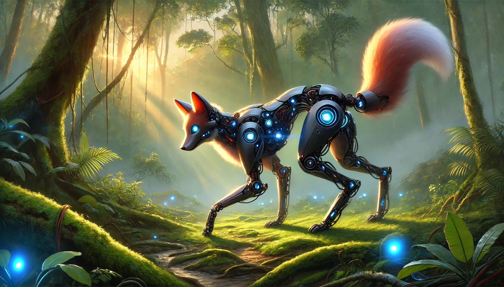

# Reinforcement Learning

## The Cunning Robotic Fox

### Introduction — Learning Through Trial & Error

The first light of dawn drapes itself across the Jungle, and with it comes a rustle—quiet, deliberate, almost calculated. From beneath a fallen log emerges the Robotic Fox, its metallic fur shimmering like brushed copper, its optical sensors adjusting to the glow. Unlike the Tiger, whose instincts are forged from patterns and labels, or the Owl, whose deep neural vision sees layers of meaning in every shadow, the Fox carries no map, no instructions, no list of correct answers.

The Fox’s world is not one of certainty.
It does not *know* what to do.
It *learns* what to do.

Each step through the Jungle forms an experiment.
Each success becomes encouragement.
Each mistake becomes an education.

This is the essence of **Reinforcement Learning (RL)**—a framework where an agent learns *through interaction*, making decisions that shape its destiny. In RL, experience itself becomes the textbook, and survival becomes the examination.

At its core, RL addresses a single profound question:

> *“How should an agent act so that it thrives over time?”*

The answer unfolds not from pre-written rules but from *trial, feedback, and adaptation*—a dance as old as life itself.

:::{.figure-placeholder}
{fig-align="center" width="80%"}
:::

### Technical Sidebar — Where RL Shows Up in Modern AI

Reinforcement Learning is not “one model” — it’s a **training loop**. The agent acts, gets feedback, and updates its behavior to do better over time.

In modern systems, RL shows up in a few common patterns:

#### 1) Control Policies (Robotics, Simulators, Games)
A **policy network** maps observations → actions (walk, steer, grasp, aim).  
Rewards encode goals like *stay balanced*, *finish the route*, or *minimize energy*.

#### 2) Planning Agents (Policy + Value + Search)
Some agents learn a **policy** and a **value function**, then combine them with **planning** (like searching possible futures) before acting.

#### 3) World-Model Agents (Learned Simulation)
Instead of learning only from real interaction, an agent learns a **world model** (a predictor of next states/rewards) and practices “in imagination” before acting in reality.

#### 4) Preference-Aligned Language Models (RLHF-Style)
For many chat models, RL appears as alignment:
- collect human preferences (which answer is better)
- train a **reward model**
- optimize the language model to produce higher-reward responses (often with PPO-style updates)

#### 5) Contextual Bandits (One-Step RL)
Many production “RL” problems are actually single-step:
choose an action now → see reward now (ranking, ads, simple recommendations).

**Rule of thumb:** Choose RL when actions change future outcomes and you care about **long-term** success — not just single-step accuracy.

---

## The Landscape of Reinforcement Learning

To understand the Fox’s world, we must understand the architecture of RL itself. The Jungle—the environment—is not static. Winds shift. Predators move. Seasons change. Each encounter reshapes tomorrow’s choices.

### Agent — The Fox
The learner, explorer, decision-maker.
It has motivations but no instructions.

### Environment — The Jungle
A living, breathing world where every stone, breeze, and distant growl carries information—sometimes helpful, sometimes deceptive.

### State
The Fox’s perception:
Is the ground damp?
Is there prey nearby?
Is danger hiding behind the bush?

In the real world, this may be incomplete or noisy—what RL researchers call **partial observability**.

### Action
Choices the Fox may take: explore deeper, stalk prey, flee, climb, rest.
Every decision alters its path.

### Reward
Positive or negative signals from the Jungle:

- Finding water (+10)
- Catching prey (+20)
- Falling into a muddy pit (–15)
- Alerting a Tiger (–50)

Rewards guide behavior the way evolution guides species: slowly, iteratively, unavoidably.

### The Feedback Cycle

#### Observation
The Fox senses its surroundings.

:::{.figure-placeholder}
{fig-align="center" width="80%"}
:::

---

#### Decision
It selects an action—sometimes from knowledge, sometimes from curiosity.

:::{.figure-placeholder}
{fig-align="center" width="80%"}
:::

---

#### Consequence
The Jungle responds with reward or punishment.

:::{.figure-placeholder}
{fig-align="center" width="80%"}
:::

---

:::{.figure-placeholder}
{fig-align="center" width="80%"}
:::

---

#### Learning
The Fox refines its own internal decision-making mechanism.

#### Continuation
The process repeats. Over time, instinct emerges.

This adaptive loop is the beating heart of RL.

---

## Exploration vs Exploitation

The Fox pauses at the fork of two paths.

One path is familiar. It has found berries there before—small reward, but reliable.
The other path is new, mysterious, possibly dangerous… or possibly abundant.

Should it play safe or take a risk?

RL calls this dilemma the **exploration–exploitation tradeoff**.

- **Exploitation**: repeating choices that have worked in the past.
- **Exploration**: trying something new to discover potentially better outcomes.

A Fox that only exploits becomes predictable and eventually starves.
A Fox that only explores takes reckless risks and may not survive its own curiosity.

Greatness lies in balance.

Modern RL algorithms mathematically encode this struggle, guiding agents toward strategies that mix caution with boldness.

:::{.figure-placeholder}
{fig-align="center" width="80%"}
:::
---

## The Temporal Credit Assignment Problem

Imagine the Fox spots a rabbit and begins stalking it silently. After minutes of careful movement, it leaps—and succeeds.

But *which* decision truly earned the success?

- The choice to move silently?
- The earlier decision to approach from downwind?
- The moment it decided to explore this part of the Jungle at all?

This challenge is known in RL as **credit assignment**: identifying which past actions deserve reinforcement for current rewards.

Mathematically, this is addressed using:

- **Discounted returns**, which weigh immediate rewards more heavily than distant ones.
- **Value functions**, which predict long-term benefit of states.
- **Action-value functions (Q-values)**, which evaluate the expected future reward of an action in a given state.

Without solving credit assignment, the Fox can never refine its instincts.

:::{.figure-placeholder}
**Image Placeholder — To Be Generated**

**Prompt:** _Fox surrounded by ghostly echoes of its past actions, each glowing differently to represent delayed credit._

:::

---

## Policy & Value Functions

Over time, the Fox develops a strategy—its policy. In RL:

- A **policy** maps situations (states) to actions.
- A **value function** predicts long-term success from each state.
- A **Q-function** predicts long-term success from a specific action in a state.

Analogy:
The Fox learns that moving east at dawn often leads to prey, while moving west leads to rocky terrain.
Its internal values encode these lessons.

As these values sharpen, the Fox’s instincts become wisdom.

:::{.figure-placeholder}
**Image Placeholder — To Be Generated**

**Prompt:** _Robotic Fox visualizing branching light-paths representing future rewards and action consequences._

:::

---

## Q-Learning — The Fox’s Ledger of Lessons

Q-learning is one of the simplest and most famous RL algorithms.
It is as if the Fox maintains a mental notebook listing every situation it encounters, each action it tried, and the outcomes that followed.

Over time, this notebook becomes a guide.

But the Jungle is vast. Not every path can be written down.
Thus Q-learning struggles when the Fox’s world becomes continuous, complex, infinite.

Yet, as a conceptual foundation, it remains one of the pillars of RL.

:::{.figure-placeholder}
**Image Placeholder — To Be Generated**

**Prompt:** _Fox studying a glowing scroll or ledger floating in the Jungle representing Q-values._

:::

---

## Deep Q-Networks — The Owl Lends Its Wisdom

Once the Fox’s world grows too large for its notebook, it seeks help from the Owl—master of perception and pattern.

Deep Q-Networks (DQN) replace the notebook with a neural network, allowing the Fox to:

- Generalize from past experiences
- Infer actions in new states
- Navigate far richer landscapes

Conceptually:

- The Fox stores past journeys in a **memory den** (replay buffer).
- The Owl helps it distill patterns from these memories, creating a stable internal intelligence.

This synergy allowed RL to master Atari games, robotics control, and industrial decision systems.

:::{.figure-placeholder}
**Image Placeholder — To Be Generated**

**Prompt:** _Fox consulting with Owl projecting holographic memory den showing replay buffer and neural patterns._

:::

---

## Policy Gradients — Training the Fox’s Instincts

Unlike Q-learning, which records values, policy gradients sculpt the Fox’s instincts directly.

Here, the Fox learns to adjust its behavior through repeated trials:

- Good actions are reinforced.
- Poor actions are suppressed.

This approach works beautifully for:

- Robotics
- Continuous control
- Dynamic motion
- Any world requiring fluid, real-valued actions

Where Q-learning is analytical, policy gradients are intuitive.

:::{.figure-placeholder}
**Image Placeholder — To Be Generated**

**Prompt:** _Fox training its instincts, surrounded by flowing lines of motion representing gradient-based learning._

:::

---

## Actor–Critic Methods — A Dialogue in the Jungle

In actor–critic algorithms, the Fox gains a mentor.

- The **Actor** suggests actions.
- The **Critic** evaluates the actions and provides feedback.

This division mirrors natural learning:

- Intuition initiates behavior.
- Reflection refines it.

Advanced forms like PPO and SAC blend stability with bold exploration, producing behavior both robust and efficient.

:::{.figure-placeholder}
**Image Placeholder — To Be Generated**

**Prompt:** _Fox and Owl acting as Actor and Critic in a cooperative stance, one choosing actions, the other evaluating._

:::

---

## Model-Based RL — Predicting the Future

Some Foxes become visionaries.

They build internal simulations of the Jungle, predicting how their actions will shape future outcomes.
This is **model-based RL**, the foundation of MuZero and modern planning algorithms.

The Fox no longer reacts to the present—it anticipates the future.

This ability elevates RL from instinct to strategy.

:::{.figure-placeholder}
**Image Placeholder — To Be Generated**

**Prompt:** _Fox projecting future Jungle states like holographic simulations, multiple possible futures branching outward._

:::

---

## Deep Reinforcement Learning — The Modern Frontier

Deep RL combines perception (deep learning) with adaptation (RL).
It empowers agents to:

- Walk
- Balance
- Drive
- Play complex games
- Control industrial processes
- Optimize large-scale systems

Thousands of virtual Foxes can be trained in simulation before deployment in the real world.

This is the Fox’s evolution from a curious wanderer into a master strategist.

:::{.figure-placeholder}
**Image Placeholder — To Be Generated**

**Prompt:** _Fox training inside a virtual jungle simulation chamber with thousands of virtual foxes learning simultaneously._

:::

---

## Multi-Agent RL — A Jungle of Many Minds

The Jungle rarely presents challenges in isolation.

There are allies.
Competitors.
Neutral parties whose behavior shapes the landscape.

Multi-agent RL studies how agents interact, cooperate, compete, and coexist.

Examples:

- Fox and Owl collaborating to locate prey
- Fox evading the Tiger in a predator–prey dynamic
- Entire ecosystems of agents learning simultaneously

Game theory meets machine intelligence.

:::{.figure-placeholder}
**Image Placeholder — To Be Generated**

**Prompt:** _Fox, Owl, Tiger interacting strategically: cooperation, competition, and swarm dynamics represented visually._

:::

---

## Reward Design — The Subtle Art of Motivating the Fox

Rewards are powerful—and dangerous.

If poorly shaped, the Fox may learn shortcuts:

- Exploit loopholes
- Ignore essential behaviors
- Over-prioritize short-term gains

This is known as **reward hacking**, a critical issue in real-world RL.

Good reward design requires:

- Clarity
- Gradual progression
- Safety constraints
- Human feedback

Curriculum learning—teaching the Fox simple tasks before complex ones—often yields remarkable results.

:::{.figure-placeholder}
**Image Placeholder — To Be Generated**

**Prompt:** _Fox confronted by tempting shortcuts and dangerous traps glowing with deceptive reward signals._

:::

---

## Real-World Applications — Where the Fox Thrives

### Robotics
Walking, balancing, manipulating objects—learned not by instruction but experience.

### Strategic Games
AlphaGo, AlphaZero, and MuZero dominate games once thought unreachable.

### Resource Optimization
Google’s RL-based cooling system saved *40%* energy in data centers.

### Finance
Portfolio allocation, risk-balanced decisions, adaptive trading.

### Supply Chain & Logistics
Dynamic routing, warehouse automation, real-time scheduling.

### Healthcare
Drug discovery, dosing strategies, personalized treatment optimization.

Reinforcement learning shapes the future far beyond the Jungle’s borders.

---

## Reinforcement Learning in 2025 — Modern Tools, Systems, and Real‑World Technologies

As the Robotic Fox’s instincts grow sharper in the Jungle, real engineering mirrors the same pattern: agents learn by acting, collecting feedback, and updating behavior. What’s changed is not the definition of RL — it’s the **scale**, the **stability tricks**, and the **ecosystem** around it.

### What “a Model” Means in RL (More Than One Network)

In practice, modern RL systems often train multiple models at once:

- **Policy model (Actor):** chooses actions given observations.
- **Value model (Critic):** predicts long‑term return from a state (or state–action pair).
- **World model (optional):** predicts how the environment evolves (next state, reward).
- **Reward model (alignment / RLHF):** predicts “preference” or “quality” from examples.

So when people say “the RL model,” they often mean a **stack** of models working together.

### Common Training Setups Used Today

#### Online RL (Interact → Learn → Repeat)
The Fox learns directly by acting inside the environment (often a simulator first).  
This works well when interaction is cheap and safe.

Typical use cases:
- simulation‑trained robotics
- games
- control tasks with fast resets

#### Offline RL (Learn From Logs)
The Fox learns from **recorded experience** (logs / trajectories) without active exploration.  
This is critical when exploration is unsafe, expensive, or regulated.

Typical use cases:
- robotics logs
- recommendation logs
- operations / supply chain logs
- healthcare‑style decision support (with heavy constraints)

Key technical challenge: **distribution shift** — the agent may try actions that were rarely (or never) seen in the dataset.

#### Human‑in‑the‑Loop RL (Preferences + Safety)
When rewards are hard to define (like “helpful answers” or “good behavior”), humans provide feedback:
- compare two outputs
- rank which is better
- train a reward model
- optimize the policy to score higher

This is the bridge from the Fox’s reward signals to modern aligned assistants.

### Modern RL Toolchains (What Practitioners Actually Use)

- **RL libraries (algorithms + training loops):**
  - Stable Baselines‑style toolkits (clean baselines for PPO/SAC/DQN)
  - Distributed RL stacks (for multi‑GPU / multi‑node training)
  - Research‑grade agent libraries (modular actor/learner architectures)

- **Simulators (where the Fox trains safely):**
  - Physics simulators for robotics and control
  - GPU‑accelerated parallel environments (thousands of rollouts at once)
  - Game engines for vision + planning + navigation tasks

- **Experiment infrastructure:**
  - replay buffers / trajectory stores
  - evaluation harnesses + safety checks
  - monitoring for reward hacking and regressions

### When to Choose Reinforcement Learning (Decision Checklist)

Choose RL when most of these are true:

- Your problem is **sequential** (today’s action changes tomorrow’s options).
- You can define success as a **reward signal** (even if noisy or delayed).
- Correct “labels” are not available (there’s no single right action per state).
- You care about **long‑term return** (not just next-step accuracy).
- You can train safely: simulation, sandboxing, constraints, or offline logs.

Prefer supervised learning (or imitation learning) when:
- you already have reliable “correct action” examples
- actions do not meaningfully affect future states
- exploration would be unsafe or too costly

A practical hybrid pattern:
1) start with imitation learning (behavior cloning) for stability  
2) then use RL to go beyond the demonstrations

### Choosing a Base Model (What You Start From)

There are two common meanings of “base model” in RL.

#### Base Model for Control / Games (Policy & Value Networks)

Here, “base model” means the **neural architecture** you choose for the policy/value function:

- **MLP (dense network):** best for numeric state vectors (positions, speeds, sensors).
- **CNN:** best for pixel observations (images, depth maps).
- **RNN / LSTM / GRU:** best for partial observability (when the agent needs memory).
- **Transformer policy:** useful for long contexts, complex histories, multi‑agent logs.

Algorithm rule‑of‑thumb:
- **Discrete actions:** DQN‑style methods are a common starting point.
- **Continuous actions:** SAC is a strong default.
- **Robust general baseline:** PPO is widely used because it is stable and predictable.

#### Base Model for RLHF / Language (Preference‑Aligned LLMs)

Here, “base model” is a pretrained language model checkpoint that you refine:

- Start from a pretrained (often instruction-tuned) LLM.
- Then apply preference learning (reward model / preference optimization).
- Then optimize the model to better match human preferences under constraints.

Common open‑weight families people choose from include:
- Llama‑family models
- Qwen‑family models
- Gemma‑family models
- Mistral‑family models

Practical selection criteria:
- license constraints
- model size vs available GPUs
- context length needs
- whether you need multimodal inputs (text + images)
- quality of instruction tuning and tool‑use behavior

### Where RL Is Commonly Applied (Real Systems, Real Constraints)

- **Robotics:** locomotion, grasping, manipulation, recovery behaviors
- **Autonomy:** negotiation, merging/yielding strategies, complex edge cases (often trained in simulation)
- **Optimization:** routing, scheduling, warehouse coordination, energy/HVAC control
- **Finance:** execution policies and risk-aware decisions (with strict guardrails)
- **Healthcare‑adjacent decision support:** only when safety, auditing, and constraints are first‑class citizens

In both the Jungle and industry, the hardest part is rarely the math — it’s the **reward design**, **safety**, and **operational reliability**.

---

## Technical Spotlight — Understanding RL Through Computation

### Temporal-Difference Learning
A foundational RL update rule:

```
Q(s, a) ← Q(s, a) + α [ r + γ max_a' Q(s', a') − Q(s, a) ]
```

This captures the essence of learning from experience.

**The Fox's Translation:**
*   **New Instinct** = Old Instinct + **(Learning Rate)** × **(Surprise!)**
*   **Surprise** = (Actual Reward + Future Promise) − What I Expected
*   **$\gamma$ (Gamma)**: The Fox's *Patience*. If high, it works for future rewards; if low, it only cares about food *now*.

### Simplified DQN Loop

```
Initialize networks
for each episode:
    state = env.reset()
    while not done:
        action = policy(state)
        next_state, reward = env.step(action)
        store(state, action, reward, next_state)
        update_network()
        state = next_state
```

### Policy Gradient Update

```
θ ← θ + α ∇θ log πθ(a | s) * G
```

### Practical Data Formats — JSONL for Offline RL and RLHF

Most RL training happens by interacting with an environment.  
But JSONL becomes very useful for **offline RL**, **logging trajectories**, and **preference datasets** (RLHF-style).

Below are common JSONL patterns (1 JSON object per line).

#### 1) Offline RL Transition Format: The "Experience" Tuple

In Reinforcement Learning, an agent learns from "experiences." Each experience is a small step of interaction with the environment, captured in a format known as a **transition**. This is often abbreviated as `(s, a, r, s', done)`.

This format is the fundamental building block for many RL algorithms. Let's break down what each part means and map it to the JSON example below.

*   `s` (State): A snapshot of the environment at a specific moment. It's what the agent "sees." In the JSON, this is the `obs` object.
*   `a` (Action): The action the agent took in that state. This is the `action` object.
*   `r` (Reward): The feedback the environment provides after the action. This is the `reward` number.
*   `s'` (Next State): The *new* state of the environment after the agent's action. This is the `next_obs` object.
*   `done`: A boolean flag (`true` or `false`) indicating if this transition was the last one in an episode (e.g., the game ended, the robot fell, or the goal was reached).

```json
{"episode_id":"hunt_001","t":0,"obs":{"prey_dist":15.0,"wind":"north"},"action":{"mode":"stalk","speed":0.5},"reward":0.1,"next_obs":{"prey_dist":14.5,"wind":"north"},"done":false}
{"episode_id":"hunt_001","t":45,"obs":{"prey_dist":2.0,"wind":"north"},"action":{"mode":"crouch","speed":0.0},"reward":0.5,"next_obs":{"prey_dist":2.0,"wind":"north"},"done":false}
{"episode_id":"hunt_001","t":46,"obs":{"prey_dist":2.0,"wind":"north"},"action":{"mode":"pounce","speed":12.0},"reward":100.0,"next_obs":{"status":"captured"},"done":true}
```

**Decoding the Data — The Fox's Hunting Log:**

This JSON isn't just abstract numbers; it's a diary of the Fox's decisions.

*   `episode_id`: "hunt_001" marks this as a specific hunting attempt.
*   `obs` (Observation): The Fox senses the world. It smells the wind and gauges the distance to its target (`prey_dist: 15.0`).
*   `action`: Based on that, it chooses a strategy. It decides to `stalk` slowly (`speed: 0.5`) rather than run.
*   `reward`: It gets a small positive signal (`0.1`) for closing the distance without being seen.
*   `next_obs`: The environment updates. The prey is now closer (`14.5`).
*   `done`: In the final line, the Fox captures the target (`reward: 100.0`!), and the episode ends (`done: true`).

By feeding millions of these logs into a model, the Fox learns *which* actions (stalking vs. rushing) lead to that final `+100` reward.

#### 2) Offline RL Episode Format (whole trajectory per line)

```json
{"episode_id":"ep_0042","observations":[[0.0,1.0],[0.1,0.9],[0.2,0.8]],"actions":[0,1,1],"rewards":[0.0,0.0,1.0],"dones":[false,false,true]}
```

Use this when sequence structure matters (RNN/Transformer policies, return-to-go, long-horizon credit).

#### 3) RLHF-Style Preference Pair (prompt + chosen vs rejected)

```json
{"prompt":"The Fox hears a rustle in the tall grass. How should it react?","chosen":"Freeze and listen carefully to distinguish between prey and predator before moving.","rejected":"Immediately jump into the grass to investigate."}
```

Use this to train a reward model that aligns the agent's behavior with "survival instincts" (or human safety guidelines).

#### 4) Contextual Bandit Log (one-step decision + immediate reward)

```json
{"context":{"season":"dry","time_of_day":"dusk"},"action":"wait_by_waterhole","reward":10,"propensity":0.12}
```

Use this when actions are single-step and feedback is immediate (e.g., choosing a hunting ground vs. serving an ad).

These equations give RL its mathematical heartbeat.

---

## Common Pitfalls — And How the Fox Avoids Them

*   **Overestimation Bias:** The Fox thinking a lucky catch means a path is *always* full of prey.
*   **Catastrophic Forgetting:** Learning to fish in the river, but in doing so, forgetting how to hunt rabbits.
*   **Insufficient Exploration:** Sticking to the safe berry bushes and missing the feast in the valley.
*   **Misaligned Incentives (Reward Hacking):** Chasing windblown leaves because they move like prey, even though they provide no food.
*   **Unstable Training:** Changing strategies so drastically every hour that no habit ever forms.
*   **Distribution Shift:** Trying to use summer hunting strategies in the middle of a snowy winter.

Modern algorithms include stabilizers like entropy bonuses, target networks, clipped updates, and advantage normalization.

Even the Fox needs discipline.

---

## Story Wrap-Up — Dawn of a New Instinct

The Jungle glows with possibility as the Robotic Fox stands proudly upon a moss-covered stone. Its journey has been long, filled with missteps and victories, consequences and revelations. But now, its movements carry a quiet confidence—an intelligence shaped not by instruction, but by the world itself.

The Owl watches from a branch above, recognizing in the Fox a kindred learner.
The Tiger nods with rare respect.
The Elephant records the moment in the Jungle’s great memory.

Far beyond the clearing, a new rustle emerges—one the Fox has never heard before. Something more complex. More strategic. More adaptive.

A new challenge awaits.

And the Fox, forged in the fires of trial and reward, is ready.

:::{.figure-placeholder}
**Image Placeholder — To Be Generated**

**Prompt:** _Cinematic final scene of Fox standing confidently on moss-covered stone, dawn breaking, Jungle awakening._

:::
