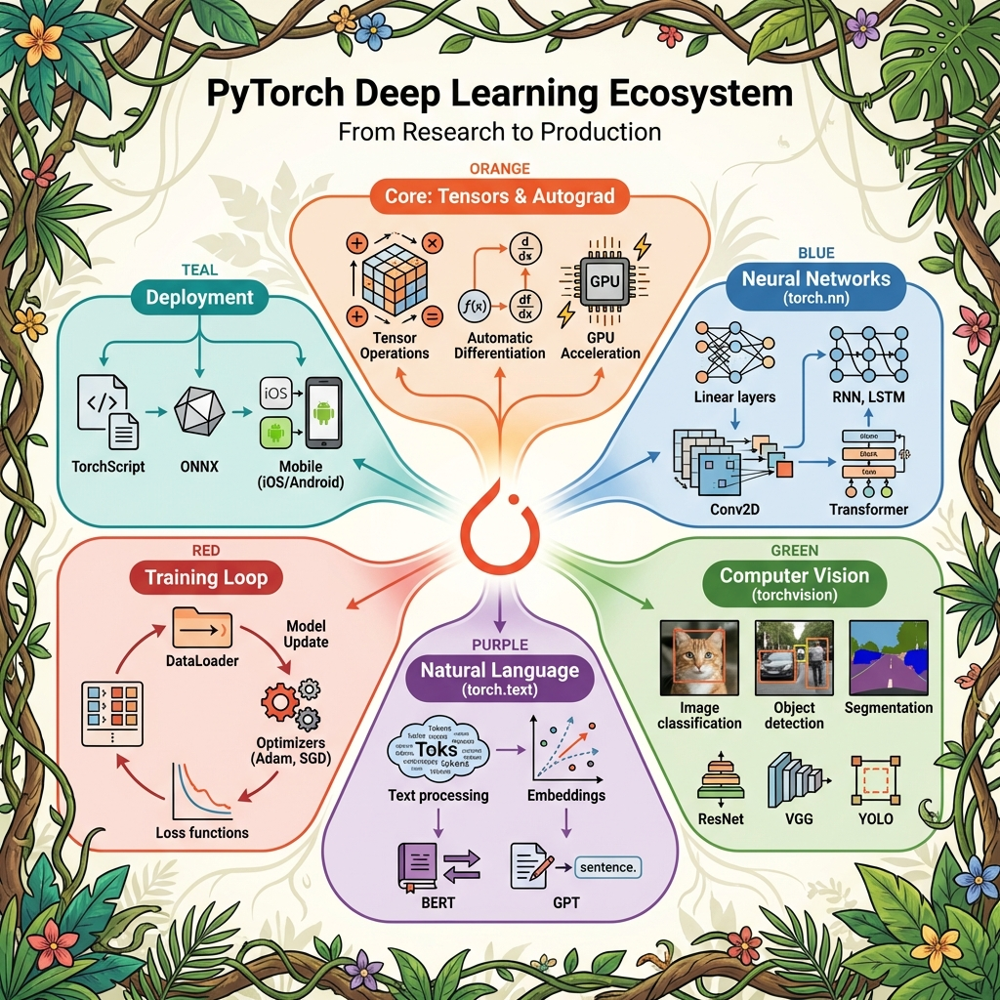
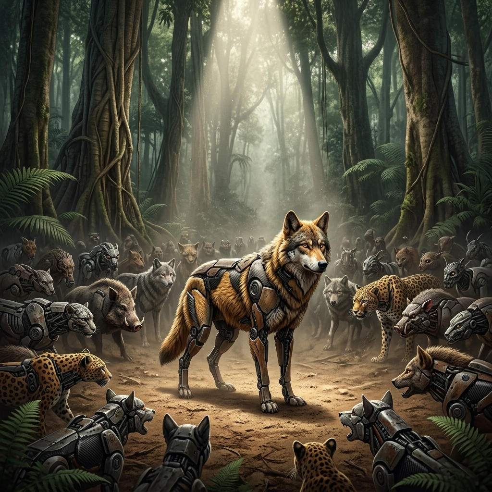

# The Watchful Robotic Owl

*Advanced AI Vigilance in the Jungle*

## Introduction: A Heightened Threat in the Jungle

Deep within the nature reserve, unexplained disturbances stir the night.  
Tracks appear where no animals should tread. Camera traps vanish without a trace. Poachers, illegal loggers, and other intruders encroach upon the habitat, threatening to disrupt the fragile balance of life.

The Robotic Owl—already proficient in basic vision and classification—now faces a far greater challenge: evolving its intelligence to protect the wildlife it has pledged to defend. In this chapter, we explore the advanced AI and ML techniques that enable the Owl to uncover hidden dangers, adapt to shifting threats, and maintain peace across its jungle domain.

:::{.figure-placeholder}
{fig-align="center" width="80%"}
:::

## Expanded Sensor Fusion: Seeing Beyond the Shadows

To rise to these new challenges, the Owl relies on a suite of enhanced sensors:

::: {.callout-tip}
## The Owl's Enhanced Senses

| Sensor Type | Purpose | ML Technique |
|:---|:---|:---|
| **Infrared** | Heat signatures in darkness | CNN + RGB fusion |
| **Acoustic** | Unusual sounds (chainsaws, voices) | RNN/Transformer |
| **Chemical** | Atypical scents (fuel, chemicals) | Unsupervised clustering |

:::

**Infrared Cameras**

- **Purpose:** Uncover heat signatures in pitch-dark regions or dense foliage.
- **ML Angle:** Combining (or fusing) IR with standard RGB data bolsters detection accuracy, even under poor lighting.

**Acoustic Arrays**

- **Purpose:** Pinpoint unusual sounds—chainsaws, vehicles, hushed voices—in real time.
- **ML Angle:** Time-series modeling (using RNNs or Transformers) can recognize audio patterns that deviate from typical jungle ambiance.

**Chemical / Olfactory Sensors**

- **Purpose:** Sniff out atypical scents, such as spilled fuel or chemical residues left by intruders.
- **ML Angle:** Unsupervised clustering differentiates routine forest smells from suspicious outliers.

:::{.figure-placeholder}
{fig-align="center" width="80%"}
:::

By blending these data streams, the Owl gains a multi-layered understanding of its environment—essential for identifying threats invisible to any single sensor.

## Detecting the Unusual: Anomaly Detection & Concept Drift

### Anomaly Detection

- **Key Idea:** Identify events or signals that don't match the Owl's learned "normal" patterns—like midnight noises near a restricted clearing.
- **Possible Approaches:**
    - **Isolation Forest:** Randomly partition data to isolate outliers.
    - **Autoencoder:** Learns to reconstruct normal sensor data; unusual inputs produce higher reconstruction errors.
- **Jungle Example:** If the Owl suddenly picks up chain-link rattling or unfamiliar vehicle engines, anomaly detection flags it so the Owl can investigate.

**Design Intuition:**  
In real-world systems, anomaly detection deliberately prioritizes coverage over certainty. The goal is not perfect classification, but early signal discovery. Higher false positives are acceptable initially, because missing rare or novel threats is often more costly than investigating benign alerts. Over time, human feedback and contextual filtering reduce noise without sacrificing sensitivity.

---

#### 🌲 The Owl's Isolation Chamber: Isolation Forest Deep Dive

The Owl's most powerful anomaly detector works on a counterintuitive principle: **anomalies are easy to isolate**. While normal observations cluster together (requiring many "cuts" to separate), outliers stand alone and can be isolated quickly.

::: {.callout-note}
## Jargon Buster: How Isolation Forest Works

**Isolation Forest** builds an ensemble of random **isolation trees**. Each tree:

1. Picks a **random feature** and a **random split point**.
2. Recursively partitions the data until each point is isolated.
3. Records the **path length** (number of splits) needed to isolate each point.

**Key Insight:** Anomalies require **shorter paths** because they're different from most data points. Normal points require **longer paths** because they're surrounded by similar neighbors.

The final **anomaly score** is the average path length across all trees, normalized to a 0–1 scale where **higher = more anomalous**.
:::

**The Jungle Narrative: Spotting the Lone Intruder**

Imagine the Owl monitoring 1,000 jungle creatures. Most travel in groups, eat at similar times, and follow predictable routes. But one creature moves alone, at odd hours, in restricted areas. When the Owl's isolation tree tries to separate this creature from the others, it only takes **2 splits**. Normal creatures take **8+ splits**. The lone creature is flagged immediately.

```{mermaid}
%%| label: fig-isolation-forest
%%| fig-cap: "Isolation Forest: Anomalies require fewer splits to isolate."
flowchart TD
    A["All Data Points"] --> B{"Random Split 1"}
    B -->|Left| C["Normal Cluster"]
    B -->|Right| D{"Random Split 2"}
    D -->|Left| E["Normal Subclusters"]
    D -->|Right| F["🚨 ANOMALY ISOLATED"]
    
    style F fill:#FFCDD2,stroke:#C62828
    style C fill:#E8F5E9,stroke:#4CAF50
    style E fill:#E8F5E9,stroke:#4CAF50
```

::: {.callout-tip}
## Real-World Example: Credit Card Fraud Detection

Banks like **JPMorgan** and **Mastercard** use Isolation Forest to detect fraudulent transactions.

Why? Because fraud is **rare** (0.1% of transactions) and **unpredictable** (new fraud patterns emerge daily). Isolation Forest doesn't need labeled fraud examples—it simply finds transactions that "stand out" from normal spending behavior: unusual amounts, strange locations, odd timing.

This **unsupervised approach** catches novel fraud types that supervised models trained on historical fraud would miss.
:::

**Technical Spotlight: Isolation Forest in Action**

```python
# Python: Isolation Forest for Anomaly Detection
from sklearn.ensemble import IsolationForest
import numpy as np

# 1. Create sample data: 995 normal, 5 anomalous
np.random.seed(42)
normal = np.random.randn(995, 2)  # Normal cluster around origin
anomalies = np.random.uniform(-4, 4, (5, 2))  # Scattered outliers

data = np.vstack([normal, anomalies])

# 2. Train Isolation Forest
iso_forest = IsolationForest(contamination=0.005, random_state=42)
iso_forest.fit(data)

# 3. Predict: -1 = anomaly, 1 = normal
predictions = iso_forest.predict(data)
anomaly_indices = np.where(predictions == -1)[0]

print(f"🚨 Detected {len(anomaly_indices)} anomalies")
print(f"   Indices: {anomaly_indices.tolist()}")
# Output: Detects the 5 anomalies at indices 995-999

# 4. Get anomaly scores (lower = more anomalous)
scores = iso_forest.decision_function(data)
most_anomalous = np.argmin(scores)
print(f"🔴 Most anomalous point: #{most_anomalous}")
```

**Key Insight:** The `contamination` parameter tells the model what fraction of data to expect as anomalies. Set it low (e.g., 0.01) for rare event detection. The `decision_function` returns raw scores—useful for ranking suspicious cases.

---

## The Owl's Toolkit: Choosing the Right Weapon

The Robotic Owl has access to many anomaly detection tools, but each has a different purpose. Just as a carpenter wouldn't use a sledgehammer to hang a picture frame, the Owl must choose the right tool for each job.

::: {.callout-note}
## Jargon Buster: When to Use What?

| Library | Best For | Example Algorithms | Model Size | When to Use |
|:---|:---|:---|:---|:---|
| **scikit-learn** | Tabular data, fast prototyping | K-Means, Isolation Forest, Logistic Regression | ~KB | 90% of business ML problems |
| **PyTorch / TensorFlow** | Neural networks, custom architectures | Autoencoders, CNNs, RNNs | KB–GB | Complex patterns, images, sequences |
| **LLM APIs** | Text understanding, generation | GPT, Claude, Gemini | 70GB+ (hosted) | Chat, summarization, reasoning |

**Rule of thumb:** Start with scikit-learn. Only move to PyTorch if scikit-learn can't capture the complexity. Only use LLMs if you need language understanding.
:::

The Isolation Forest we just saw uses **scikit-learn**—perfect for tabular data with numeric features. But what if the Owl needs to detect anomalies in more complex patterns? That's when it reaches for **PyTorch** and the Autoencoder.

::: {.callout-note}
## Jargon Buster: What is PyTorch?

**PyTorch** is a deep learning framework that lets you build neural networks from scratch. While scikit-learn provides ready-made algorithms, PyTorch gives you **building blocks** to construct custom architectures.

| Component | What It Does | Example |
|:---|:---|:---|
| **Tensors** | Multi-dimensional arrays (like NumPy, but GPU-accelerated) | `torch.tensor([1, 2, 3])` |
| **Autograd** | Automatic differentiation for training | Computes gradients automatically |
| **torch.nn** | Neural network layers | `nn.Linear`, `nn.Conv2d`, `nn.Transformer` |
| **Optimizers** | Update weights during training | `Adam`, `SGD` |
| **DataLoader** | Batch and shuffle data | Handles mini-batch training |

**When to use PyTorch vs scikit-learn?**

| Scenario | Use | Why |
|:---|:---|:---|
| Tabular data, quick prototype | scikit-learn | Simpler, faster, interpretable |
| Complex patterns, 100+ features | PyTorch (Autoencoder) | Learns multi-dimensional correlations |
| Images, audio, sequences | PyTorch (CNN, RNN) | Neural networks excel at spatial/temporal patterns |
| Custom research architecture | PyTorch | Full flexibility to build anything |

**The PyTorch Pattern:**
```python
# PyTorch follows a similar pattern to scikit-learn
import torch.nn as nn

model = nn.Sequential(nn.Linear(100, 50), nn.ReLU(), nn.Linear(50, 10))  # 1. Define
optimizer = torch.optim.Adam(model.parameters())  # 2. Choose optimizer
# 3. Training loop: forward → loss → backward → step
```
:::

{#fig-pytorch-ecosystem}

---

### 🧠 The Autoencoder: Learning What "Normal" Looks Like

An **Autoencoder** is a neural network that learns to compress data into a tiny representation, then reconstruct it. If the reconstruction is poor, the input was probably abnormal—it didn't match the patterns the network learned.

::: {.callout-note}
## Jargon Buster: How Autoencoders Work

An Autoencoder has two parts:

1. **Encoder:** Compresses input (e.g., 100 features) into a small "latent space" (e.g., 10 dimensions)
2. **Decoder:** Expands the latent space back to the original size (100 features)

```
Input (100) → [Encoder] → Latent (10) → [Decoder] → Output (100)
```

**Training:** The network learns to minimize **reconstruction error**—the difference between input and output. It's forced to learn the essential patterns because information must squeeze through the bottleneck.

**Anomaly Detection:** After training on normal data, feed in a suspicious sample. If reconstruction error is high, the sample is anomalous—it doesn't fit the patterns the Autoencoder learned.
:::

**The Jungle Narrative: The Owl's Memory Compression**

The Owl can't store raw sensor readings from every patrol forever—that's terabytes of data. Instead, it compresses each patrol into a "patrol fingerprint" (the latent space). Normal patrols compress cleanly. But a patrol with unusual activity—say, a poacher using new tactics—produces a garbled fingerprint with high reconstruction loss. That's the alert.

::: {.callout-tip}
## Real-World Example: Healthcare Provider Fraud Detection

Healthcare fraud costs the US over **$100 billion annually**. Insurers use Autoencoders to detect fraudulent provider billing:

- **Input:** 100+ billing features (procedure codes, patient demographics, claim amounts, referral patterns)
- **Latent space:** Compressed to ~10 dimensions
- **Training:** On millions of legitimate claims
- **Detection:** New claims with high reconstruction error are flagged for investigation

Why not Isolation Forest? Because billing patterns have **complex correlations** (certain procedures always accompany others). Autoencoders can learn these multi-dimensional relationships; tree-based methods struggle.
:::

**Technical Spotlight: Autoencoder in PyTorch**

```python
# Python: Autoencoder for Anomaly Detection with PyTorch
import torch
import torch.nn as nn
import numpy as np

# 1. Define the Autoencoder architecture
class Autoencoder(nn.Module):
    def __init__(self, input_dim=100, latent_dim=10):
        super().__init__()
        # Encoder: compress 100 → 50 → 10
        self.encoder = nn.Sequential(
            nn.Linear(input_dim, 50),
            nn.ReLU(),
            nn.Linear(50, latent_dim),
            nn.ReLU()
        )
        # Decoder: expand 10 → 50 → 100
        self.decoder = nn.Sequential(
            nn.Linear(latent_dim, 50),
            nn.ReLU(),
            nn.Linear(50, input_dim)
        )
    
    def forward(self, x):
        latent = self.encoder(x)
        reconstructed = self.decoder(latent)
        return reconstructed

# 2. Create sample data (normal + anomalies)
np.random.seed(42)
normal_data = np.random.randn(1000, 100).astype(np.float32)
anomaly_data = np.random.randn(10, 100).astype(np.float32) * 3  # Different distribution

# 3. Train on normal data only
model = Autoencoder(input_dim=100, latent_dim=10)
optimizer = torch.optim.Adam(model.parameters(), lr=0.001)
criterion = nn.MSELoss()

X_train = torch.tensor(normal_data)
for epoch in range(50):
    optimizer.zero_grad()
    output = model(X_train)
    loss = criterion(output, X_train)
    loss.backward()
    optimizer.step()

print(f"✅ Training complete. Final loss: {loss.item():.4f}")

# 4. Detect anomalies via reconstruction error
def get_reconstruction_error(model, data):
    with torch.no_grad():
        reconstructed = model(torch.tensor(data))
        error = ((reconstructed - torch.tensor(data)) ** 2).mean(dim=1)
    return error.numpy()

normal_errors = get_reconstruction_error(model, normal_data)
anomaly_errors = get_reconstruction_error(model, anomaly_data)

print(f"🟢 Normal avg error:  {normal_errors.mean():.4f}")
print(f"🔴 Anomaly avg error: {anomaly_errors.mean():.4f}")
# Output: Anomaly error is significantly higher!
```

**Key Insight:** The Autoencoder was trained **only on normal data**. It has no idea what fraud looks like—but it knows what normal looks like. Anything that can't be reconstructed well is suspicious.

---

### 🔗 The Encoder/Decoder Pattern: From Tiny to Massive

Here's a surprising fact: the same **Encoder/Decoder pattern** powers both our tiny Autoencoder AND the massive GPT models that can write essays. The architecture is the same—only the scale differs.

::: {.callout-warning}
## Jargon Buster: Same Pattern, Vastly Different Scale

| Aspect | Our Autoencoder | GPT-4 / Claude |
|:---|:---|:---|
| **Purpose** | Detect anomalies in numbers | Generate human-like text |
| **Input** | 100 numeric features | Text tokens (words) |
| **Training data** | 10,000 rows (your data) | Trillions of words (internet) |
| **Model size** | ~100 KB | ~70 GB – 700 GB |
| **Runs where** | Your laptop / Snowflake | Massive GPU clusters |
| **Architecture** | Dense layers (4 layers) | Transformer (96+ layers) |

Both use **encode → latent space → decode**. But GPT's "latent space" encodes the meaning of language, while ours encodes normal billing patterns.
:::

**PyTorch is LEGO Blocks**

Think of **PyTorch** (and TensorFlow) as a box of LEGO blocks. You can build:

- A **small house** (Autoencoder for anomaly detection) → No LLM needed
- A **massive castle** (GPT-scale language model) → Full LLM

Same blocks, different projects. The Owl uses the small house for patrol analysis. The Council's scholars use the castle for interpreting ancient texts.

```
PyTorch = Building Blocks

Small Build (No LLM):           Massive Build (LLM):
┌────────────────────┐          ┌────────────────────────────┐
│ Autoencoder        │          │ Transformer (GPT, Claude)  │
│ - 4 layers         │          │ - 96+ layers               │
│ - 1000s of params  │          │ - Billions of params       │
│ - Trains in mins   │          │ - Trains for months        │
│ - Runs on CPU      │          │ - Requires GPU clusters    │
└────────────────────┘          └────────────────────────────┘
```

**When to Use Each:**

| Task | Tool | Why |
|:---|:---|:---|
| Cluster customers by behavior | scikit-learn (K-Means) | Simple, fast, interpretable |
| Detect rare fraud in transactions | scikit-learn (Isolation Forest) | Tree-based, handles tabular data well |
| Detect complex anomalies in 100+ features | PyTorch (Autoencoder) | Learns multi-dimensional correlations |
| Classify images | PyTorch (CNN) | Neural networks excel at spatial patterns |
| Generate text / answer questions | LLM API (GPT, Claude) | Pre-trained on massive text corpora |

---

### Concept Drift

**Definition:**  
As wildlife migrates, seasons shift, or intruders adopt stealthier tactics, the statistical properties of sensor data evolve over time.

**Adaptive Response:**  
Online or incremental learning allows the Owl’s models to update continuously without full retraining.

**Outcome:**  
Even when poachers transition from loud trucks to near-silent electric bikes, the Owl continues to detect emerging threat patterns.

**Failure Mode to Watch:**  
Concept drift is often “silent”—the system may keep producing confident outputs while accuracy degrades because the world has changed. This is why drift monitoring is typically paired with rolling-window evaluation (recent data vs. historical baseline), alert thresholds on error/uncertainty, and periodic calibration so performance doesn’t decay unnoticed.


## Watching the Tides: Time-Series Anomaly Detection

The Watchful Robotic Owl has learned to spot strange creatures in the jungle: the leopard moving against the herd, the glowing vine that does not belong, the sudden silence where birds should be singing. But time-series anomalies ask for a different kind of attention. Here, the Owl is not watching one frozen scene. It is watching the river hour after hour, day after day, season after season.

Some dangers arrive like a lightning strike. A sensor spikes. A payment jumps. A server collapses under traffic. Other dangers arrive like a tide. Nothing looks dramatic on Monday. Tuesday is only a little worse. Wednesday is still easy to explain away. By the time the river reaches the village path, the danger was not one dramatic flood, but weeks of quiet accumulation.

Time-series anomaly detection teaches the Owl to watch motion, rhythm, and memory. It asks not only, "Is this point unusual?" but also, "Has the story been changing?"

### CUSUM: When the River Slowly Rises

CUSUM, short for Cumulative Sum, is a change-point detection technique. It is useful when individual readings may look harmless, but their accumulated pattern tells a more serious story.

{fig-align="center" width="80%"}

Imagine the Owl perched above a riverbank. Each day, the river rises a little above its usual mark. No single day looks like a flood. The frogs still sing, the deer still cross, and the reeds still bend in familiar ways. But the Owl remembers. It adds each small overflow to yesterday's concern. If the river dips back below normal, the Owl lets the worry drain away. If the overflow keeps building, the Owl eventually sounds the alarm.

Plain-English math:

1. Start with a baseline, such as the expected temperature of a machine part.
2. Each new reading is compared with that baseline.
3. If the reading is above the baseline, add the excess to a running sum.
4. If the running sum falls below zero, reset it to zero.
5. If the running sum crosses a chosen threshold, flag a change.

In compact form, the idea is:

`running_sum = max(0, previous_running_sum + current_value - baseline)`

If `running_sum > threshold`, the Owl calls it a possible change point.

```{mermaid}
flowchart LR
  A["Sensor reading<br/>near baseline"] --> B["Small excess<br/>added to sum"]
  B --> C["Next reading<br/>also high"]
  C --> D["Running sum<br/>keeps rising"]
  D --> E{"Sum exceeds<br/>threshold"}
  E -->|"No"| C
  E -->|"Yes"| F["Owl flags<br/>change point"]
  C --> G{"Reading drops<br/>below baseline"}
  G -->|"Yes"| H["Running sum<br/>resets to zero"]
  H --> A
```

A manufacturing plant gives the Owl a useful example. Suppose a turbine bearing is expected to run at a stable temperature. On one day, it is only slightly warm. That may mean nothing. On the next day, it is a little warmer again. Over many days, the bearing continues to heat up, not enough to trigger a simple static threshold, but enough to show a slow decline in machine health. CUSUM is designed for this kind of creeping signal.

This is where **onset duration** matters. If the onset is short, the anomaly may be a sudden event: a broken coolant line, a blocked vent, or a sharp load change. If the onset is long, the anomaly may be organic drift: wear, friction, calibration decay, or a part slowly moving out of tolerance. The Owl cares about both, but it tells a different story for each.

A short onset says, "The river rose quickly." A long onset says, "The river has been arguing with the bank for a long time."

::: {.callout-tip}
## Jargon Buster: CUSUM in Plain English

CUSUM is a memory-based alarm. Instead of asking whether today's value is shocking by itself, it asks whether many small pushes in the same direction have added up to something meaningful.
:::

CUSUM is especially helpful when normal noise hides gradual change. A static threshold may wait too long. A single-week z-score may shrug. But the Owl does not forget the last several ripples in the water.

The tradeoff is that basic CUSUM is usually directional. If it watches only upward drift, it may miss alternating swings or downward changes. For that, practitioners often use a two-sided CUSUM: one running sum for upward pressure and another for downward pressure. The Owl keeps one eye on the rising river and the other on the disappearing streambed.

### Dynamic Z-Score: Letting Each Creature Keep Its Rhythm

A standard z-score asks how far a value is from normal, measured in units of variation. That is useful, but the jungle is not equally noisy everywhere.

The elephant walks with a steady rhythm. If it suddenly races through the trees, the Owl notices immediately. The monkey, however, leaps, tumbles, pauses, and darts all day long. The same jump that would be strange for the elephant may be ordinary for the monkey.

Dynamic Z-Score keeps this difference in mind. It adjusts anomaly thresholds based on volatility. Instead of giving every creature the same alarm bell, the Owl scales the bell to match each creature's natural rhythm.

Plain-English math:

`threshold = base × (1 + Coefficient of Variation)`

The Coefficient of Variation compares variability to the average. A low value means the series is steady. A high value means the series naturally swings around. When volatility is high, the threshold expands. When volatility is low, the threshold tightens.

A practical tiering scheme might look like this:

| Volatility Tier | Coefficient of Variation | Owl's Interpretation | Threshold Behavior |
|---|---:|---|---|
| STABLE | 0.00 to 0.15 | Elephant rhythm | Tight alarm range |
| MODERATE | 0.15 to 0.40 | Deer rhythm | Slightly wider range |
| VOLATILE | 0.40 to 0.80 | Monkey rhythm | Wider alarm range |
| HIGHLY_VOLATILE | Above 0.80 | Stormy canopy rhythm | Very cautious alarm range |

Consider credit-card spending. A salaried office worker may spend in a predictable pattern: groceries, fuel, rent, subscriptions, and occasional dining. A sudden burst of high-value electronics purchases in another city might deserve attention. For this user, the Owl keeps a narrow watch.

A small-business owner may be different. Some weeks are quiet. Other weeks include inventory purchases, travel expenses, vendor payments, and client meals. A fixed threshold may cry danger too often. Dynamic Z-Score lets the Owl ask a better question: "Is this transaction unusual for this user, given how noisy this user's normal life already is?"

::: {.callout-tip}
## Jargon Buster: Dynamic Z-Score in Plain English

Dynamic Z-Score is an adaptive alarm. It still looks for values far from normal, but it gives naturally steady patterns a tighter boundary and naturally jumpy patterns a wider one.
:::

This technique is useful for heterogeneous populations, where one baseline would be unfair. A single rule for all cardholders, all sensors, or all network devices can create two failures at once: too many false alarms for noisy subjects, and missed warnings for quiet ones.

The Owl does not want to punish the monkey for being a monkey. It wants to notice when the monkey moves in a way even monkeys do not usually move.

Dynamic Z-Score works best for sharp single-period surprises in noisy environments. It is less suited to slow, sustained drift. If every week is only a little high, the adjusted threshold may keep stretching around the behavior. That is when CUSUM becomes the better river watcher.

### Local Outlier Factor: The Lone Wolf at the Edge of the Glade

Some anomalies are not strange because they are globally far away. They are strange because of the company they keep.

{fig-align="center" width="80%"}

At twilight, many creatures gather near the watering hole. They form dense clusters: deer near the reeds, birds near low branches, insects hovering over the wet stones. Then the Owl sees a lone wolf standing near the empty edge of the glade. The wolf is not necessarily far from every creature in the jungle. But compared with its nearest neighbors, it stands in a sparse, unusual patch.

Local Outlier Factor, or LOF, is a density-based anomaly detection technique. It compares each point's local density with the local density of its neighbors. A point becomes suspicious when its neighborhood is much thinner than the neighborhoods around it.

Plain-English math:

1. Find each point's nearest neighbors.
2. Estimate how crowded the point's local neighborhood is.
3. Estimate how crowded the neighbors' own neighborhoods are.
4. Compare the two.
5. If the point lives in a much sparser area than its neighbors, flag it as unusual.

This makes LOF different from methods that only ask, "How far is this point from the center?" In real data, there may be many centers. Some groups are dense. Some are spread out. Some normal behavior happens at the edge of one region but still has a healthy local crowd. LOF gives the Owl a neighborhood-sensitive map.

Network traffic provides a good example. Most legitimate devices communicate in dense, familiar patterns: routine authentication, predictable service calls, scheduled backups, ordinary application traffic. A small fraud ring or suspicious coordination pattern may involve four or five nodes that cluster together unusually inside an otherwise dense legitimate-traffic zone. Each node may not look globally extreme. The cluster may even sit near normal traffic. But its local density pattern can be odd: close to one another, weakly connected to the normal crowd, and sparse compared with the surrounding neighborhood.

::: {.callout-tip}
## Jargon Buster: LOF in Plain English

LOF asks whether a point's neighborhood is unusually empty compared with its neighbors' neighborhoods. It is suspicious when it looks lonely in a place where nearby points are not lonely.
:::

LOF is helpful when the jungle has mixed-density regions. A static distance rule may mistake a normal quiet clearing for danger, or miss a suspicious pocket hidden near a busy path. LOF lets the Owl judge local context.

Its weakness is the opposite of its strength. If a point is globally isolated and obviously far from everything, Isolation Forest may be simpler and stronger. LOF shines when the question is more subtle: "Does this point belong to the local crowd around it?"

### Choosing the Owl's Watch Pattern

No single anomaly detector is the whole jungle. Static thresholds, CUSUM, Dynamic Z-Score, and LOF each teach the Owl a different style of attention.

| Technique | What it catches | What it misses | When to use |
|---|---|---|---|
| Static Z-Score | Single-week shocks vs fixed baseline | Slow drift, volatile populations | Stable processes only |
| CUSUM | Slow accumulating drift | Bidirectional swings (use 2-sided variant) | Catching gradual escalation |
| Dynamic Z-Score | Single-week shocks adjusted to natural noise | Multi-week sustained patterns | Noisy or heterogeneous populations |
| LOF | Local-density anomalies (small clusters in dense space) | Global isolated points (use IF instead) | Mixed-density populations |

The practical Owl often combines these methods. CUSUM watches the rising river. Dynamic Z-Score learns each creature's rhythm. LOF studies the shape of the crowd around the watering hole. Together, they turn anomaly detection from a single alarm into a layered patrol of time, volatility, and local context.

*The Owl blinks once from the branch.* *"A strange moment matters. A strange rhythm matters more."*

## Intelligent Patrol: Reinforcement Learning for Route Optimization

**Dynamic Flight Paths**
 
 - **Challenge:** The Owl can't be everywhere at once. It must plan routes for maximum coverage and minimal wasted energy.
 - **Technique:** Reinforcement Learning (RL), where the Owl's system tries different flight patterns, earning "rewards" if threats are detected, "penalties" if critical events are missed.
 
 **Why Reinforcement Learning:**  
Static or rule-based patrol heuristics work only in predictable environments. In dynamic settings like this jungle, threat locations, timing, and behavior evolve continuously. Reinforcement learning reframes patrol planning as a sequential decision problem, allowing the system to balance exploration (checking rarely visited areas) with exploitation (revisiting high-risk zones) while adapting its strategy based on observed outcomes.

**Potential Multi-Agent Collaboration**

- If desired, smaller scout drones or ground-based sensors can coordinate with the Owl using multi-agent RL.
- Ensures large swaths of jungle are covered efficiently, sharing data in real time.

## Explainable AI: Trusting the Owl's Judgment

Advanced sensing is crucial, but so is transparency about each alert:

**Feature Attribution**

- Highlights which sensor readings (thermal anomalies, suspicious sounds) triggered the Owl's warning.

**Saliency Maps**

- Overlays the most relevant areas of an infrared image, showing rangers exactly where the Owl detected potential intruders.

**Human-in-the-Loop**

- Rangers can label false positives or confirm real incidents, refining the model incrementally. This clarity fosters confidence that the Owl’s advanced capabilities aren’t a “black box” but a collaborative tool.

**Engineering Insight:**  
In practice, explainability is not only about user trust—it is a critical debugging tool. Feature attribution and saliency maps help engineers identify sensor failures, data leakage, spurious correlations, or drift-induced misbehavior. Many production issues are discovered not through accuracy metrics, but by inspecting *why* a model made a particular decision.

## Practical Considerations

**Energy & Coverage**

- The Owl's battery life and sensor ranges limit flight duration. RL-based optimization chooses which areas to prioritize nightly.

**Ethical Boundaries**

- Overly intrusive surveillance must balance with preserving wildlife privacy and not disturbing the habitat's natural flow.

**Continuous Maintenance**

- Concept drift means the Owl's software must be updated continuously—like routine calibrations to keep sensors accurate.

**Edge vs. Base Station**

- Some data is processed onboard (edge AI) to reduce latency; heavy training or updates may occur at a protected station.

## Key Takeaways

**Sensor Fusion:**
Blending infrared, acoustic, and chemical data yields a panoramic view of the jungle—vital when intruders adopt stealthy tactics.

**Anomaly Detection & Concept Drift:**
Detecting outliers and updating models for changing conditions keeps the Owl nimble in a dynamic environment.

**Reinforcement Learning:**
Intelligent route planning maximizes coverage with limited resources, allowing the Owl to safeguard wide territories.

**Explainable AI:**
Clear justifications of each alert build trust in the Owl's vigilance, especially in sensitive conservation efforts.

**Balanced Deployment:**
Effective system upkeep, ethical considerations, and respect for nature’s rhythms ensure advanced AI remains a force for good.

## Story Wrap-Up & Teaser

Nightfall blankets the reserve. The Robotic Owl takes to the skies, its acoustic arrays tuned to the faintest whispers, while its infrared sensors glow hot with life below. In the distance, the buzz of a hidden engine sets off an anomaly alert—chain-link rattling in an off-limits zone. Guided by reinforcement learning, the Owl adjusts its flight plan, gliding toward the disturbance.

Within minutes, a detailed, explainable report lands with the rangers, pinpointing the suspicious activity and clarifying precisely what triggered the alarm. Once again, the forest remains under vigilant protection, thanks to the Owl's evolving AI guardianship.

**Next Chapter Preview:**

In Chapter 7, we zoom out to examine the ethical dimensions of these AI defenders and speculate on future developments. As the Owl’s watch grows more sophisticated, so do the questions about sustainable deployment and long-term impact on both wildlife and humanity.