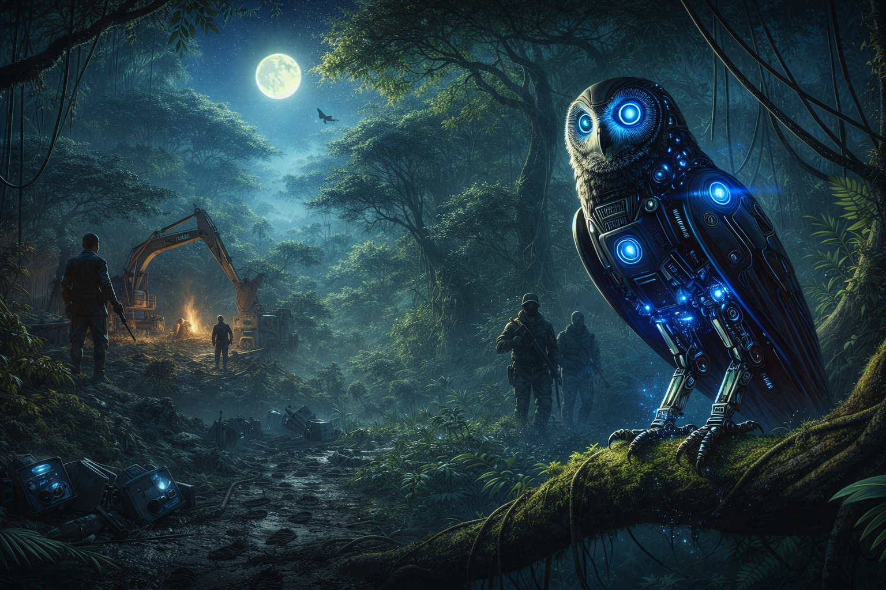
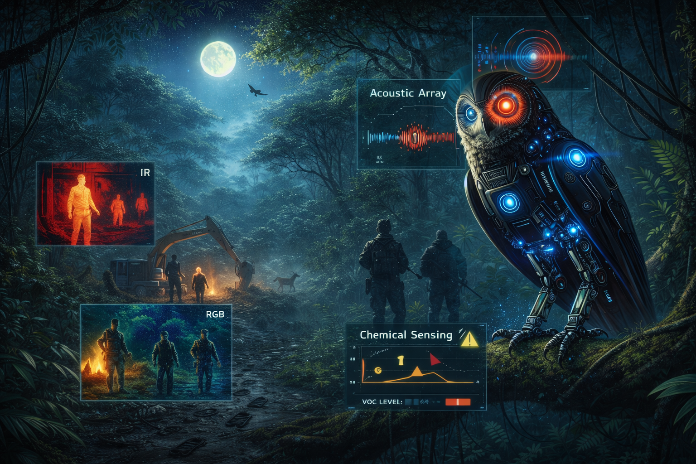
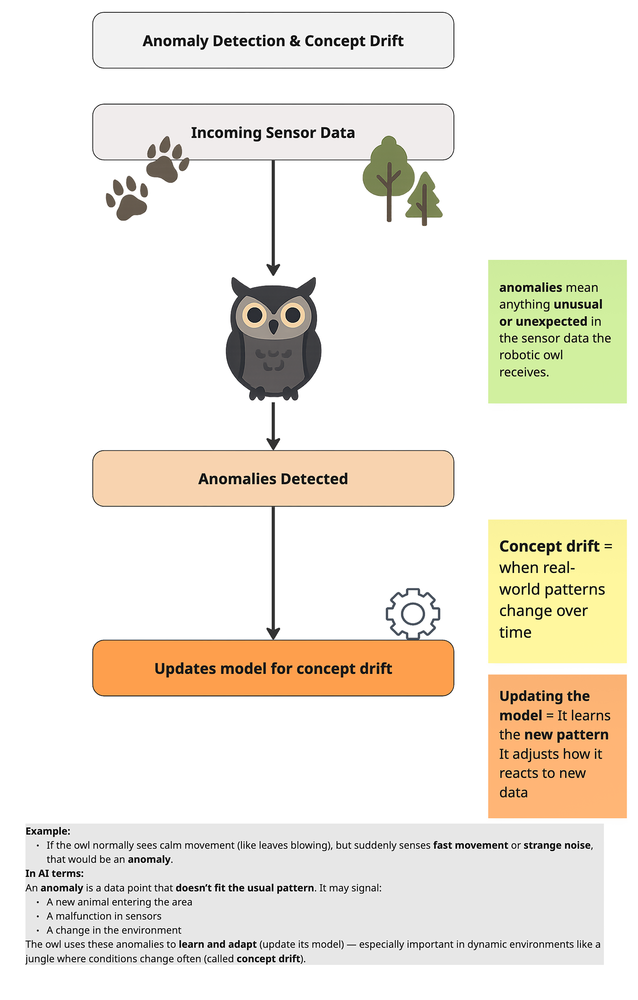

# The Watchful Robotic Owl  
Advanced AI Vigilance in the Jungle

## Introduction: A Heightened Threat in the Jungle

Deep within the nature reserve, unexplained disturbances stir the night.  
Tracks appear where no animals should tread. Camera traps vanish without a trace. Poachers, illegal loggers, and other intruders encroach upon the habitat, threatening to disrupt the fragile balance of life.

The Robotic Owl—already proficient in basic vision and classification—now faces a far greater challenge: evolving its intelligence to protect the wildlife it has pledged to defend. In this chapter, we explore the advanced AI and ML techniques that enable the Owl to uncover hidden dangers, adapt to shifting threats, and maintain peace across its jungle domain.

:::{.figure-placeholder}
{fig-align="center" width="80%"}
:::

## Expanded Sensor Fusion: Seeing Beyond the Shadows

To rise to these new challenges, the Owl relies on a suite of enhanced sensors:

**Infrared Cameras**
- Purpose: Uncover heat signatures in pitch-dark regions or dense foliage.
- ML Angle: Combining (or fusing) IR with standard RGB data bolsters detection accuracy, even under poor lighting.

**Acoustic Arrays**
- Purpose: Pinpoint unusual sounds—chainsaws, vehicles, hushed voices—in real time.
- ML Angle: Time-series modeling (using RNNs or Transformers) can recognize audio patterns that deviate from typical jungle ambiance.

**Chemical / Olfactory Sensors**
- Purpose: Sniff out atypical scents, such as spilled fuel or chemical residues left by intruders.
- ML Angle: Unsupervised clustering differentiates routine forest smells from suspicious outliers.

:::{.figure-placeholder}
{fig-align="center" width="80%"}
:::

By blending these data streams, the Owl gains a multi-layered understanding of its environment—essential for identifying threats invisible to any single sensor.

## Detecting the Unusual: Anomaly Detection & Concept Drift

### Anomaly Detection
- Key Idea: Identify events or signals that don’t match the Owl’s learned “normal” patterns—like midnight noises near a restricted clearing.
- Possible Approaches:
  - Isolation Forest: Randomly partition data to isolate outliers.
  - Autoencoder: Learns to reconstruct normal sensor data; unusual inputs produce higher reconstruction errors.
- Jungle Example: If the Owl suddenly picks up chain-link rattling or unfamiliar vehicle engines, anomaly detection flags it so the Owl can investigate.

### Concept Drift
**Definition:**  
As wildlife migrates, seasons shift, or intruders adopt stealthier tactics, the statistical properties of sensor data evolve over time.

**Adaptive Response:**  
Online or incremental learning allows the Owl’s models to update continuously without full retraining.

**Outcome:**  
Even when poachers transition from loud trucks to near-silent electric bikes, the Owl continues to detect emerging threat patterns.

## Intelligent Patrol: Reinforcement Learning for Route Optimization

**Dynamic Flight Paths**
- Challenge: The Owl can’t be everywhere at once. It must plan routes for maximum coverage and minimal wasted energy.
- Technique: Reinforcement Learning (RL), where the Owl’s system tries different flight patterns, earning “rewards” if threats are detected, “penalties” if critical events are missed.

**Potential Multi-Agent Collaboration**
- If desired, smaller scout drones or ground-based sensors can coordinate with the Owl using multi-agent RL.
- Ensures large swaths of jungle are covered efficiently, sharing data in real time.

## Explainable AI: Trusting the Owl’s Judgment

Advanced sensing is crucial, but so is transparency about each alert:

**Feature Attribution**
- Highlights which sensor readings (thermal anomalies, suspicious sounds) triggered the Owl’s warning.

**Saliency Maps**
- Overlays the most relevant areas of an infrared image, showing rangers exactly where the Owl detected potential intruders.

**Human-in-the-Loop**
- Rangers can label false positives or confirm real incidents, refining the model incrementally. This clarity fosters confidence that the Owl’s advanced capabilities aren’t a “black box” but a collaborative tool.

## Practical Considerations

**Energy & Coverage**
- The Owl’s battery life and sensor ranges limit flight duration. RL-based optimization chooses which areas to prioritize nightly.

**Ethical Boundaries**
- Overly intrusive surveillance must balance with preserving wildlife privacy and not disturbing the habitat’s natural flow.

**Continuous Maintenance**
- Concept drift means the Owl’s software must be updated continuously—like routine calibrations to keep sensors accurate.

**Edge vs. Base Station**
- Some data is processed onboard (edge AI) to reduce latency; heavy training or updates may occur at a protected station.

## Key Takeaways

**Sensor Fusion**  
Blending infrared, acoustic, and chemical data yields a panoramic view of the jungle—vital when intruders adopt stealthy tactics.

**Anomaly Detection & Concept Drift**  
Detecting outliers and updating models for changing conditions keeps the Owl nimble in a dynamic environment.

**Reinforcement Learning**  
Intelligent route planning maximizes coverage with limited resources, allowing the Owl to safeguard wide territories.

**Explainable AI**  
Clear justifications of each alert build trust in the Owl’s vigilance, especially in sensitive conservation efforts.

**Balanced Deployment**  
Effective system upkeep, ethical considerations, and respect for nature’s rhythms ensure advanced AI remains a force for good.

## Story Wrap-Up & Teaser

Nightfall blankets the reserve. The Robotic Owl takes to the skies, its acoustic arrays tuned to the faintest whispers, while its infrared sensors glow hot with life below. In the distance, the buzz of a hidden engine sets off an anomaly alert—chain-link rattling in an off-limits zone. Guided by reinforcement learning, the Owl adjusts its flight plan, gliding toward the disturbance.  
Within minutes, a detailed, explainable report lands with the rangers, pinpointing the suspicious activity and clarifying precisely what triggered the alarm. Once again, the forest remains under vigilant protection, thanks to the Owl’s evolving AI guardianship.

Next Chapter Preview:  
In Chapter 7, we zoom out to examine the ethical dimensions of these AI defenders and speculate on future developments. As the Owl’s watch grows more sophisticated, so do the questions about sustainable deployment and long-term impact on both wildlife and humanity.