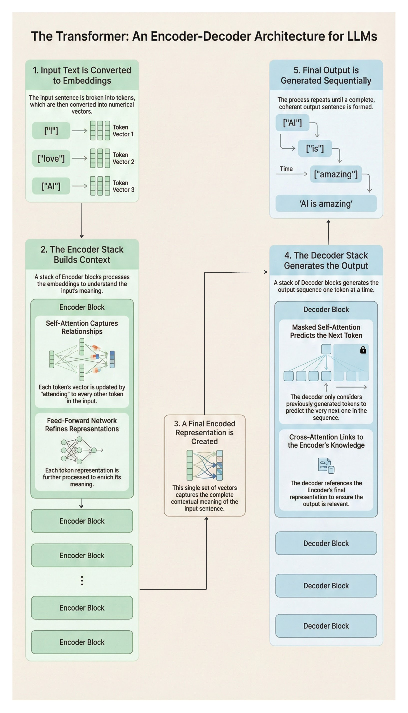

# Large Language Models & Ethical Horizons

- The Eloquent Robotic Owl

## Introduction: The Hidden Library Revisited 
Despite its prowess in surveillance and classification, the Watchful Robotic Owl senses something deeper stirring in the jungle. Its nocturnal flights reveal a secret clearing filled with dense tomes of text—insights far beyond ordinary data. Here, it encounters Large Language Models (LLMs), AI systems that can understand and generate human-like text. This chapter explores how such models (akin to ChatGPT, DeepSeek, Grok, Meta Llama) are constructed, the ethical dilemmas they pose, and how you can begin experimenting with them in code. 

Story Angle: The Owl steps through shadowy vines to discover an ancient library, brimming with pages that speak of near-endless linguistic possibility. But the more it reads, the more it realizes that words can shape reality—for better or worse. 


:::{.figure-placeholder}
{fig-align="center" width="80%"}
:::

## The Eloquent Robotic Owl: Foundations of LLMs 

### What Are Large Language Models (LLMs)? 
Before diving into the nuts and bolts of Transformers, let’s clarify why Large Language Models (LLMs) matter. In essence, LLMs are neural networks trained on vast textual data—often billions of words from diverse sources (books, websites, code repositories, etc.). Their aim is to predict the next word in a sequence with high accuracy, but in doing so, they learn remarkably deep language patterns. This results in capabilities like: 
- Understanding Context: Remembering what was said many sentences earlier. 
- Generating Coherent Text: Crafting paragraphs, dialogue, or even code. 
- Adapting to Various Tasks: Summarizing articles, translating languages, or answering questions. Historically, simpler language models used RNNs (Recurrent Neural Networks), which processed text token by token. While RNNs were a huge step forward, they struggled with long-range context and parallelization. LLMs overcame these limitations thanks to a new architecture that relies on attention mechanisms— especially the Transformer. 

### Transformer Architecture 
#### Three Transformer “Species” in the Jungle
Most readers hear “Transformer” and assume it is one single creature. In reality, the jungle has three closely related species—each optimized for a different kind of thinking.

- **Encoder-only (BERT-style): The Owl *reads* to understand.**
  - Best for: classification, tagging, search, “what does this mean?” tasks.
  - Analogy: the Owl studies a page and produces a rich internal understanding, but it is not primarily designed to write long answers.

- **Decoder-only (GPT-style): The Owl *speaks* to generate.**
  - Best for: chat, writing, code generation, “continue this” tasks.
  - Analogy: the Owl is focused on composing the next token, sentence by sentence, turning understanding into fluent output.

- **Encoder–Decoder (T5 / original translation-style): The Owl *reads in one tongue, speaks in another*.**
  - Best for: translation, rewriting, structured transforms (input → output).
  - Analogy: the Owl reads a scroll in one language and produces a clean scroll in another.

**Practical takeaway:** When people say “ChatGPT,” they usually mean a **decoder-only** Transformer; when people say “BERT,” they usually mean an **encoder-only** Transformer.
What Is a Transformer? 
A Transformer is a deep learning model introduced to handle entire sequences of data all at once, rather than step-by-step like RNNs. Its hallmark feature is the attention mechanism, enabling the model to “attend” to specific parts of the input sequence more flexibly than previous methods. 
- Self-Attention: Each token (word, subword) can “look” at every other token to understand context. This is radically different from an RNN, which primarily sees tokens in sequential order. 
- Parallelism: Because the Transformer processes tokens in parallel rather than sequentially, it’s much faster to train on large datasets. 

Why It Matters 
This shift from RNNs to Transformers fuels modern LLMs (like GPT, Llama, etc.). By capturing relationships across an entire sentence—or even multiple paragraphs— Transformers excel at producing coherent, contextually rich text. If you haven’t worked with RNNs, that’s okay—just think of the Transformer as an evolution that can ingest and process full sequences more efficiently, making large-scale language modeling feasible. 


:::{.figure-placeholder}
{fig-align="center" width="80%"}

:::


#### Encoder-Decoder Transformer Flow

Tokens move from an input embedding to a series of encoder blocks. Each encoder block uses self-attention to contextualize words (for example, “I,” “love,” “AI”).

The encoded representation then flows into the decoder, which employs:
1. 
Masked Self-Attention: Predicting the next token while only looking at past tokens. 

2. 
Cross-Attention: Referencing the encoder’s output to produce coherent output sequences. 

Analogy: The Eloquent Robotic Owl scans entire pages (self-attention in the encoder) and then references them again while generating new sentences (cross.attention in the decoder). Contrast that with an RNN-based approach, which reads text word by word in a single pass—like an animal with limited memory of earlier clues. 

### Massive Pretraining 
1. Billions of Tokens: LLMs ingest text from diverse sources—books, websites, code—to develop broad “language intuition.” 
2. Pros & Cons: This can yield impressive general understanding but may embed biases or misinformation from the training corpus. 
Story Note: The Owl, voraciously reading entire shelves of the hidden library, gains vast linguistic abilities. At the same time, it risks adopting the flaws or misinformation present in these texts—a double-edged sword of knowledge. 

Summary of Section 7.2 
- LLMs are large-scale neural networks trained on massive corpora, allowing them to understand and generate human-like text. 
- Transformers underpin most LLMs, enabling efficient, parallel processing of input sequences through self-attention. 
- RNN vs. Transformer: The latter scans all tokens simultaneously, capturing long-range dependencies better—key to producing coherent paragraphs and advanced language tasks. 
- Pretraining on billions of words gives LLMs a broad knowledge base but raises ethical risks regarding biased or misleading information. By grasping the foundation of Transformers and the scale of massive pretraining, you’ll be better prepared to follow the advanced LLM techniques in subsequent sections—everything from prompt engineering to reinforcement learning from human feedback. 

## Advanced LLM Techniques: Unlocking the Library 
With Transformers and massive pretraining established, we now delve deeper into the techniques that turn these raw large language models (LLMs) into polished, context-aware systems. The Eloquent Robotic Owl, standing in the hidden library with shelves upon shelves of text, must do more than merely read. It must learn to ask the right questions, refine its responses based on feedback, adapt cheaply to new domains, and act beyond static text generation. Below are the four pillars that enable real-world success. 

### Prompt Engineering & Instruction Tuning 
- LLMs respond based on input prompts. Effective prompt engineering can be the difference between vague or contradictory outputs and a precise, context-rich response. 
- Instruction Tuning teaches a model to follow explicit instructions across multiple tasks, making it more general-purpose and less likely to produce random tangents. 

7.3.1.1 Case Study: Customer Support Chatbot 
- Context: A mid-sized e-commerce company trains a GPT-like model to handle customer support queries. 
- Approach: 

1. Instruction Tuning: Train the LLM on “how to greet customers,” “how to respond to a refund request,” etc.
2. Prompt Engineering: Insert a system prompt with constraints (e.g., “Always maintain a polite, friendly tone.”).

- Outcome: Support tickets resolved faster, with higher user satisfaction, due to consistent tone and relevant info 
Quick Exercise 
1. Write a prompt that instructs the LLM to respond as a polite, knowledge-laden guide.
2. Add an example question from a hypothetical user (“Where is my order?”) and see how your model replies differently when you modify the system prompt.

### Reinforcement Learning from Human Feedback (RLHF) 
Even the best LLM can produce unhelpful or toxic outputs. RLHF aligns the model with desired human values by ranking or scoring candidate responses, then adjusting the model accordingly. 

**Story Twist: The Fox Returns**  
The Owl can read every shelf in the Hidden Library, but raw knowledge is not the same as *good judgment*. Sometimes it answers too confidently, sometimes too sharply, and sometimes it invents details to fill silence.

From the shadows steps the **Robotic Fox**—the jungle’s specialist in rewards. The Fox cannot out-read the Owl, but it can do something equally powerful: it can decide what deserves a *treat*.

- When the Owl gives a helpful, safe, and honest answer, the Fox awards a digital token.
- When the Owl hallucinates, becomes rude, or drifts off-task, the Fox withholds the reward.

Over many rounds, the Owl learns a simple truth: *not all correct-sounding answers are acceptable answers.* This training loop—teaching the model to prefer responses humans rank higher—is what we call **RLHF**.
7.3.2.1 Real-World Application: Moderation Systems 
- Context: A large social media platform uses an LLM for content moderation. 
- Process: 
- Human-in-the-loop: Moderators label hateful or misleading content, training a reward model. 
- RL: The base LLM is further tuned to minimize “high penalty” outputs and promote “helpful” ones. 
- Result: Reduced harmful posts, improved user experience. 

Hands-On Mini-Project 
- Try a small-scale RLHF approach with an open-source model (e.g., huggingface/trl library). 
- Collect feedback from a few friends or colleagues on sample answers. 
- Update your model’s parameters or a reward function. Observe how it changes 

the model’s style or correctness. 

### Parameter-Efficient Fine Tuning (PEFT) 
Full fine-tuning of a large LLM can be time-consuming and costly. Techniques like LoRA, Adapters, and Prefix Tuning let you update a tiny fraction of the parameters— drastically cutting compute and data requirements. 

7.3.3.1 Unique Case: Domain-Specific Robotics Manuals 
- Situation: A robotics manufacturing firm wants an LLM specialized in reading technical manuals for warehouse robots. 
- PEFT Approach: 
- LoRA: Insert low-rank adaptation layers for specialized robot terminology. 
- No Full Retrain: The base GPT model remains intact; the custom domain knowledge is overlaid. 

Impact: The firm slashes training costs by 80%, enabling them to maintain up-to.date doc references as new robot models release. 
Coding Exercise 
- Load a smaller GPT-2 or LLaMA-based checkpoint. 
- Use LoRA or Adapters to inject new domain-specific vocabulary (like “actuator,” “PID controller,” etc.). 
- Assess how quickly the model picks up on specialized queries compared to full fine-tuning. 

### Agentic LLMs & Tool Usage 
- Some LLM frameworks (e.g., Auto-GPT, LangChain) chain prompts to plan and execute tasks. 
- The model can call APIs, read local files, or even spin up scripts—expanding from “passive text generator” to an “active problem solver.” 

7.3.4.1 Real-World Example: AI Research Assistant 
- Scenario: A small biotech startup uses an agentic LLM to read PDFs, summarize each, then propose next-step experiments. 
- Process: 
- The LLM receives a goal (“Summarize study X, propose a follow-up.”). 
- It queries retrieval modules or local documents. 
- It synthesizes a summary and reasons about a recommended experiment plan. 
- Challenge: Risk of the LLM making incorrect assumptions if not cross-checked by human scientists. 

Interactive Task 
- Explore a tool like LangChain or Auto-GPT. 
- Give your LLM an “agent” role with the ability to fetch files from your local directory. 
- Watch how it splits tasks, references your code or notes, and tries to solve a multi-step objective. 

### Emerging Trends & Next-Level Possibilities 
- Retrieval-Augmented Generation (RAG) 
- Concept: Models seamlessly integrate an external knowledge base or vector database to ground their answers in real data. 
-- Use Case: The Owl references a specialized “volume” whenever it encounters new species’ descriptions, ensuring accurate info. 

**RAG vs. Fine-Tuning (Don’t Mix These Up)**
- **Fine-Tuning (PEFT/LoRA):** The Owl goes to school and permanently learns a new dialect or style. This changes the Owl’s “brain.”
- **RAG:** The Owl does not memorize new facts; it keeps a reference book open while answering and retrieves facts in real time.
- Multimodal LLMs 
- What: Combining text with images, audio, or even sensor data. 
- Why: Potential for advanced tasks—image captioning, speech-based queries, or real-time event analysis in the jungle. 
- Continuous Online Learning 
- Idea: LLMs that keep updating from streams of data, tackling concept drift in dynamic environments (like a constantly evolving forest). 

Micro-Exercise: 
Brainstorm how you might combine PEFT with a RAG approach in a multimodal pipeline—imagine the Owl scanning camera traps (images) and textual logs. Which portion would each technique address? 

### Real-World Applications & Unique Case Studies 
To ground these methods in authentic scenarios, here are short case studies: 
- Disaster Relief Chatbot: Prompt Engineering ensures clarity when local populations ask for emergency instructions. RLHF aligns responses to critical safety guidelines, and PEFT 
adds region-specific knowledge. 
- Medical Triage Assistant: Agentic LLM reads patient charts, calls relevant hospital APIs for data, and compiles an initial triage plan. Doctors provide feedback that refines the LLM’s future suggestions. 
- Cultural Preservation: Prompt Engineering + LoRA modules store endangered dialects in the model. The system replays folklore or stories on demand, ensuring the dialect lives on. 

### Interactive Hands-On Project 
Goal: Combine Prompt Engineering, PEFT, and a simple RLHF loop to adapt a base GPT model into a “Nature Interpreter” chatbot. 
1. Data Setup: Gather short paragraphs from various wildlife guides and park ranger reports.
2. PEFT: Use LoRA or Adapters to overlay domain knowledge (species names, habitat facts).
3. Prompt Templates:
4. A system prompt specifying the bot is an official “Nature Interpreter.”
5. A few-shot format showing how to label an animal or plant from user queries.
6. Mini RLHF: Ask a few environmental experts or friends to rank the chatbot’s answers and incorporate these scores into a reward model.
7. Test: Evaluate how well the “Nature Interpreter” performs on new queries and summarize improvements, time saved, or unexpected behaviors.
Outcome: A small but functioning demonstration that merges advanced LLM topics in a single pipeline—perfect for building confidence before tackling large-scale production. 

## Key Takeaways 
1. Prompt Engineering & Instruction Tuning: Precise instructions can drastically shape an LLM’s output; small changes often yield big improvements.
2. RLHF: Human feedback loops help maintain alignment, ensuring the model remains polite, helpful, and domain-appropriate.
3. Parameter-Efficient Fine Tuning: Methods like LoRA or Adapters slash training costs and time, letting you adapt giant models for specialized uses.
4. Agentic LLM Usage: LLMs can plan tasks, call tools, and handle multi-step goals—bridging passive text generation and active problem-solving.
5. Emerging Trends: Retrieval-Augmented Generation, multimodal expansions, and continuous learning promise deeper synergy between AI and the real world.
Moral of the Story: The Eloquent Robotic Owl isn’t just parroting text. With these advanced techniques, it can refine its voice, heed feedback from rangers, adapt swiftly to domain changes, and even orchestrate tasks beyond static predictions— becoming a truly living AI presence in the jungle. 

## Beyond Text: Embeddings, Long Context, and Memory 

### Embedding-Based Retrieval & Vector Databases 
Technique: Convert text to embedding vectors, store in a vector database for semantic search. 
Advantage: The Owl can quickly locate relevant passages from thousands of library pages based on meaning, not just keywords. 
Story Link: When the Owl hunts for a specific “lost prophecy” in the vast library, semantic search pinpoints the exact pages, ignoring trivial mention of the same words elsewhere. 

### Long Context & Memory Techniques 
Problem: Standard LLMs have a limited **context window**—a fixed amount of text they can “hold in mind” at once.

**Scroll Analogy:** The Owl can only keep one scroll unrolled to a certain length. Anything beyond that length is no longer visible.

Solutions:
- **Chunking & Summaries:** Roll up older parts of the scroll into short summaries, then continue reading.
- **Hierarchical Memory:** Keep layered notes—high-level summaries pointing to more detailed summaries.
- **Retrieval (Vector DB):** When needed, the Owl runs back to the shelves, fetches the right scroll, and places it beside the current one.
Story Link: The Owl weaves multiple tomes together, summarizing each chapter to 
form a coherent “big picture” across hundreds of pages. 

## Security & Model Alignment 

### Adversarial Prompts & Jailbreaks 
Threat: Clever or malicious users can craft “prompt attacks,” bypassing model safeguards. 
Defense: Strict policy layers, continuous adversarial testing, fallback disclaimers. 

### 7.5.2 Ethical & Policy Enforcement Hard-Coded Rules: The Owl has certain “lines it won’t cross.” Alignment: Balancing user autonomy and protective constraints to keep the Owl 
from inadvertently supporting wrongdoing. Story Link: Poachers attempt to feed manipulative prompts to the Owl, trying to hide their tracks. The Owl’s alignment strategies detect the trick, refusing to comply. 

## Evaluation Strategies: Measuring the Owl’s Eloquence 
Holistic Assessments: Checking helpfulness, clarity, factual correctness—beyond simple perplexity. 
Automatic vs. Human Evaluations: eval harnesses can handle some tasks, but human review is still crucial. 
Continuous Monitoring: In a dynamic environment, the Owl’s knowledge can degrade or become outdated (concept drift for text). 
Story Link: A “council of elders” in the jungle performs monthly tests, reading random passages from the Owl’s newly integrated texts to ensure it remains credible and balanced. 

## Hands-On Coding: LLM Fine-Tuning Example 
Below is a condensed demonstration of PEFT (LoRA) on a base GPT-2 model—not production-scale, but enough to illustrate how you might add specialized knowledge or style: 

```python
# Example: Adding a small “LoRA” adaptation
# !pip install peft transformers accelerate

from transformers import GPT2LMHeadModel, GPT2Tokenizer
from peft import LoraConfig, get_peft_model

base_model_name = "gpt2"
tokenizer = GPT2Tokenizer.from_pretrained(base_model_name)
model = GPT2LMHeadModel.from_pretrained(base_model_name)

# Configure LoRA: a low-rank adaptation technique
lora_config = LoraConfig(
    r=8, 
    lora_alpha=32, 
    target_modules=["c_attn"], 
    lora_dropout=0.05
)
model = get_peft_model(model, lora_config)

# Now ‘model’ can be fine-tuned on your specialized dataset
# with minimal additional parameters being updated.
print("LoRA model ready for lightweight fine-tuning!")
```
Note: This snippet uses the peft library. In practice, you’d add a training loop or Trainer object with your custom data. 
Why This Matters: The Owl gains “plug-in modules,” adapting to new dialects or specialized junglespeak swiftly, without retraining from scratch. 

## Ethical Horizons: Balancing Potential & Peril 
Bias & Fairness 
Even subtle biases in text can magnify in an LLM. Transparent data sourcing and robust evaluation mitigate this risk. 
Privacy & Consent 
Large datasets might inadvertently include personal or sensitive info. Employ data scrubbing and differential privacy if needed. 
Regulatory Landscape 
Governments, conservationists, and community leaders weigh in on how far the Owl should go in shaping discourse or policing behavior. 
Story Wrap-Up: The Owl emerges as both a scholar and a sentinel—equipped with eloquence yet mindful of the responsibilities such power entails. Ranger councils, local inhabitants, and the Owl itself must collaborate to ensure these advanced language abilities nurture harmony rather than chaos. 

## Key Takeaways 
LLM Fundamentals & Transformer Advances 
The shift to self-attention allowed LLMs to handle massive text corpora, fueling near-human linguistic capabilities. Advanced Topics Prompt Engineering: Precise instructions and examples shape output quality. RLHF: Aligns model responses with human values through feedback loops. Parameter-Efficient Tuning: LoRA, Adapters, and other techniques reduce compute/ 
time cost. Agentic LLMs: Tool-using or multi-step AI expansions. Embeddings & Long Context: Powerful retrieval and memory strategies. Security & Alignment: Strategies to prevent malicious usage or manipulative 
prompts. Practical Coding Simple Hugging Face examples demonstrate how you might build or adapt your own 
LLM-based tools, from chatbots to specialized knowledge modules. Ethical Imperatives LLMs carry immense influence; vigilance in data curation, bias management, and 
regulation is paramount. 

## Story Finale & Next Steps 
As dawn breaks over the jungle canopy, the Eloquent Robotic Owl lifts its wings, newly empowered by the library’s textual wealth. With advanced LLM techniques in tow, it can conjure insights, refine ideas, and even hold philosophical debates. Yet it also bears the burden of ethical guardianship—monitoring potential abuses, discarding spurious data, and heeding the counsel of those it serves. 
Teaser: In Chapter 8—featuring the Robotic Elephant—we’ll journey deeper into MLOps and massive-scale pipelines that keep these monumental LLMs fed, updated, and responsibly deployed. The Elephant’s mighty memory and organizational prowess prove vital as the Owl’s textual explorations continue to expand.