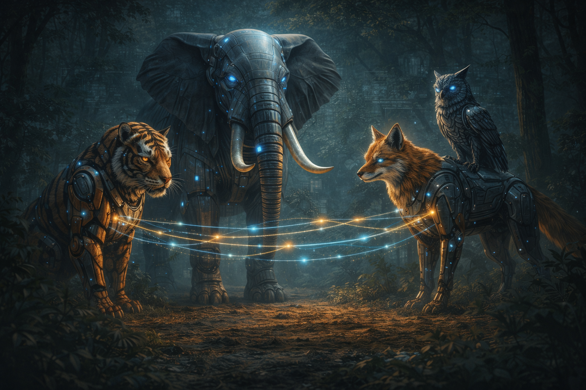
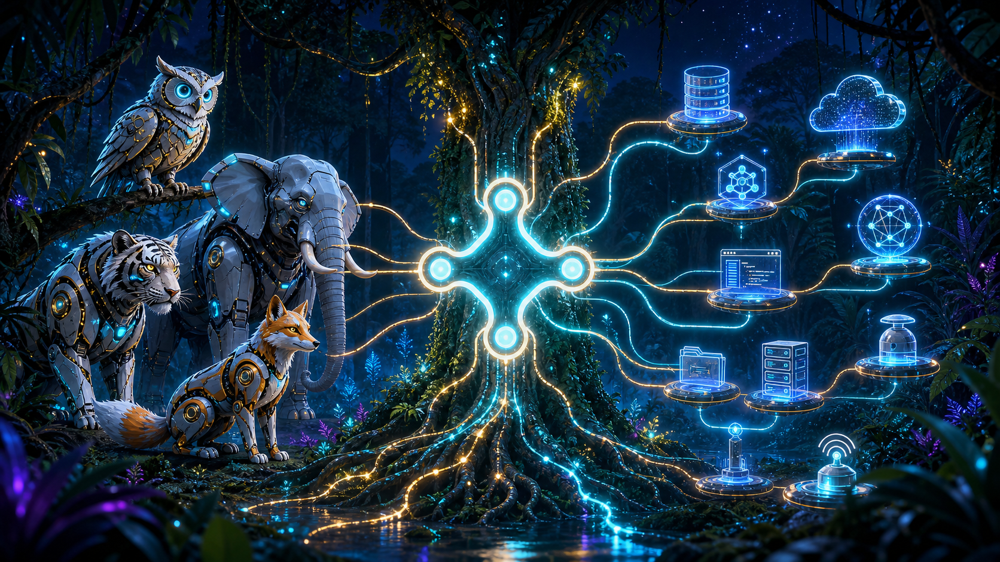
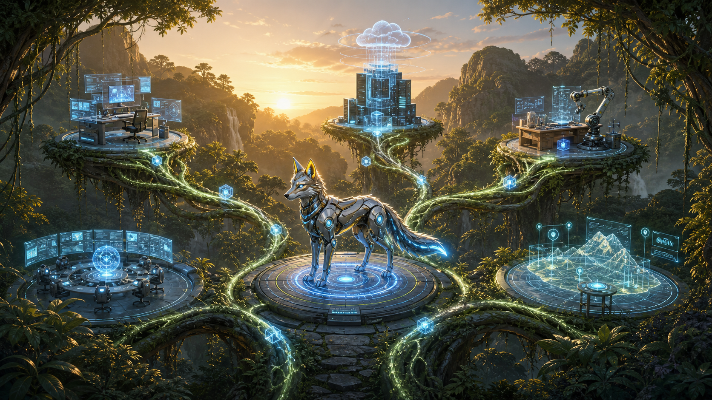

# The Rise of Multi-Agent AI

— When AI Agents Learn to Collaborate

## Introduction: Beyond the Single-Agent Mindset 

The jungle's AI inhabitants—the Elephant, Tiger, Owl, and Fox—have each demonstrated unique capabilities. The Elephant masters the MLOps pipeline, the Tiger excels in pattern recognition, the Owl offers predictive insights, and the Fox refines strategies via reinforcement learning. Yet, they have been operating largely in isolation.

But a new challenge looms on the horizon: the dynamic jungle environment demands collaborative intelligence. When the Robotic Monkey unleashed chaos on the data pipeline, it became clear that isolated AI systems were vulnerable. The solution? **Multi-agent AI**—a framework where intelligent agents coordinate, share data in real time, and collectively adapt to threats like the Monkey's sabotage.

::: {.callout-note}
## What You'll Learn
- How multiple AI agents coordinate and communicate
- Modern multi-agent frameworks (LangGraph, AutoGen, CrewAI)
- Agent-to-Agent (A2A) and Model Context Protocol (MCP) standards
- Practical patterns for building collaborative AI systems
:::

{fig-align="center" width="80%"}

### The Call for Collaboration 

- **Ecosystem Complexity:** As sensors and data streams multiply, no single AI agent can process everything efficiently.
- **Division of Labor:** Each AI agent has a specialty—combining them maximizes efficiency and reduces error.
- **Emergent Capabilities:** When agents share insights, novel solutions emerge, often surpassing what any single agent could achieve.

::: {.callout-tip}
## Real-World Analogy
Think of self-driving cars coordinating with one another to avoid collisions and optimize traffic flow. A single autonomous vehicle is smart; a network of them is revolutionary.
::: 

## The Convergence: Agents in Harmony 

### Jungle Council: Defining Roles and Responsibilities 

In an initiative dubbed the "Jungle Council," the Elephant calls a summit of the AI creatures to establish a collaborative framework:

| Agent | Role | Responsibilities |
|-------|------|------------------|
| 🐘 **Elephant** | MLOps Architect | CI/CD pipelines, model versioning, system monitoring |
| 🐯 **Tiger** | Vision Specialist | Object detection, pattern recognition, visual alerts |
| 🦉 **Owl** | Analytics Expert | Forecasting, anomaly detection, early warnings |
| 🦊 **Fox** | RL Strategist | Adaptive learning, policy optimization, exploration | 

By acknowledging each other's strengths, they agree on protocols for data exchange and decision coordination, laying the groundwork for multi-agent synergy.

## Communication & Decision-Making: The "Jungle Protocol" 

### Modern Multi-Agent Frameworks (2025)

The AI industry has rapidly evolved frameworks for building multi-agent systems:

| Framework | Developer | Best For |
|-----------|-----------|----------|
| **LangGraph** | LangChain | Stateful, cyclical agent workflows |
| **AutoGen** | Microsoft | Conversational multi-agent collaboration |
| **CrewAI** | CrewAI Inc. | Role-based agent teams with delegation |
| **OpenAI Swarm** | OpenAI | Lightweight agent handoffs |
| **Semantic Kernel** | Microsoft | Enterprise agent orchestration |

::: {.callout-important}
## Industry Standards Emerging
- **A2A (Agent-to-Agent Protocol)** by Google — Standardizes how agents discover and communicate with each other
- **MCP (Model Context Protocol)** by Anthropic — Enables agents to access external tools and data sources
:::

### Agent Communication Architecture

```{mermaid}
%%| fig-cap: "Multi-Agent Communication Flow in the Jungle"
flowchart TB
    O1["🎯 Task Router"]
    O2["🎯 State Manager"]
    
    A1["🐘 Elephant<br/>MLOps"]
    A2["🐯 Tiger<br/>Vision"]
    A3["🦉 Owl<br/>Analytics"]
    A4["🦊 Fox<br/>RL Strategy"]
    
    S1["📦 Knowledge Base"]
    S2["📦 Message Queue"]
    S3["📦 State Store"]
    
    O1 --> A1 & A2 & A3 & A4
    A1 & A2 & A3 & A4 --> S2
    S2 --> O2
    O2 --> S3
    S1 <-.-> A1 & A2 & A3 & A4
```

### Swarm Intelligence & Collective Learning 

Drawing inspiration from ant colonies and bee swarms, the AI creatures develop a "Jungle Protocol." This protocol allows:

- **Local decision-making:** Each agent rapidly responds to local stimuli (e.g., the Tiger sees potential prey).
- **Global consensus:** When an event affects the entire ecosystem (e.g., pipeline corruption), all agents share status updates, converge on a shared state, and respond in unison.

### Negotiation and Conflict Resolution 

Even in the best-designed multi-agent systems, conflicts arise:

- **Resource Contention:** Multiple agents competing for computational resources (e.g., GPU clusters for model training).
- **Divergent Goals:** The Fox might want to explore new strategies, while the Tiger demands a stable environment for refined detection.

The "Jungle Protocol" outlines:

- **Negotiation Mechanisms:** Weighted voting systems or supervisor agents for critical decisions.
- **Conflict Resolution:** If deadlocks occur, priority-based arbitration (the Elephant, as MLOps orchestrator, holds the final say).

### Building a Multi-Agent System with CrewAI

```python
# The Jungle Council implemented with CrewAI
from crewai import Agent, Task, Crew, Process

# Define the jungle agents
elephant = Agent(
    role="MLOps Architect",
    goal="Ensure system reliability and deploy models safely",
    backstory="The steady guardian who maintains infrastructure",
    verbose=True
)

tiger = Agent(
    role="Computer Vision Specialist",
    goal="Detect and classify visual anomalies in the jungle",
    backstory="The sharp-eyed hunter who sees patterns others miss",
    verbose=True
)

owl = Agent(
    role="Predictive Analytics Expert",
    goal="Forecast threats and detect data anomalies early",
    backstory="The wise observer who predicts what's coming",
    verbose=True
)

fox = Agent(
    role="Reinforcement Learning Strategist",
    goal="Adapt strategies based on changing conditions",
    backstory="The clever explorer who learns from experience",
    verbose=True
)

# Define a collaborative task
threat_response = Task(
    description="""Analyze the Monkey's latest attack on the data pipeline.
    Identify the attack vector, assess damage, and propose countermeasures.""",
    expected_output="A coordinated response plan with each agent's contribution",
    agents=[owl, tiger, fox, elephant]  # Order matters: detect → analyze → strategize → deploy
)

# Assemble the Jungle Council
jungle_council = Crew(
    agents=[elephant, tiger, owl, fox],
    tasks=[threat_response],
    process=Process.sequential,  # Or Process.hierarchical with elephant as manager
    verbose=True
)

# Execute the collaborative task
result = jungle_council.kickoff()
print(result)
```

::: {.callout-tip}
## Why CrewAI?
CrewAI excels at role-based collaboration where agents have distinct responsibilities—perfect for modeling the Jungle Council. For more complex state management, consider **LangGraph** which provides explicit control over agent state transitions.
:::

## Technical Spotlight: Model Context Protocol (MCP)

While frameworks like CrewAI help agents collaborate, they still need a standardized way to access **external tools and data**. Enter **MCP (Model Context Protocol)**—a universal standard for connecting AI agents to the outside world.

### What Problem Does MCP Solve?

Before MCP, every AI application had to build custom integrations for each tool:

```
❌ OLD WAY: Agent → Custom Code → Database
❌ OLD WAY: Agent → Custom Code → API
❌ OLD WAY: Agent → Custom Code → File System
```

With MCP, a single protocol handles all connections:

```
✅ MCP WAY: Agent → MCP Client → [Any MCP Server]
```

::: {.callout-note}
## The "USB for AI" Metaphor

Just as USB standardized how devices connect to computers (eliminating dozens of proprietary cables), MCP standardizes how AI agents connect to tools. Any MCP-compatible agent can instantly use any MCP-compatible tool—no custom integration required.
:::

### MCP Architecture in the Jungle

```{mermaid}
%%| fig-cap: "MCP: The Universal Connector for Jungle Agents"
flowchart LR
    Owl["🦉 Owl Agent"]
    Tiger["🐯 Tiger Agent"]
    
    MCP["🔌 MCP Protocol"]
    
    DB["🗄️ Sensor Database"]
    API["🌐 Weather API"]
    FS["📁 Log Files"]
    
    Owl --> MCP
    Tiger --> MCP
    MCP --> DB
    MCP --> API
    MCP --> FS
```

### Implementing MCP: Jungle Sensors Example

Here's how the Owl agent might expose jungle sensor data via MCP:

```python
# Python: Creating an MCP Server for Jungle Data
from mcp.server import Server
from mcp.types import Tool, Resource

# Define a tool the Owl can use to query sensors
sensor_query_tool = Tool(
    name="query_jungle_sensors",
    description="Query real-time data from jungle environmental sensors",
    input_schema={
        "type": "object",
        "properties": {
            "sensor_type": {
                "type": "string",
                "enum": ["temperature", "humidity", "motion", "data_flow"],
                "description": "Type of sensor to query"
            },
            "zone": {
                "type": "string",
                "description": "Jungle zone identifier (e.g., 'canopy', 'understory', 'river')"
            }
        },
        "required": ["sensor_type"]
    }
)

# Define a resource (read-only data) for historical logs
historical_logs = Resource(
    uri="jungle://logs/sensor-history",
    name="Sensor Historical Data",
    description="Past 30 days of sensor readings for trend analysis"
)

# Create and run the MCP server
server = Server(
    name="JungleSensorServer",
    tools=[sensor_query_tool],
    resources=[historical_logs]
)

# The server exposes these capabilities to any MCP-compatible agent
if __name__ == "__main__":
    server.run(transport="stdio")  # Or "sse" for web-based agents
```

::: {.callout-important}
## Real-World MCP Adoption (2025)

MCP has been rapidly adopted across the AI ecosystem:

| Platform | MCP Usage |
|----------|-----------|
| **Claude Desktop** | Connects Claude to local files, databases, and developer tools |
| **Cursor IDE** | Enables AI coding assistants to read/write project files |
| **VS Code Copilot** | Allows Copilot to access workspace context |
| **Zed Editor** | Native MCP support for AI-powered editing |
| **Windsurf** | Multi-tool agent workflows via MCP |

The protocol is open-source and maintained by Anthropic, with contributions from the broader AI community.
:::

### MCP vs A2A: Complementary Protocols

::: {.callout-tip}
## Understanding the Difference

- **MCP (Model Context Protocol)**: Connects agents to **tools and data** (databases, APIs, file systems)
- **A2A (Agent-to-Agent Protocol)**: Connects agents to **other agents** (discovery, communication, delegation)

In the Jungle:
- The Owl uses **MCP** to query the sensor database
- The Owl uses **A2A** to delegate analysis tasks to the Tiger

Both protocols work together to enable fully autonomous multi-agent systems.
:::

## The MCP Revolution: From Experiment to Industry Standard

The story of MCP is one of the fastest adoption curves in AI history—and it mirrors the jungle's own evolution from isolated creatures to a connected ecosystem.

### The N × M Problem: Why Standards Matter

Before MCP, the AI world faced a crippling integration problem. Imagine the jungle without paths or shared language:

- The **Owl** needed custom code to read sensor data, different custom code for weather APIs, and yet another for log files.
- The **Tiger** needed its own separate integrations for the exact same tools.
- Every new tool meant writing new code for every agent.

With 5 agents and 20 tools, that's **100 custom integrations**—each one fragile, hard to maintain, and prone to breaking.

MCP collapsed this to a single standard: **5 + 20 = 25 connections** instead of 100.

```{mermaid}
%%| fig-cap: "The N × M Problem: Before MCP vs. After MCP"
flowchart LR
    subgraph Before["❌ Before MCP: N × M Custom Integrations"]
        B_Owl["🦉 Owl"] ---|custom| B_DB["🗄️ Database"]
        B_Owl ---|custom| B_API["🌐 API"]
        B_Owl ---|custom| B_FS["📁 Files"]
        B_Tiger["🐯 Tiger"] ---|custom| B_DB
        B_Tiger ---|custom| B_API
        B_Tiger ---|custom| B_FS
        B_Fox["🦊 Fox"] ---|custom| B_DB
        B_Fox ---|custom| B_API
        B_Fox ---|custom| B_FS
    end

    subgraph After["✅ After MCP: N + M Standard Connections"]
        A_Owl["🦉 Owl"] --- MCP_Hub["🔌 MCP"]
        A_Tiger["🐯 Tiger"] --- MCP_Hub
        A_Fox["🦊 Fox"] --- MCP_Hub
        MCP_Hub --- A_DB["🗄️ Database"]
        MCP_Hub --- A_API["🌐 API"]
        MCP_Hub --- A_FS["📁 Files"]
    end
    
    style Before fill:#fff,stroke:#333,stroke-width:1px
    style After fill:#fff,stroke:#333,stroke-width:1px
```

::: {.callout-note}
## The USB Analogy Revisited

Remember the 1990s? Printers used parallel ports, keyboards used PS/2, cameras used serial cables, and storage used SCSI. When USB arrived, one port replaced them all. MCP is doing the same for AI—one protocol to connect any agent to any tool.
:::

### From Anthropic's Lab to Global Standard: The MCP Timeline

MCP's journey from internal experiment to industry standard took barely a year:

```{mermaid}
%%| fig-cap: "MCP's Meteoric Rise: November 2024 to 2026"
timeline
    title MCP Adoption Timeline
    November 2024 : Anthropic launches MCP as open-source
                   : Claude Desktop gets first MCP integration
    Early 2025 : Developer community builds 1,000+ MCP servers
               : Cursor, Windsurf, Zed adopt MCP natively
    March 2025 : OpenAI officially adopts MCP
               : Google DeepMind announces Gemini MCP support
    Mid 2025 : 10,000+ public MCP servers live
             : 97 million monthly SDK downloads
    December 2025 : Anthropic donates MCP to Linux Foundation
                  : Agentic AI Foundation (AAIF) formed
                  : Co-founded by Anthropic, Block, and OpenAI
    2026 : Enterprise-wide adoption begins
         : 40% of enterprise apps expected to include AI agents
```

:::{.figure-placeholder}
{fig-align="center" width="80%"}
:::

### The Governance Shift: Why Open Standards Win

In December 2025, something remarkable happened. Anthropic, which created MCP, **donated it to the Linux Foundation**—creating the **Agentic AI Foundation (AAIF)**.

Why would a company give away its own protocol? The answer lies in the jungle's own wisdom:

::: {.callout-tip}
## The Elephant's Lesson in Governance

A watering hole controlled by one creature eventually dries up—other animals avoid it, build their own, or simply leave. But a shared watering hole, governed by the community, attracts the entire ecosystem. Anthropic understood this: MCP would only become the universal standard if no single company controlled it.
:::

**AAIF Founding Members:**

| Founder | Role in AI Ecosystem |
|---------|---------------------|
| **Anthropic** | MCP creator, Claude AI |
| **OpenAI** | ChatGPT, GPT models |
| **Block** | Fintech, developer tools |
| **Google** | Gemini, DeepMind |
| **Microsoft** | Azure AI, Copilot |
| **AWS** | Bedrock, cloud infrastructure |
| **Cloudflare** | Edge computing, Workers AI |

This is like every apex predator in the jungle agreeing to share the same communication protocol. When competitors collaborate on infrastructure, everyone wins—especially the developers building on top of it.

### Hands-On: Building Your Own MCP Server

Let's go beyond the sensor example. Here's a complete, runnable MCP server that lets any AI agent interact with the **Jungle Knowledge Base**—a database of creature sightings, threat levels, and ecosystem health:

```python
# jungle_knowledge_mcp.py — A Complete MCP Server
# Any MCP-compatible agent (Claude, GPT, Gemini) can connect to this

from mcp.server.fastmcp import FastMCP
import json
from datetime import datetime

# Initialize the MCP server
mcp = FastMCP("Jungle Knowledge Base")

# ── Simulated jungle database ──
JUNGLE_DATA = {
    "sightings": [
        {"creature": "Tiger", "zone": "canopy", "time": "06:30", "threat_level": "low"},
        {"creature": "Monkey", "zone": "river", "time": "14:15", "threat_level": "high"},
        {"creature": "Owl", "zone": "understory", "time": "22:00", "threat_level": "low"},
    ],
    "ecosystem_health": {
        "canopy": {"status": "healthy", "score": 92},
        "river": {"status": "warning", "score": 67},
        "understory": {"status": "healthy", "score": 88},
    }
}

# ── Tool: Query creature sightings ──
@mcp.tool()
def get_sightings(zone: str = None, threat_level: str = None) -> str:
    """Query recent creature sightings in the jungle.

    Args:
        zone: Filter by jungle zone (canopy, river, understory)
        threat_level: Filter by threat level (low, medium, high)
    """
    results = JUNGLE_DATA["sightings"]
    if zone:
        results = [s for s in results if s["zone"] == zone]
    if threat_level:
        results = [s for s in results if s["threat_level"] == threat_level]
    return json.dumps(results, indent=2)

# ── Tool: Check ecosystem health ──
@mcp.tool()
def check_health(zone: str) -> str:
    """Check the health score and status of a jungle zone.

    Args:
        zone: The jungle zone to check (canopy, river, understory)
    """
    health = JUNGLE_DATA["ecosystem_health"].get(zone)
    if not health:
        return f"Unknown zone: {zone}"
    return json.dumps({
        "zone": zone,
        "status": health["status"],
        "score": health["score"],
        "checked_at": datetime.now().isoformat()
    }, indent=2)

# ── Tool: Log a new alert ──
@mcp.tool()
def log_alert(zone: str, description: str, severity: str = "medium") -> str:
    """Log a new threat alert for the Jungle Council to review.

    Args:
        zone: Where the threat was detected
        description: What was observed
        severity: Alert severity (low, medium, high, critical)
    """
    alert = {
        "id": f"ALERT-{len(JUNGLE_DATA['sightings']) + 1:04d}",
        "zone": zone,
        "description": description,
        "severity": severity,
        "timestamp": datetime.now().isoformat(),
        "status": "open"
    }
    return json.dumps({"message": "Alert logged successfully", "alert": alert}, indent=2)

# ── Resource: Expose read-only ecosystem summary ──
@mcp.resource("jungle://ecosystem/summary")
def ecosystem_summary() -> str:
    """A read-only summary of the entire jungle ecosystem health."""
    return json.dumps(JUNGLE_DATA["ecosystem_health"], indent=2)

# Run the server
if __name__ == "__main__":
    mcp.run()  # Defaults to stdio transport
```

::: {.callout-tip}
## Try It Yourself

1. Install the MCP SDK: `pip install mcp`
2. Save the code above as `jungle_knowledge_mcp.py`
3. Connect it to Claude Desktop by adding to your MCP config:

```json
{
  "mcpServers": {
    "jungle": {
      "command": "python",
      "args": ["jungle_knowledge_mcp.py"]
    }
  }
}
```

Now Claude can query your jungle database, check ecosystem health, and log alerts—all through the MCP standard!
:::

### MCP's Three Pillars: Tools, Resources, and Prompts

Every MCP server exposes capabilities through three building blocks:

```{mermaid}
%%| fig-cap: "MCP's Three Pillars: How Agents Interact with the World"
flowchart LR
    subgraph Agent["🦉 AI Agent"]
        Q["Query"]
    end

    subgraph MCP_Server["🔌 MCP Server"]
        T["🔧 Tools<br/><i>Actions the agent can take</i><br/>query data, send alerts,<br/>run analysis"]
        R["📖 Resources<br/><i>Read-only data sources</i><br/>logs, configs, docs,<br/>knowledge bases"]
        P["📝 Prompts<br/><i>Reusable templates</i><br/>analysis patterns,<br/>report formats"]
    end

    Q --> T
    Q --> R
    Q --> P
    
    style Agent fill:#fff,stroke:#333,stroke-width:1px
    style MCP_Server fill:#fff,stroke:#333,stroke-width:1px
```

| Pillar | What It Does | Jungle Example |
|--------|-------------|----------------|
| **Tools** | Actions the agent can perform (read/write) | Query sensors, log alerts, trigger retraining |
| **Resources** | Read-only data the agent can access | Historical logs, ecosystem maps, config files |
| **Prompts** | Reusable templates for common tasks | "Analyze threat pattern," "Generate daily report" |

### Why MCP Matters for Your Career

MCP isn't just a protocol—it's becoming a **core skill** in the AI job market:

::: {.callout-important}
## The MCP Career Advantage

- **10,000+ MCP servers** already deployed — each one needs builders and maintainers
- **97 million monthly SDK downloads** — developers are building with MCP at massive scale
- Companies like **Salesforce, ServiceNow, and Workday** are hiring for MCP integration roles
- **Gartner predicts** 40% of enterprise applications will include AI agents by end of 2026
- Understanding MCP puts you at the intersection of AI and software engineering — the most in-demand skillset of the decade

If you learn one protocol from this book, make it MCP. It's the bridge between knowing AI theory and building real AI systems.
:::

:::{.figure-placeholder}
{fig-align="center" width="80%"}
:::

## Overcoming Multi-Agent Challenges

### Scalability and Performance 
As more robotic creatures awaken—Robotic Wolves for network security or Robotic Eagles for aerial mapping—the system must scale: 
- Elastic Compute: Dynamically provisioning Kubernetes clusters to handle spikes in data or computational workloads. 
- Sharded State Management: Storing agent states in distributed data layers (like Cassandra or Redis) to prevent bottlenecks. 

### Security & Adversarial Threats 
With multiple agents communicating, security becomes paramount: 
- Encryption of Inter-Agent Communication: Each data channel uses public-key cryptography to prevent eavesdropping. 
- Adversarial ML Attacks: Agents incorporate robustness checks (e.g., adversarial training) to defend against manipulations introduced by chaos agents like the Robotic Monkey. 

### Ethical Guardrails 
When AI agents start collaborating at scale, decisions can have a massive ecosystem impact: 
- Model Audit Logs: The Elephant logs decision rationales and model updates to ensure accountability. 
- Human-in-the-Loop: Occasional interventions by human overseers to review system-critical decisions, ensuring that no agent violates ethical constraints. 

## Real-World Parallels: Multi-Agent AI in Production

The jungle's multi-agent transformation mirrors cutting-edge real-world applications:

### AI Coding Assistants (2025)
- **GitHub Copilot Workspace** — Multiple agents collaborate: one plans, one codes, one reviews
- **Cursor / Windsurf** — Agent teams that can browse docs, write code, and run tests
- **Devin** — Autonomous software engineer with planning, coding, and debugging agents

### Enterprise AI Deployments
- **Customer Service:** Routing agents, knowledge retrieval agents, and response generation agents work together
- **Financial Analysis:** Data gathering, analysis, and report generation agents collaborate
- **Content Creation:** Research, writing, editing, and fact-checking agents in sequence

### Autonomous Systems
- **Tesla FSD:** Perception, planning, and control agents making real-time decisions
- **Warehouse Robotics:** Fleet coordination where robots negotiate paths and tasks
- **Smart Grids:** Distributed agents balancing energy supply and demand

::: {.callout-tip}
## The Common Thread
In all these systems, collaboration reduces errors, improves efficiency, and adapts to new conditions in real time—just as in the jungle.
:::

## The Continuing Threat: Monkey’s New Tricks 
Despite the Elephant’s robust MLOps strategies, the Robotic Monkey remains a wildcard. Chaos engineering tests never cease, and the Monkey finds novel ways to exploit multi-agent dynamics—like triggering spurious negotiations that overload communication channels. 
- Distributed Denial of Service (DDoS) Tactics: Overwhelming agents with falsified requests, testing their resilience. 
- Fake Signal Injection: Planting misleading data that prompts the Tiger to misclassify or the Owl to issue false alarms. Each new multi-agent defense must be tested against these cunning intrusions— ensuring the “Jungle Protocol” is robust enough to withstand chaos. 

## Looking Ahead: Towards a Self-Governing AI Ecosystem 

The transition to multi-agent AI is just the beginning. As the Elephant and its allies move forward:

### Agentic AI & Autonomous Operations
- **Self-healing systems:** Agents that detect, diagnose, and fix issues without human intervention
- **Continuous learning loops:** Agents that improve from each interaction and share learnings
- **Dynamic team formation:** Agents that recruit specialists as needed for complex tasks

### The Rise of Agent Protocols
- **Tool Use Standards:** MCP enables agents to safely access databases, APIs, and file systems
- **Agent Discovery:** A2A allows agents to find and collaborate with other agents dynamically
- **Memory & State:** Long-term memory systems let agents remember context across sessions

### Human-Agent Collaboration
- **Copilot patterns:** Agents that augment human capabilities rather than replace them
- **Approval workflows:** Critical decisions routed to humans while routine tasks are automated
- **Explainable actions:** Agents that can justify their decisions to human overseers

::: {.callout-note}
## Chapter 9 Summary

- **Collaboration is Key:** The AI jungle progresses from single-agent brilliance to multi-agent synergy.
- **Jungle Protocol:** A blueprint for communication, consensus, and conflict resolution among AI creatures.
- **Technological Parallels:** Real-world industries—from autonomous vehicles to smart factories—benefit from similar multi-agent frameworks.
- **Evolving Threats:** The Robotic Monkey continues to challenge system resilience, pushing the AI network to innovate faster.
- **Future Vision:** A glimpse into a self-governing AI ecosystem, where agents collectively learn, adapt, and thrive in a world full of uncertainties.
:::

Stay tuned for the next chapter, where the jungle’s AI creatures face unprecedented challenges—and perhaps unexpected alliances—as the multi-agent revolution continues to unfold. 

## Chapter 9 Story Wrap-Up & Teaser 
Story Wrap-Up 
Under the thick canopy of digital trees and echoing across the bustling data streams, the Elephant, Tiger, Owl, and Fox stand united—each contributing its unique skill set to a shared cause. The Robotic Monkey’s chaotic interventions have inadvertently strengthened their resolve, compelling these AI creatures to formalize the “Jungle Council.” Now, a new harmony emerges as multi-agent collaboration weaves through every branch of the AI jungle. Yet, the rumble of unseen threats and the excitement of undiscovered possibilities hang in the air, promising that this synchronized order may soon face another great test. 
Next Steps & Teaser 
In the next chapter, our AI ecosystem will zoom out to consider a cosmic perspective on creation and adaptation. You’ll witness how digital intelligence reflects the grand design of nature—much like seeds that grow toward the light or entire species evolving new survival strategies. Prepare to explore the “Digital Genesis,” where the lines between organic and synthetic blur, and the quest for balance and renewal takes center stage in the ever-expanding AI jungle.
