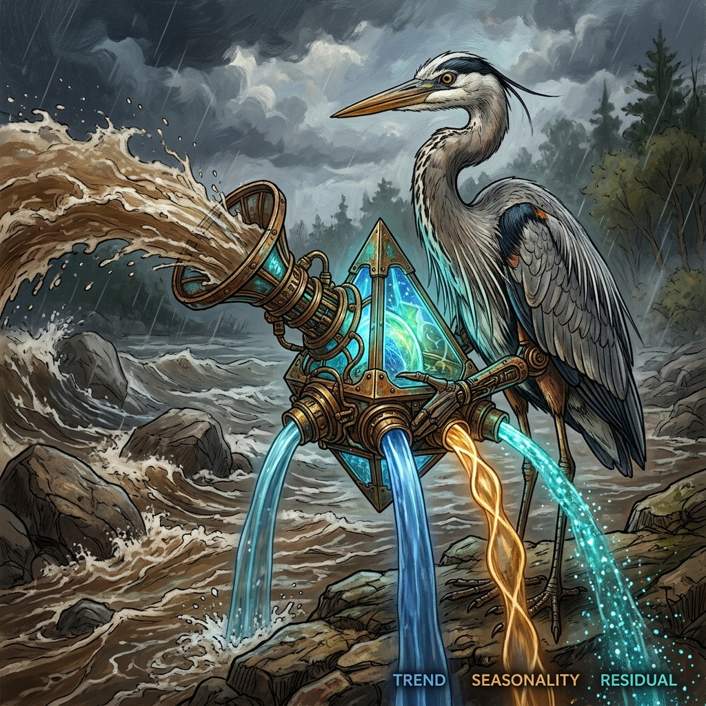

# The Tide-Reader: Forecasting the Currents of Time

## Introduction: The River that Speaks in Layers

At the edge of the AI Jungle, where the canopy opens and the river widens into silver bands, stands the Robotic Heron. Its legs are thin titanium reeds. Its eyes are polished lenses that never rush. While the Tiger watches movement and asks, "What kind of creature is this?" and the Owl listens for strange cries and asks, "Is something unusual happening?" the Heron asks a quieter question:

*What will the river do next?*

{fig-align="center" width="80%"}

The river never speaks in a single voice. Today's flow carries yesterday's rain, last week's heat, last season's meltwater, and a thousand small accidents: fallen branches, sudden storms, wandering fish, cracked stones under the current. To an impatient machine, the river looks like a jagged line. To the Heron, it is a layered message.

Time-series forecasting is the art of reading that message. It asks: given how the river behaved yesterday, last week, and last season, what will tomorrow's flow look like? Not whether today's flow is unusual. Not which category today's flow belongs to. Forecasting asks where the river is going.

That distinction matters. Classification is the Tiger's leap: decide whether a pawprint belongs to deer, boar, or leopard. Anomaly detection is the Owl's night call: notice when the normal rhythm breaks. Forecasting is the Heron's stillness: watch the current long enough to sense its direction before the bend arrives.

In machine learning terms, a time series is data ordered through time: hourly electricity demand, daily website traffic, weekly sales, monthly rainfall. The order is not decoration. Time is the structure. Shuffle the observations and the river loses its grammar.

The Heron's wisdom begins here: the future is not random fog. It is partly memory, partly rhythm, and partly surprise.

## When You Need Forecasting

Forecasting is useful whenever a decision must be made before the future arrives.

A utility company forecasts energy grid demand so it can prepare enough electricity for tomorrow's heat wave without wasting fuel today. Demand often rises in the evening, shifts with weather, and changes across weekdays, weekends, and holidays. The river has a daily pulse and a seasonal swell.

An e-commerce retailer forecasts inventory so popular products are available before customers ask for them. Too little stock means lost sales. Too much stock means money trapped in shelves and warehouses. The river may surge during festivals, promotions, school seasons, or paydays.

A telecom company forecasts network capacity so streaming, calls, and data traffic do not overwhelm towers and routers. Usage may rise during commute hours, sports events, storms, or major software releases. The river flows differently at dawn, at lunch, and after sunset.

But forecasting is not one-size-fits-all. Some rivers rise slowly over years. Some pulse every day. Some are ruled by holidays. Some are mostly steady until sudden change. Different patterns need different reading methods.

The Heron has learned four tide-reading methods over many seasons: STL, Holt-Winters, ARIMA, and Prophet. Each method sees the river differently. The useful question is not "Which method is best?" It is "What kind of river am I reading?"

## The Heron's Three Lenses: Decomposing the River

Before forecasting tomorrow, the Heron separates today's river into layers.

The fundamental idea is decomposition. Any observed time series can often be understood as the combination of three forces:

```text
Observed flow  =  Trend (long-run direction)
              +  Seasonal (repeating pattern)
              +  Residual (what's left)
```

The trend is the river's long-run direction. Is the waterline rising year after year? Is demand slowly growing as more customers arrive? Is traffic declining as users move elsewhere? Trend is the slow story.

The seasonal component is the repeating rhythm. It may be daily, weekly, monthly, or annual. The river may swell every monsoon, web traffic may spike every Monday morning, and electricity demand may rise every summer afternoon. Seasonality is the drumbeat.

The residual is what remains after trend and seasonality are removed. It is the splash, the eddy, the loose branch, the sudden gust. Residuals may contain random noise, measurement errors, shocks, or true anomalies. They are important precisely because they are what the usual pattern cannot explain.

```{mermaid}
flowchart LR
  A["Observed flow<br/>river history"] --> B["Robotic Heron<br/>patient tide reader"]
  B --> C["Glowing prism<br/>decomposition"]
  C --> D["Trend<br/>slow long run direction"]
  C --> E["Seasonal pulse<br/>repeating moon pull"]
  C --> F["Residual<br/>eddies and surprises"]
```

This prism is one of the most practical ideas in forecasting. If you look only at raw values, you may mistake a normal seasonal rise for danger. If you ignore trend, you may set thresholds that were sensible last year but useless now. If you ignore residuals, you may miss the part of the river that is truly unexpected.

The Heron does not ask the raw river to explain everything at once. It separates the current into layers, studies each layer, and then recombines them into a forecast.

*The Heron murmurs, "First divide the song. Then listen."*

## STL — The Robust Decomposer

{fig-align="center" width="80%"}

STL stands for Seasonal-Trend decomposition using LOcally Estimated Scatterplot Smoothing. The name is long, but the idea is friendly: STL gently smooths the time series to estimate its long-run trend, estimates the repeating seasonal pattern, and leaves behind the residual.

In the jungle metaphor, STL is the Heron's glowing prism made sturdy. It does not shatter when a single flash flood rushes through. If one day the river surges because a storm breaks upstream, STL can reduce that event's influence on the estimated seasonal pattern. This is why STL is often described as robust to outliers.

That robustness matters. Suppose a retailer usually sees higher sales every December. One December, a warehouse outage causes sales to crash for three days. A fragile method might learn the wrong lesson and think December itself is weaker than usual. STL is more patient. It can treat the outage as a strange residual event rather than rewriting the whole seasonal rhythm.

STL works best when it has enough history to see the seasonal pattern repeat. As a rule of thumb, it needs at least two full seasonal cycles. For annual seasonality, that means at least two years of data. For weekly seasonality in daily data, two or more weeks may be enough to begin, though more history is better.

The output of STL is not a forecast by itself. It gives you the components: trend, seasonal, and residual. You can then model or extrapolate those pieces, or use the residual for anomaly detection. This point is crucial: when searching for anomalies in a seasonal series, flag the residual, not the raw value. A high value during a known seasonal peak may be completely normal. A modest value at the wrong time may be suspicious.

{fig-align="center" width="90%"}

In real Python work, STL is available in `statsmodels`, and many modern time-series libraries build on the same idea. It is one of the Heron's most dependable tools when the river has a clear repeating pulse and enough history to reveal it.

::: {.callout-note}
### Jargon Buster: LOESS

**LOESS** is a smoothing method that fits small local curves instead of one global line. Imagine the Heron studying each bend of the river with nearby observations, then stitching those local readings into a smoother view of the whole current.
:::

## Holt-Winters — The Three Smoothers

Holt-Winters forecasting is built from exponential smoothing, a family of methods that give more weight to recent observations while still remembering the past. The method runs three weighted memories in parallel: level, trend, and season.

The level is where the river is now. If demand has recently settled around 10,000 units per day, the level captures that current baseline.

The trend is how quickly the river is moving upward or downward. If demand has been rising by 100 units per week, the trend captures that slope.

The seasonal component is the current repeating effect. If Saturdays are usually higher than weekdays, or summer afternoons are usually hotter and more energy-hungry than spring mornings, the seasonal smoother remembers that pattern.

Each component has its own smoothing parameter. Alpha controls how quickly the level reacts. Beta controls how quickly the trend reacts. Gamma controls how quickly the seasonal pattern reacts. Higher values make the model more responsive to recent changes. Lower values make it more stable and less jumpy.

This is the Heron's three weighted memories: recent water at its feet, the midstream direction, and the old seasonal pull of the moon. Combine them and the Heron can forecast the next moment quickly.

Holt-Winters comes in two common flavors. Additive seasonality assumes the seasonal swing has roughly constant size. If December sales are usually 500 units above average whether the business is small or large, additive may fit. Multiplicative seasonality assumes the seasonal swing scales with the level. If December sales are usually 30 percent above average, and that uplift grows as the business grows, multiplicative may fit better.

Compared with STL, Holt-Winters can work on shorter histories. It often needs around one full seasonal cycle to begin estimating the seasonal pattern. It is also fast, making it useful when many forecasts must be produced frequently.

Its weakness is that it is not naturally robust to outliers. A sudden flash flood can pull the smoothed memories in the wrong direction. For rivers with many shocks, the Heron may clean the data first or choose a more robust method.

::: {.callout-tip}
### Jargon Buster: Exponential Smoothing

**Exponential smoothing** means recent observations receive the strongest weight, and older observations fade gradually rather than disappearing all at once. The memory decays like ripples spreading from the Heron's feet.
:::

## ARIMA and Its Cousins — The Statistician's Forecast

ARIMA stands for AutoRegressive Integrated Moving Average. It is one of the classic statistical approaches to forecasting, and it remains valuable because it treats uncertainty seriously.

ARIMA has three core parameters: `p`, `d`, and `q`.

The `p` term is autoregressive. It asks how much the current value depends on previous values. If today's river flow is strongly related to yesterday's flow, autoregression helps capture that memory.

The `d` term is integrated, which usually means differencing. Instead of modeling the raw water level, the model may look at changes from one time step to the next. This helps make a series more stationary.

The `q` term is moving average. It models the influence of past forecast errors. If the Heron overestimated yesterday, that error may contain useful information for correcting today's forecast.

Seasonal ARIMA, often called SARIMA, adds seasonal parameters: `P`, `D`, `Q`, and `m`. The `m` represents the seasonal period, such as 7 for weekly seasonality in daily data or 12 for monthly data with annual seasonality.

ARIMA's great strength is rigorous statistical inference. It can produce meaningful confidence intervals and leave a clear audit trail. This makes it useful when the question is not only "What is the forecast?" but also "How uncertain is the forecast, and can we defend the method?"

{fig-align="center" width="90%"}

Its weakness is that it expects the series to be stationary, meaning its statistical behavior is stable over time. In plain language, the mean and variance should not drift wildly. Differencing often helps, but choosing the right parameters can take care. Auto-ARIMA tools search the parameter grid for you, but the Heron still inspects the result.

Choose ARIMA when you have relatively small data, need uncertainty estimates, and want a classical statistical explanation.

::: {.callout-note}
### Jargon Buster: Stationary

**Stationary** means the river's statistical behavior stays roughly stable. The water can move, but its average level and volatility should not keep changing shape in ways the model has not accounted for.
:::

## Prophet — The Calendar-Aware Sage

Prophet is a modern forecasting library released by Meta. It was designed for business time series where calendars matter: holidays, promotions, weekends, fiscal periods, school schedules, and other human-made rhythms.

Prophet decomposes a series into parts that look familiar to the Heron:

```text
y(t) = trend(t) + season(t) + holiday(t) + noise
```

The trend captures long-run growth or decline. The seasonal component captures repeating rhythms such as weekly or yearly cycles. The holiday component captures known calendar events. Noise is what remains.

This calendar awareness is Prophet's signature strength. It includes built-in support for U.S. federal holidays, and users can add custom calendars: fiscal quarters, school years, religious observances, regional events, or company-specific busy periods. For many business rivers, these calendar stones shape the current more than pure physics does.

Prophet also auto-detects change points in the trend. A change point is a place where the river's long-run direction shifts. Perhaps growth accelerates after a product launch. Perhaps traffic flattens after a market matures. Prophet can identify these bends without requiring the analyst to specify every one manually.

Another practical advantage is forgiveness. Prophet can handle missing data and outliers better than many older methods. It is often approachable for business analysts who understand the domain but are not full-time machine learning engineers.

That does not make it magic. Prophet can overfit if change-point sensitivity is too high. The Heron may see too many bends in the river and mistake every ripple for a new channel. Still, for calendar-driven business series, Prophet is often an excellent starting point.

*The Heron says, "When humans build calendars, the river learns their rituals."*

::: {.callout-tip}
### Jargon Buster: Change Points

**Change points** are moments when the trend changes direction or speed. They are bends in the river: before the bend, the current follows one path; after it, the path is different.
:::

## Side-by-Side Comparison

| Method | Min history | Holiday support | Robust to outliers | Speed | Best for |
|---|---|---|---|---|---|
| STL | 2+ seasons | Manual | Yes (LOESS) | Fast | Long history with annual season |
| Holt-Winters | 1 season | Manual | No | Fastest | Medium history, fast-changing patterns |
| ARIMA / SARIMA | 50+ observations | Manual | No | Slow on large data | Statistical inference quality |
| Prophet | 12+ weeks | **Built-in** | Moderate | Moderate | Calendar-driven business series |

The table is a map, not a law. A patient Heron still looks at the river before choosing the tool.

If the river has long history and clear repeating seasonality, STL is a strong decomposer. If the river changes quickly and forecasts must be computed cheaply, Holt-Winters is practical. If the forest council demands confidence intervals and statistical reasoning, ARIMA earns its place. If holidays and calendars dominate the current, Prophet often reads the water with less effort.

The best forecasting work usually begins with simple questions. How much history do we have? Is the seasonal pattern daily, weekly, yearly, or something stranger? Are holidays important? Are outliers common? Do we need an interpretable forecast, a fast forecast, or a carefully audited uncertainty range?

The Heron does not worship one method. It matches method to river.

## Common Pitfalls

- **Confusing forecasting with anomaly detection.** Forecasting asks what comes next. Anomaly detection asks whether what happened is unusual. The Owl and the Heron cooperate, but they do not ask the same question.

- **Failing to seasonally adjust before flagging anomalies.** A December sales spike may be ordinary. A quiet day during a normally loud season may be the true warning.

- **Using static thresholds on a series with trend or seasonality.** A fixed line across a rising river will eventually call everything abnormal. Thresholds must respect the current's direction and rhythm.

- **Overfitting Prophet's change-point sensitivity.** Too many change points can create suspiciously good in-sample fits. The Heron should care about future accuracy, not just a beautiful explanation of the past.

- **Ignoring drift.** A model trained on Q1 may be wrong by Q3. Markets shift, weather changes, users adapt, and systems age. Forecasting models need monitoring and retraining.

- **Treating missing values casually.** Gaps in the river record may mean sensor failure, store closure, network outage, or true zero activity. These are not always interchangeable.

- **Forgetting the decision.** A forecast is useful only if it improves action. Predicting tomorrow's flow is not the end; deciding how much capacity, inventory, or energy to prepare is the point.

## Story Bridge

At sunset, the Robotic Heron leaves the riverbank and joins the jungle's growing council. The Owl brings anomaly detection, sharp-eyed in darkness. The Tiger brings classification, decisive in motion. The Fox brings reinforcement learning, testing paths through reward and consequence. The Elephant brings memory, holding long histories in patient layers. The Jaguar brings quantum imagination, exploring strange possibilities at the edge of the known.

The Heron adds temporal foresight. Together, they form a wider intelligence: spatial, temporal, statistical, and decision-aware. Beyond the river, another trail waits, and the jungle will need a new kind of wisdom to follow it.
