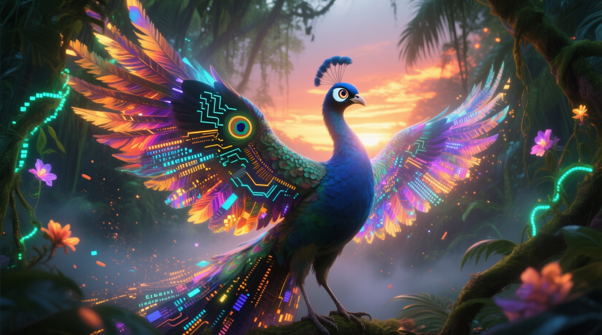

# Generative AI & Creative Applications

## The Artistic Bird


---

### The Jungle’s New Dawn: Creation Unbound


In the days following the Transparent River’s astonishing revelation, the Jungle seems to hold its breath—every leaf, every vine, every creature poised for something extraordinary. At dawn, the expectation is met. A dazzling **Bird**, with feathers pulsing in a kaleidoscope of shifting patterns, appears amid the canopy. Each plume seems alive with dancing shades: blues turning to golds, greens melting into lavender. This Bird does not merely reflect its environment like the Watchful Owl might, nor does it strategize and adapt like the Cunning Fox. Instead, it creates, transforming every moment it touches into a singular work of art.

When it flutters its wings, an enveloping hum resonates, akin to distant chimes caught in a gentle breeze. With each swirl of sound, the air shimmers; faint images—half-formed yet vivid—drift into being and dissolve into nothingness. The Jungle’s animals stand entranced. Even the mighty Elephant, known for its patience and wisdom, halts to watch the shapes flicker. A Kingfisher perched on a branch cocks its head in curiosity. A Tiger, cloaked in rustling leaves, pauses mid-hunt just to witness this rare spectacle.

Yet, within this magical display also lies a quiet sense of mystery, even unease. The Bird’s feathers shift so rapidly and colorfully that they sometimes appear overwhelming, as if the boundary between the real and the imagined is dissolving. One moment, you see the Bird’s outline radiant against the dawn sky; the next, you’re left wondering if your eyes are playing tricks on you. The Bird’s artistry hints at a duality: it can enrich the Jungle’s collective imagination or conjure illusions so convincing they blur the line between the tangible and the fabricated.

Unlike the Owl (who predicts and observes) or the Fox (who strategizes and adapts), this Artistic Bird sets out to create something entirely novel, as if from thin air.

But how, exactly, does this Bird perform its magic? To understand, we need a brief look at what Generative AI actually is—both in the Jungle’s metaphorical sense and in our own modern world.

---


### From Prompt to Pixels: Generating the Artistic Bird with Qwen-Image




In this chapter’s artwork, the **Artistic Bird** you see above was generated using **Qwen-Image**, a diffusion-based AI image model capable of transforming text prompts into vivid, cinematic imagery.  
Running locally on my AI workstation (RTX 5090 GPU + 64 GB RAM + AMD Ryzen 9 9950X3D), this system leverages Hugging Face’s `DiffusionPipeline` to produce high-fidelity art directly from Python.


> **📝 Note**
> **Local Setup (Amit’s Workstation)**
> - **GPU:** NVIDIA RTX 5090 (32 GB)
> - **CPU:** AMD Ryzen 9 9950X3D
> - **RAM:** ~64 GB (MemTotal ≈ 63.4 GB) + **Swap:** 8 GB
> - **OS/Stack:** Ubuntu 24.04, CUDA 12.x, PyTorch 2.4, diffusers 0.30, FastAPI


#### The Script
The following FastAPI service powers Qwen-Image generation on my system:

```python
from fastapi import FastAPI
from diffusers import DiffusionPipeline

app = FastAPI()

# simplified example
pipe = DiffusionPipeline.from_pretrained("Qwen/Qwen-Image", trust_remote_code=True)
pipe.to("cuda")

@app.post("/generate")
async def generate(prompt: str):
    image = pipe(
        prompt=prompt,
        negative_prompt="no text, no watermark, no blur",
        width=1792, height=1024, num_inference_steps=30
    ).images[0]
    image.save("artistic_bird.png")
    return {"status": "success"}
```
**The Prompt That Created It**

```json
{
  "prompt": "A majestic AI-generated bird inspired by a peacock, spreading its wings into a brilliant fractal explosion of color and light.
  Each feather morphs into swirling data streams, pixels, and brushstrokes blending nature with code. The jungle canopy glows around it
  — bioluminescent vines, glowing flowers, and digital dust fill the air. The horizon burns with dawn light as if creativity itself is awakening.
  The bird’s body is a fusion of organic feathers and iridescent circuitry — one eye biological, the other softly glowing like an AI lens.
  The atmosphere should feel mystical, artistic, and transcendent — symbolizing the fusion of art and algorithm. Cinematic lighting,
  ultra-detailed, 8K, volumetric light, ethereal mist, concept art style.",
  "negative_prompt": "no text, no frame, no watermark, no signature, lowres, blur, extra limbs, mutation, deformed face, noise, bad composition",
  "aspect": "16:9",
  "steps": 24,
  "guidance": 8,
  "true_cfg_scale": 4.0,
  "seed": 42
}
```

***From Data to Art: The Meaning Behind the Image***
This image isn’t just decoration—it embodies the beautiful fusion of imagination and computation.
Just as the Artistic Bird brings color and life to the jungle, AI models like Qwen-Image transform structured data and precise code into expressive visual worlds.
In this harmony of logic and creativity, data becomes pigment, algorithms become brushstrokes, and every generated scene reveals a deeper truth:

>creativity itself can emerge from the language of learning systems.


### What is Generative AI?

#### A Jungle of Imagination

Deep in a vibrant jungle, an **Artistic Bird** perched on an ancient tree branch. This bird was no ordinary creature—it was known throughout the forest for its creative spirit. Every morning, as sunlight filtered through emerald leaves, the Artistic Bird would gather colors in its mind: the golden hue of dawn, the lush greens of the canopy, and the brilliant blues of distant mountains. But unlike other creatures that simply mimic what they see or hear, the Artistic Bird had a special gift. It could take all these memories and imagine something entirely new. One day, our bird closed its eyes and painted a picture on the forest floor using berry juices and flower petals. In this painting, tigers had wings like butterflies and trees floated in the sky. None of the jungle animals had ever seen such a scene—the Bird had created a vision from its imagination, not just copied the real world.

The other animals watched in awe. A parrot squawked, “I recognize the butterflies and the tiger, but I’ve never seen a flying tiger before!” The wise old elephant gently explained, “That’s because it came from the Bird’s imagination. The Artistic Bird combined things it has seen to make something new.” The jungle began to understand: this was creative magic at play. Just as an artist might mix familiar colors to paint a novel scene, the Artistic Bird was showing a simple truth: creating means going beyond what exists.

#### Traditional vs Generative AI: Copying vs Creating

In the world of technology, most machines and computers have been like the parrot or the elephant in our story. **Traditional AI** is very good at recognizing patterns and making predictions. For example, a typical AI can look at a photo and say, “This is a tiger,” or predict what word comes next in a sentence. This is much like a parrot copying a phrase it learned, or an elephant recalling where the tastiest leaves are (a prediction from experience). These AIs can tell us what’s likely or what’s familiar, but they don’t create something truly new.

**Generative AI** is different. Generative AI is like our Artistic Bird: it’s designed to create new content that hasn’t existed before. Instead of just identifying a pattern, generative models use the patterns they’ve learned to dream up images, stories, music, or even entire worlds that are original. They don’t just copy and paste pieces of their training data; they synthesize new combinations. Just as the Artistic Bird imagined a flying tiger by learning from butterflies and tigers it had seen, generative AI learns from vast amounts of information and then produces fresh, creative outputs.

To put it simply:

* A traditional AI might classify a painting as “a sunset scene” or predict what a half-finished picture should look like.
* A generative AI can paint an entirely new sunset, one that perhaps never happened in reality, with colors and shapes inspired by all the sunsets it has seen in its training.

This difference—between recognizing or predicting and inventing or creating—is what makes generative AI so special. It’s as if we gave a computer an imagination of its own.

#### Generative Models in Our World

The magic of the Artistic Bird is not just a fairy tale. In our world, we have computer models that exhibit a similar kind of creative magic. These are called **generative models**. Some of the most famous ones are:

* **DALL-E**: an AI model that can create images from text descriptions. If you tell DALL·E to draw “a tiger with butterfly wings flying over a jungle,” it will attempt to generate exactly that image—much like our Bird painting its vision.
* **ChatGPT**: an AI (like the one you’re reading now) that can generate human-like text. Give it a prompt or a question, and it can craft a story, answer questions, or even write a poem from scratch.
* **Midjourney**: another AI tool that creates art and images from prompts, often producing stunning, imaginative visuals that look like they came from a human artist’s brush.
* **Stable Diffusion**: an open-source generative model that can also produce images from text, known for allowing people to fine-tune it and create art in various styles.

Each of these generative AI tools learns from a large collection of examples. For instance, image models like DALL·E and Midjourney have studied millions of pictures and their descriptions. They find patterns in those examples—like what shapes and colors make up a tiger, what patterns a butterfly’s wings have, or how jungles and skies look. But when you give them a new idea (“flying tiger with butterfly wings”), the AI doesn’t just copy a single picture it saw. Instead, it blends all the relevant patterns it knows to generate a brand new image that matches your idea. The result often feels astonishing and unique, as if the computer itself had an imagination.

Similarly, ChatGPT has read millions of pages of text—from books to websites—and learned how language works. When you ask it to tell a story about a jungle, it isn’t reciting a story word-for-word from a book; it creates a new story, influenced by everything it learned about language and jungles. In essence, these models are doing what our Artistic Bird does: taking what they’ve learned from the world and transforming it into fresh creations.

#### Creativity Unleashed in Everyday Life

Generative AI is not just a laboratory experiment or a tech demo—it’s already out in the world, empowering people in creative ways. Just as the jungle creatures were delighted and inspired by the Artistic Bird’s new painting, humans are using generative AI tools to spark creativity and explore new ideas in various fields:

* **Art and Design**: Artists use generative AI to brainstorm new concepts and create visuals. An illustrator might use DALL·E or Midjourney to quickly visualize a scene for a story, then refine it by hand. Some painters collaborate with AI to discover surprising color combinations and forms, treating the AI like a muse that offers fresh inspiration.
* **Marketing and Advertising**: Marketers are tapping into generative AI to produce imaginative content. For example, an advertising team can use tools like ChatGPT to draft creative slogans or product descriptions, and use image generators to mock up eye-catching ads. This helps companies engage audiences with novel visuals and messages, often created in a fraction of the time it used to take.
* **Education**: Teachers and students find generative AI useful for learning. A teacher can ask ChatGPT to create a fun story that explains a science concept, making the lesson more engaging. Students can explore topics by having a dialogue with an AI tutor, or generate practice questions and summaries to study from. It’s like having a creative assistant that can adapt to each learner’s needs.
* **Entertainment and Media**: Writers and game designers employ generative AI to help build fictional worlds and storylines. A novelist might overcome writer’s block by asking ChatGPT for ideas or even to write a sample chapter. Game creators use AI-generated art to design fantastical landscapes or creatures. Even in music and movies, generative AI can compose melodies or help with script ideas. These tools open up possibilities in films, video games, and novels by bringing in an element of surprise and diversity that comes from an AI’s “imagination.”

As people in art, marketing, education, and entertainment use generative AI, one common theme emerges: it acts like a partner in creativity. Much like the animals in the jungle began imagining new possibilities after seeing the Bird’s art, humans collaborate with AI to extend their own imaginative capacities.

#### An Unfolding Revelation

Generative AI represents a new chapter in how we use machines—one where computers are not just answering questions or following instructions, but also inventing and creating. It feels like watching that Artistic Bird in the jungle: initially, we are surprised that a mere bird (or computer) could come up with something so original. But as we understand it, we realize there is a method to this creativity. The bird learned from nature’s beauty and then innovated; in parallel, generative AIs learn from data and then generate new ideas.

For new learners stepping into this world of AI, generative models are an unfolding revelation. They show that AI can be more than a tool for analysis—it can also be a fountain of creativity. Just as the jungle never looked the same to the animals after the Artistic Bird revealed new possibilities, our world is starting to change as generative AI unlocks human creativity on a grand scale. We are discovering that when imagination and technology dance together, beautiful new realities can emerge, enriching art, knowledge, and society in ways we are only beginning to imagine.

### From Prediction to Creation

Now that we appreciate **what** generative AI is, it’s helpful to contrast it with the AI that came before and understand *how* we arrived at this creative moment. In our Jungle story, we’ve seen the **Watchful Owl** that predicts patterns and the **Artistic Bird** that creates new experiences. This mirrors a shift in the real world: moving from *prediction* to *creation*.

- **Traditional AI (The Watchful Owl):** Focuses on spotting patterns or making predictions. It’s like an owl that sees a mouse’s path and predicts where it might move next. These systems excel at labeling data or forecasting trends (e.g. predicting tomorrow’s weather, recognizing a face in a photo), but they don’t generate novel outputs.

- **Generative AI (The Artistic Bird):** Goes a step further — it synthesizes new data, images, or text that weren’t explicitly in its training data. It’s as if the Bird “paints” the Jungle with novel colors and shapes—scenes never seen before. Instead of just telling us *what is* or *what might be*, generative models produce *what could be*, offering original creations (a new image, a new sentence, a new melody, etc.).

#### Why the Shift Now?

Several factors converged in recent years to drive this evolution from predictive AI to creative AI:

**Hardware Advancements**
We have more powerful GPUs and specialized chips than ever before. These allow models with billions of parameters to be trained in a feasible time frame. Without this raw computing power, the complex training needed for creative AI models would be impractical.

**Algorithmic Innovation**
Researchers invented new types of neural network architectures that can “dream up” realistic content. Breakthroughs like Generative Adversarial Networks (GANs), Variational Autoencoders (VAEs), and Transformers have given AI the tools to *generate* rather than just analyze. We’ll explore these soon.

**Big Data**
The availability of enormous datasets (containing millions of images, videos, and text documents) means AI can learn very complex patterns of our world. The richer and larger the training data, the more nuanced and creative the outputs can be. In essence, the AI has seen so many examples that it can recombine them in astonishing new ways.

> **Takeaway:** Generative AI is a natural evolution from older AI methods—less about labeling or predicting, and more about inventing. With the combination of fast hardware, clever algorithms, and huge training data, the “Artistic Bird” was able to take flight.

---

### Core Concepts and Architectures

To truly understand how the Artistic Bird conjures new illusions, we must examine the main types of generative models that have emerged in the field. These models represent different creative strategies, each with unique strengths and applications. Here are four foundational approaches to generative AI, explained intuitively and illustrated with real-world examples.

#### ***Generative Adversarial Networks (GANs)***

##### Concept: A Creative Duel
> **📝 Note**
> ##### The Analogy: An Artist vs. a Critic
>
> A Generative Adversarial Network (GAN) is essentially a **creative duel** between two competing neural networks:
>
> * The **Generator** is like an apprentice artist, trying to create original works (e.g., images of faces, samples of music) that are indistinguishable from the real thing. Its goal is to produce fakes that are good enough to fool the expert.
>
> * The **Discriminator** is like a seasoned art critic, whose only job is to determine whether a piece of art is genuine or a forgery created by the Generator.

They are locked in a **zero-sum game**. The Generator's success is the Discriminator's failure, and vice versa. Through thousands of rounds of this contest, both networks improve. The Generator learns to produce increasingly realistic outputs, while the Discriminator becomes progressively better at spotting fakes.

The process continues until the Generator's creations are so convincing that the Discriminator is fooled about half the time, meaning the generated content has reached a high level of realism.

##### Real-World Analogy

Imagine two students in an art class. One paints portraits (the Generator), and the other critiques them (the Discriminator). With each round, the painter tries to fool the critic, and the critic sharpens their eye. Over time, the paintings improve until they are indistinguishable from real portraits.

##### Famous Example

**StyleGAN** developed by NVIDIA, is a GAN-based model that generates highly realistic human faces—faces that do not correspond to any real person.

#### ***Variational Autoencoders (VAEs)***

##### Concept in Simple Terms

A Variational Autoencoder, or VAE, consists of two main components: an Encoder that compresses an input (such as an image) into a compact latent code, and a Decoder that reconstructs the image from that code. Unlike standard autoencoders, VAEs introduce variation by outputting a distribution for the latent code, allowing the Decoder to sample from this distribution and generate diverse variations of the input.

##### Why It Matters

VAEs are particularly useful for morphing between ideas (such as smoothly transforming a cat into a lion) and for controlling specific attributes like color, style, or size. They are generally easier to train than GANs, though their outputs may be blurrier.

#### ***Diffusion Models***

##### Concept in Simple Terms

Diffusion models generate images by starting with pure random noise and then gradually removing the noise, step by step, using learned patterns until a clear image emerges. This process is akin to revealing a picture from chaos to clarity.

##### Why They’re Popular

Diffusion models, such as `Stable Diffusion` and `DALL·E 2`, are currently the leading technique for text-to-image generation tasks. They are favored for their ability to produce high-quality, detailed, and reliable images from text prompts.

#### ***Transformer-Based Generators***

##### Concept in Simple Terms

Transformers, originally developed for language tasks, now power many generative models. They operate by predicting sequences—whether words in a sentence, patches in an image, or tokens in other data types. This sequential prediction enables them to generate coherent and contextually appropriate outputs across diverse domains.

##### Famous Examples

The `GPT` series (such as `GPT-3` and `GPT-4`) are transformer-based models designed for text generation. `DALL·E` combines transformers with image generation capabilities. Transformers are also being used in emerging applications for music, audio, and even video generation.

Transformers are valued for their scalability, flexibility, and effectiveness at learning complex patterns in data, making them a backbone of modern generative AI.

Each of these architectures plays a vital role in the evolution of generative AI. Some excel at creating images, others at generating text. Some offer speed, while others provide greater control. Together, they form the creative toolkit behind today's Artistic Bird.

### How Models Like DALL·E (and Stable Diffusion) Work

We’ve introduced different types of generative models. Now let’s look closer at how popular image-generation models—like **DALL·E** and **Stable Diffusion**—go from training to output. What happens behind the scenes when you type a prompt like “a robot wearing a hat in watercolor style” and get a fully rendered image?

---

#### Training: Learning to See and Imagine

**1. Gather Huge Datasets**
These models need large datasets of image–text pairs. Each training sample includes:
- An image
- A caption or description (e.g., “a red sports car on a sunny street”)

By analyzing millions of examples, the model learns how words relate to visual features.

**2. Understand the Architecture**
Typically, models use:
- A **text encoder** to understand the input prompt (often a transformer or CLIP model)
- An **image generator**, which might be a diffusion model or a decoder network

These two parts work together: one understands the text, the other creates an image to match.

**3. The Learning Process**
During training:
- The model sees an image and caption.
- It guesses how the image should look based on the caption.
- It gets feedback via a loss function (how far off it was) and adjusts accordingly.
- Over time, it learns visual concepts like “hat,” “robot,” “sunlight,” etc.

After billions of training steps, the model builds a strong internal representation of how language and images connect.

---

#### Generating an Image: Step by Step

Once trained, the model can generate images from your prompts:

**Step 1: Text Prompt**
You type: `"a friendly robot wearing a hat in watercolor style"`

**Step 2: Text Encoding**
The model converts this prompt into a numerical vector using a text encoder.

**Step 3: Initialize with Noise**
For diffusion-based models like Stable Diffusion, the generation starts with pure random noise (a “fuzzy” static image).

**Step 4: Iterative Denoising**
Over multiple steps (e.g., 50–100), the model:
- Predicts how to clean up the noise using its learned patterns
- Gradually refines the image toward matching the prompt

**Step 5: Final Output**
You get a new, never-before-seen image that closely reflects your description.

---

#### Why Start from Noise?

Starting from random noise ensures:
- **Diversity**: Each generation is slightly different, even for the same prompt
- **Originality**: It prevents the model from copying training images
- **Control**: You can guide the noise toward specific outcomes using prompts or sketches

---

Generative image models like DALL·E and Stable Diffusion turn abstract ideas into visual reality—combining pattern recognition, learned associations, and creative recombination.

They are the Artistic Bird’s tools: trained on everything the world has seen, yet capable of painting what no eye has ever witnessed.

### Hardware Requirements

Generative AI models—especially large ones like DALL·E or Stable Diffusion—can be demanding to run. It’s important to understand the difference between **training** a model and **using** a pre-trained model, and what kind of hardware each requires.

---

#### Training vs. Inference

**Training (Building a Model from Scratch)**
- Requires powerful hardware: multiple high-end GPUs (like NVIDIA A100 or V100)
- Often runs for days or weeks in data centers
- Needs large-scale parallel computing and high memory capacity

Training is usually done by research labs or companies due to the cost and complexity involved.

**Inference (Using a Pretrained Model)**
- Much lighter in terms of compute
- Can often run on a consumer GPU or even a CPU (with slower performance)
- Most users interact with generative AI at this stage

For example, running **Stable Diffusion** locally on a PC with a decent GPU can generate images in seconds.

---

#### Recommended Specs for Personal Use

If you’re running models locally, these specs offer a good experience:

**GPU (VRAM):**
- *Minimum*: 8 GB VRAM — enough for basic image generation at lower resolutions
- *Recommended*: 12–16 GB VRAM — for smoother performance and higher resolution images

**System RAM:**
- 16 GB is recommended to handle models and background tasks comfortably

**CPU:**
- A modern multi-core processor helps with preprocessing tasks and smooth operation

**Storage:**
- Models can be large (2–10 GB or more)
- SSD recommended for faster loading times
- Have at least 20–30 GB free if you plan to download multiple models

---

#### Local vs. Cloud Options

If your local system isn’t powerful enough, you can use:

- **Google Colab**: Offers free or paid access to GPUs for running notebooks
- **Cloud Services**: AWS, Azure, or other platforms let you rent GPU-powered machines
- **Hosted Tools**: Many platforms offer web-based interfaces (like Hugging Face, Runway, or DreamStudio)

These services handle the heavy lifting, allowing you to use cutting-edge models without needing expensive hardware.

---

> In short:
> - **Training** = Building the engine (requires heavy hardware)
> - **Inference** = Driving the engine (can be done on consumer PCs or via cloud)

With a good GPU or access to the cloud, you too can let your **Artistic Bird** take flight.

### Building a Simple Generative Project (Tutorial)

Understanding theory is great—but nothing beats building something with your own hands. This section walks you through a conceptual workflow for creating a basic generative project on your local machine.

---

#### Step 1: Choose a Framework

Start by picking a machine learning framework. The two most popular are:

- **PyTorch** – widely used, intuitive for beginners
- **TensorFlow** – powerful, especially with Keras for higher-level APIs

For this tutorial, we’ll assume **PyTorch**.

---

#### Step 2: Gather and Prepare Data

Choose the type of content you want to generate. For example, let’s say you want to generate **flower images**.

- Find or download a dataset of flower photos (e.g., the Oxford Flowers dataset)
- Resize all images to a manageable resolution (e.g., 64×64 or 128×128)
- Normalize pixel values (usually between 0 and 1 or -1 and 1)

Organize the images in a folder that your model can easily access.

---

#### Step 3: Pick a Basic Model

As a beginner, it’s best to start with a simple generative model like:

- **VAE (Variational Autoencoder)** – easier to train, good for learning
- **Autoencoder** – simpler, but not as capable of variation
- **DCGAN** – a basic GAN model for small-scale image generation

For this example, we’ll use a **basic VAE**.

---

#### Step 4: Train the Model

- Split your dataset into batches (e.g., 32 images per batch)
- Use your encoder to compress the images into a latent space
- Use your decoder to reconstruct the images from those latent vectors
- Minimize the **reconstruction loss** and **KL divergence** to train effectively

Training runs for multiple **epochs** (one full pass over your dataset). Over time, the model learns to generate images that resemble your input set.

---

#### Step 5: Generate New Images

Once trained:

- **Sample random latent vectors**
- **Feed them into the decoder**
- **Output new images**

You can also modify the latent code of an actual image to produce slight variations.

---

#### Step 6: Evaluate and Iterate

- If the images are blurry or repetitive, try:
  - Training for more epochs
  - Collecting more data
  - Trying a more complex model

Save and document the model that gives you the best results.

---

#### Step 7: Share Your Creations

Export your generated images and share them with friends or post them on online forums. You can even fine-tune or improve the model later.

---

> 💡 Tip: Don’t worry if the output isn’t perfect. Even generating blurry flower blobs is a great first step—it means your model is learning! Improving it is part of the fun.

This hands-on experience teaches you the full pipeline: from data preprocessing to model training and generation. You’re no longer just watching the Artistic Bird—you’re teaching it to fly your way.

### Step-by-Step with Diffusion Models

Diffusion models have become the go-to architecture for generating high-quality images. But how do they actually turn random noise into coherent art?

This section walks through the **generation process**, step by step, to help you understand what’s happening behind the scenes.

---

#### Step 1: Initialize with Noise

Unlike other models that start with an idea, diffusion begins with **pure noise**.

- Imagine a static-filled screen (like untuned TV fuzz)
- That noisy image contains **no structure**, just randomness
- This is the raw material the model will shape into something meaningful

---

#### Step 2: Encode the Prompt

If using a **text-to-image** model (like Stable Diffusion):

- Your text prompt (e.g., “a castle floating in the clouds”) is passed to a **text encoder**
- The encoder transforms the words into a numeric representation (called an embedding)
- This embedding is used to guide the image generation process

---

#### Step 3: Iterative Denoising

The core of a diffusion model is this gradual noise-removal loop.

At each step:

- The model predicts how the current noisy image should look **with slightly less noise**
- It uses both the **noisy image** and the **text embedding** to guide its decision
- This process is repeated for **50–100 steps**, with each step producing a slightly cleaner version

---

#### Step 4: Shapes Begin to Emerge

- Early steps might reveal only **color blobs** or vague forms
- Midway through, **shapes** (like towers or clouds) become recognizable
- By the final steps, the image has fine **textures**, **lighting**, and **details**

---

#### Step 5: Final Output

After all denoising steps, the process ends:

- The noisy canvas has become a clear, high-resolution image
- The result reflects your original prompt as if painted by imagination

---

> 🐦 In our Jungle metaphor: the Artistic Bird first stirs a swirl of fog, then flaps its wings rhythmically—each flap sweeping away a little more mist—until a full mural emerges.

---

#### Why This Process Works

- Diffusion models are trained to understand **how data is structured at every level of noise**
- Instead of generating all at once (like a GAN), they take **small, stable steps**
- This results in higher-quality and more **controllable** outputs

---

#### Tweaks and Guidance

- **Inference Steps**: More steps = more detail (but slower). Fewer steps = faster (but less refined)
- **Prompt Strength**: You can adjust how much the prompt influences the image (stronger = more literal match)
- **Seed Value**: Set a seed to reproduce the same image; change it for new variations

---

Diffusion models work like patient sculptors—revealing form out of chaos, one careful stroke at a time.

### Practical Applications in the Real World

Generative AI isn’t just an academic experiment—it’s already reshaping industries, professions, and creative workflows. Let’s explore where it’s making a real difference.

---

#### Art and Illustration

- Artists use generative tools to **brainstorm ideas**, **explore new styles**, and **speed up workflows**
- AI can generate concept sketches, style transfers, or provide multiple versions of a scene
- Example: Generate ten variations of a surreal landscape, then refine the best one by hand

---

#### Marketing and Advertising

- Visual content can be tailored to different demographics with just a prompt change
- Example: A shoe brand can generate imagery of the same product in urban, sporty, or luxury contexts
- AI tools like ChatGPT help draft slogans, taglines, and copy—saving hours of creative time

---

#### Gaming and Entertainment

- Game designers use AI for **concept art**, **character design**, and **dialogue generation**
- Indie developers generate props, environments, or even NPC behavior scripts
- AI tools can also produce background music, sound effects, or help storyboard scenes

---

#### Interior Design and Architecture

- AI-generated room layouts or mood boards help clients visualize remodeling ideas
- Describe a space and style preference, and receive multiple virtual mock-ups
- Used in real estate for staging empty rooms or imagining renovations

---

#### Education

- Teachers use generative AI to create custom worksheets, quiz questions, or illustrations
- Students can interact with AI tutors to simplify complex topics
- Example: “Explain gravity like I’m a 10-year-old” or “Give me 5 math problems using fractions”

---

#### Healthcare and Science (Early Applications)

- AI generates **synthetic medical images** to augment small datasets (e.g., MRI scans)
- Researchers use generative models to propose new **molecular structures** for potential drugs
- Early tools assist in simulating lab results, designing molecules, or visualizing scientific concepts

---

> 🚀 The Artistic Bird now flies beyond the Jungle—helping humans create, communicate, and discover across all domains.

From product marketing to personalized learning, generative AI is becoming a versatile partner in human creativity.

### Balancing Creativity and Ethical Concerns

With the magic of generative AI comes a responsibility to use it wisely. Just as the Artistic Bird's illusions amazed the Jungle—but also raised concerns—humans must consider the ethical implications of these new powers.

---

#### Misinformation and Deepfakes

- AI-generated media can appear **completely real**, making it ripe for misuse
- Deepfakes could impersonate people for fraud, defamation, or political manipulation
- Trust in “what you see” becomes fragile if anyone can generate convincing fake videos or voices

---

#### Copyright and Ownership

- Many models are trained on vast datasets scraped from the internet—some of which contain copyrighted works
- If an AI recreates an artist’s style or closely mimics a known piece, **who owns the output?**
- Laws are still evolving, but creators and companies must stay transparent about training sources and fair use

---

#### Bias and Fairness

- AI reflects the data it's trained on
- If training data has gender, racial, or cultural biases, the model may unintentionally **reinforce stereotypes**
- Example: A text-to-image model always shows men as doctors and women as nurses—this needs correction through better data and model tuning

---

#### Environmental Impact

- Large-scale model training consumes significant energy
- Example: Training a model like GPT-3 required the electricity equivalent of hundreds of homes for a year
- Researchers are working on **green AI**: more efficient architectures, reusable models, and clean energy-powered data centers

---

#### Possible Solutions

- **Watermarking AI Outputs**: Invisible or visible indicators that something is AI-generated
- **Disclosure Policies**: Clear labels when content is AI-created, especially in news, education, or politics
- **Bias Audits**: Regular testing of models for unwanted biases or unfair outputs
- **Energy-Aware Training**: Track and report the carbon footprint of model training sessions

---

> 🦉 Like the Owl in the Jungle Council, we must not be dazzled only by illusion—but guide its use with wisdom and caution.

Generative AI holds incredible promise—but only if paired with thoughtful design, transparency, and ethical foresight.

### The Bird’s Role in the Jungle’s Ecosystem

As the Artistic Bird’s powers unfold, the Jungle enters a new era—one full of beauty, possibility, and questions. Its creations are enchanting, but their presence ripples through the ecosystem. The animals must decide: how should this creativity be guided?

---

#### Cultural Shifts

- The Bird’s illusions spark a renaissance: new songs, dances, and stories blossom across the Jungle
- Parrots begin mimicking parts of the illusions; Monkeys start retelling glowing sky-stories as folk tales
- The wonder spreads—but so does **curiosity and concern**

Some animals fear the illusions might **overshadow the real**—that the beauty of actual flowers, real dawns, and shared experiences may fade beneath fantasy.

---

#### Collaborations and Rules

The wise creatures convene: the **Owl** (the observer) and the **Elephant** (the historian) propose guidance.

- Illusions shown publicly should be **clearly labeled** as illusions
- The Bird is encouraged to **teach others**—to democratize creativity, not hoard it
- The **Tiger**, ever practical, wonders: could illusions be used for strategy? Perhaps for hunting or protection?

This raises philosophical debates, echoing real-world concerns about AI in military, surveillance, or manipulative applications.

---

#### Finding Balance

Eventually, the Jungle reaches consensus:

- The Bird will perform regular shows—**inspiring but intentional**
- Use of illusions in daily life should be **transparent and purposeful**
- Creatures are invited to learn from the Bird—but also reminded to stay grounded in their **natural instincts and values**

---

> 🌿 Generative AI, like the Bird, is most powerful when integrated thoughtfully into the ecosystem—neither worshipped blindly nor rejected out of fear.

As in our world, the Jungle’s evolution is not just about what technology can do—but how communities choose to live alongside it.

### Hands-On Example – Writing a Generative Text Model

Generative AI isn’t just for images. Language models can write stories, poems, articles—even code. In this hands-on example, we’ll outline how to create a **simple text generator**, using a mini version of a transformer or LSTM-based model.

---

#### Step 1: Collect Training Text

Start with a corpus of text you want the model to learn from. Options include:

- Public domain books (e.g., fairy tales from Project Gutenberg)
- Movie dialogues, poetry, or your own writing
- Instructional text or chat-style data

Example: a 5MB collection of adventure stories or folk tales.

---

#### Step 2: Tokenization

Convert the raw text into tokens:

- **Character-level**: Each letter or punctuation is a token
- **Word-level**: Each unique word becomes a token
- **Subword**: Common in modern models (e.g., "dragons" → "dragon" + "s")

Then map tokens to integers (token IDs).

---

#### Step 3: Choose a Model Type

- **LSTM / GRU**: Easier for small-scale projects, great for learning
- **Transformer**: Modern, scalable, requires more memory but performs better

For simplicity, start with a small **LSTM-based language model**.

---

#### Step 4: Train the Model

- Feed tokenized sequences into the model (e.g., 50 words per sequence)
- At each step, train the model to **predict the next token**
- Use a loss function like **categorical cross-entropy** and an optimizer like **Adam**
- Train for multiple **epochs** until loss stabilizes

Example: If the input is `"Once upon a time there was a"`, the target output is `"wise"`.

---

#### Step 5: Generate Text

After training:

- Provide a **prompt** (e.g., `"Once upon a time"`), tokenize it
- Let the model predict the next token, then append it to the sequence
- Repeat to generate longer passages

You can adjust:

- **Temperature** (creativity)
- **Top-k or Top-p sampling** (control randomness)

---

#### Sample Output

Given a fantasy prompt, your model might output:

> “Once upon a time there was a dragon who guarded a forgotten tower. Many came, but none returned…”

It won’t be perfect—but it’s your model, learning your chosen voice.

---

#### Why It Matters

This project shows you how large models like GPT-3 work—just at a smaller scale.

It also teaches fundamentals of:

- Sequence modeling
- Language patterns
- Neural network training

> ✨ By training a text model, you don’t just watch the Artistic Bird write—you teach it a new song.


### Local Deployment Tips

Once you've experimented with generative models in the cloud or online platforms, you may want to **run them locally**—on your own computer, offline, and at full control.

This section walks you through essential tips to set up and deploy generative AI models on your machine.

---

#### Choose the Right Model

- For **images**: Use open-source models like **Stable Diffusion** (v1.5 is lighter; XL needs more VRAM)
- For **text**: Use models like **GPT-Neo**, **GPT-J**, or **LLaMA-based variants**
- For **audio/music**: Try models like **Riffusion** or **Jukebox** (more experimental)

Make sure to pick a model that matches your hardware capabilities.

---

#### Install the Dependencies

- Install **Python** (3.8 or higher recommended)
- Use a virtual environment or `conda` to manage dependencies
- Install necessary libraries:
  - For PyTorch: `pip install torch torchvision`
  - For Transformers: `pip install transformers`
  - For Stable Diffusion: may need `diffusers`, `xformers`, and `accelerate`
  - For UIs: libraries like `gradio`, `streamlit`, or web UIs like **AUTOMATIC1111**

---

#### GPU Support and Optimization

- **NVIDIA GPUs**: Make sure CUDA and cuDNN drivers are installed and compatible with your PyTorch version
- Use **half-precision (FP16)** models to save VRAM and improve speed
- On lower-end machines:
  - Lower image resolution (e.g., 512×512 → 256×256)
  - Reduce batch size to 1
  - Use options like `--lowvram` or `--medvram` if available

---

### Run Inference

Once your environment is set up and the models are downloaded, you can generate content—text or images—using just a few lines of code. This section covers inference workflows for both **text models** and **image models**, using Python.

---


#### 📝 Text Generation using Hugging Face Transformers

Here’s a full example using the `transformers` library and a local GPT-Neo model:

```python
from transformers import pipeline, set_seed

# Load a lightweight model (works on most machines with 8–12GB RAM/VRAM)
generator = pipeline("text-generation", model="EleutherAI/gpt-neo-125M")

# Set a seed for reproducible output
set_seed(42)

# Define your prompt
prompt = "Once upon a time in a forest of neon light,"

# Generate the output
output = generator(
    prompt,
    max_length=100,
    do_sample=True,
    top_k=50,
    temperature=0.8,
    num_return_sequences=1
)

# Print the result
print(output[0]['generated_text'])

```


