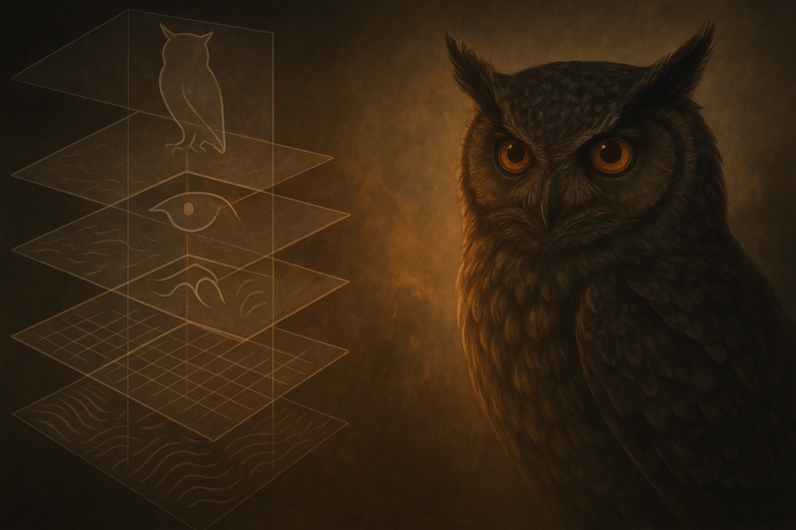

# Neural Networks & Deep Learning

## The Insightful Robotic Owl

### Introduction

In the previous chapters, you followed our Robotic Tiger through the jungle, mastering traditional Machine Learning techniques to hunt, adapt, and survive. But now, high above the canopy, another mechanical creature quietly observes: the Robotic Owl, endowed with a deep neural network. Equipped with layered intelligence, it sees not just the surface-level features of the jungle, but the subtle patterns hidden beneath. This advanced perception allows the Owl to notice details and relationships the Tiger might miss. (In the real world, this mirrors how deep learning models began outperforming earlier ML methods by huge margins in complex tasks—for example, a 2012 vision model crushed its competition with less than half the error rate of previous approaches
, signaling the rise of “owl-like” AI acuity.)

### Why a Separate “Robotic Owl”?

- **The Tiger:** Great for fast, rule-based or straightforward ML decisions (quick classification rules, simple patterns).
- **The Owl:** Excels at deeper, more ***complex understanding***—perfect for tasks requiring many layers of analysis and abstraction.

Rather than mixing brains, you now have two distinct robots in one ecosystem, each with a clear role:

- **The Tiger**: A nimble hunter, trained with classic ML, relying on human-defined features and shallower logic.
- **The Owl**: A wise observer, leveraging deep neural networks to spot subtle or multi-layered patterns that the Tiger’s simpler vision might overlook.

Late at night, while the Tiger rests, the Owl quietly scans the forest floor, catching every twitch of movement through its advanced multi-layered vision. With this layered intelligence, it can distinguish real threats or prey from mere shadows swaying in the moonlight. The Tiger might see a moving shape and react, but the Owl analyzes what that shape truly is – for instance, differentiating a camouflaged gazelle from leaves in the wind by recognizing intricate patterns.

**Key Analogy**

The Owl builds complex ideas from simple parts. In a deep neural network, early layers detect basic features (like edges or dots), middle layers combine them into meaningful shapes or textures, and later layers recognize whole objects or concepts—like building a detailed map from many small landmarks. The Owl’s mind layers simple cues into rich understanding.
### The Building Blocks of Neural Networks

#### Neurons: Tiny Decision Nodes

Each “neuron” in the Owl’s brain is like a small watchtower guard post. It receives incoming signals (inputs) and sums them up. Based on a learned threshold and pattern (its weights and bias), the neuron decides whether to activate (“fire”) and pass a signal onward. In practice, this means each artificial neuron performs a weighted sum of inputs and then applies an activation function (like a squashing rule) to decide its output. Individually, a single neuron’s decision is simple—much like a lone owl’s sentry deciding if a slight rustle is notable. But when you have millions of these tiny decision nodes working in concert, arranged in layers, they can together encode astonishingly complex decision boundaries and features.

Biology Analogy: A neuron in a real owl’s brain might receive signals from the eyes and, if the combined signal exceeds a certain intensity, it triggers an alert. Similarly, an artificial neuron might output a “1” if the weighted sum of pixel values suggests an edge in an image, or remain “0” if not. Crucially, the Owl’s neurons learn how strongly to weight each input through training, so they become tuned to important features (for example, a certain combination of colors or edges that indicate an animal’s outline).

####  Layers: From Simple to Complex

A Deep Neural Network has multiple hidden layers sandwiched between the input and output. Each layer is a team of neurons that receives outputs from the previous layer and processes them to increasingly refine the data. As information flows upward through these layers, the representation of the data becomes more abstract and meaningful:

- **Early layers** (closest to input) detect very basic low-level features. In vision, this might be tiny edge fragments, corners, or simple textures. In our Owl’s eyes, the first layer might just signal “there is a vertical line here” or “a patch of dark shadow there.”
- **Intermediate layers** form more detailed patterns by combining the basics. Several edge detections might combine to identify a shape like a circle or an eye, or a particular texture like stripes on fur or the bark of a tree. These layers start understanding parts of objects (e.g., an animal’s limb, a face outline, the pattern of motion).
- **Deeper final layers** assemble the detailed parts into whole concepts or categories. One cluster of neurons might fire strongly when all the pieces of a “gazelle” are present (legs, body, movement pattern), while another set activates for “rock” or “tree branch.” By the output layer, the Owl’s network can make a high-level decision or classification (e.g., “This shape is a gazelle, not just a collection of edges”).

In essence, each layer transforms the data into a more refined form. The Owl’s perception grows from raw pixels or sensor signals in the input layer to a rich understanding in the output layer. This layering is the source of the term “deep” in deep learning (many layers = depth). It’s like a multi-tiered sieve: the first sieve catches large, obvious pieces (edges), the next catches combinations that slip through (shapes), and so on, until only the most meaningful identification remains (the object or decision).


### Layers Inside the Owl’s Brain



### Deep Learning in Action: An Owl’s Perspective

When the Robotic Owl encounters a problem (say, identifying creatures on the forest floor from up in a tree), its deep neural network goes through a training and inference process. This can be broken down into a few key steps:

- **Forward Pass:**The Owl inputs sensor data—imagine it snaps an aerial photo of the moonlit jungle—and feeds this data through its network layer by layer. Each layer processes the image (as described above) and passes up a more refined signal. By the final layer, the network produces an output, such as a prediction: “85% confidence this shape is a small gazelle.” This is the Owl’s initial guess based on what it has learned so far.

- **Error Calculation:** Suppose the Owl’s guess was wrong—it mistook a small mossy rock for a gazelle. Once it gets the true answer (perhaps from cross-checking or an eventual outcome), the Owl computes an error. This error measures how far off the prediction was. For instance, the network output might ideally have been 0% gazelle, 100% rock for that image, so the error is the difference between the predicted probabilities and the correct answer. In our analogy, the Owl realizes it “misclassified a rock as prey” and notes how mistaken it was.
- **Backward Pass (Backpropagation):** Now the Owl learns from its mistake. The error is propagated backward through all the layers of the network. Imagine a corrective signal flowing from the output neurons back down to the earlier neurons, adjusting the strength of connections (weights) along the way. This is called backpropagation. Each neuron that contributed to the error gets its weights nudged a bit: connections that led to the wrong guess are weakened, while connections that would favor the correct guess are strengthened. In effect, the Owl fine-tunes all its tiny decision nodes so that next time, the pattern of a mossy rock won’t trigger a “gazelle” response.
- **Weight Update and Refinement:** The Owl uses an optimization process (often gradient descent) to adjust the weights by small amounts based on the backpropagated error gradients. This is akin to the Owl refining its internal “parameters” or memory. After one round of adjustment, the Owl’s brain is a tiny bit better calibrated. But a single correction isn’t enough—over many cycles of seeing images, making guesses, and adjusting (training epochs), the Owl’s predictions become incredibly accurate. Eventually, the Robotic Owl can spot a camouflaged animal in the dark with uncanny accuracy, because its network has learned from mistakes and optimized itself to high performance.

Over time, the Owl’s deep learning model generalizes its experience to handle new scenarios. The more data (observations of the jungle) it gets, the more it hones its ability to detect and classify whatever it might see. This feedback-driven learning is what sets the Owl apart from the Tiger’s more static, rule-based knowledge.

**Overfitting – When the Owl Gets Overly Confident in Shadows:**

There is a risk that the Owl becomes too sure about patterns it saw during training and fails to generalize to new jungles or new conditions. In other words, it might start seeing phantom gazelles in every shadow because it memorized the training examples too specifically. This is called overfitting. To prevent the Owl from becoming a narrow-minded expert on the training data but a poor generalist, we use techniques like regularization (adding slight penalties for overly complex internal models), dropout (making neurons occasionally “ignore” some signals during training so the network doesn’t rely on any one detail too much), early stopping (halting training at the point when validation performance stops improving), and ensuring a diverse training dataset. These strategies keep the Owl’s mind sharp yet flexible, so it truly learns the underlying patterns of the jungle, not just the exact scenes it saw yesterday.
### Specialties Among Robotic Birds & Beasts

Not all neural networks are identical. Just as jungle creatures have different specialties, deep learning has spawned architectures tailored to particular kinds of data. In our robotic wildlife park, we introduce a couple more cyber-creatures to illustrate specialized deep nets:


#### Robotic Hawk (Convolutional Neural Network – CNN)

- **Task Specialty:** The Robotic Hawk is specialized for scanning images or video frames with exceptional detail. If you have visual data (like photos, medical scans, or satellite images), a CNN is often the go-to neural network.
- **Analogy:** The hawk’s sweeping vision picks out fine details from high above. As it soars, it can spot the shimmer of a fish underwater or a mouse in the grass. Similarly, a ***Convolutional Neural Network (CNN)*** scans an image using sliding filters—like a hawk’s sharp eyes sweeping across a landscape—to detect features regardless of their position. The CNN’s convolutional layers act as the hawk’s retinas, filtering the view for specific patterns (edges, textures) across the entire image. This specialized focus allows the Robotic Hawk to quickly identify objects in images with great accuracy and efficiency. In practice, CNNs have revolutionized image recognition: from diagnosing diseases in X-rays to enabling self-driving cars to recognize road signs. In fact, some deep CNNs have even outperformed human experts in certain vision tasks (one CNN model surpassed professional radiologists at detecting pneumonia in chest X-rays
, showing just how keen the Hawk’s vision has become).


#### Robotic Owl (Recurrent Networks – RNN/LSTM)

- **Task Specialty:** Our Owl not only has sharp vision but also an exceptional memory for sequences. This makes the Owl (when powered by Recurrent Neural Networks like LSTMs) excel at handling sequential data: time-series signals, language, or any information that unfolds over time. Whenever context and history matter, the Owl’s RNN brain shines.
- **Analogy:** The owl’s wisdom in folklore comes from its ability to observe silently and remember. A real owl can listen to a series of twigs snapping and infer the presence of a moving creature. In the same way, a ***Recurrent Neural Network (RNN)*** processes one step at a time while retaining a memory of previous steps. It’s as if the Robotic Owl, while listening to the forest, keeps an internal state (short-term memory) of what happened moments before. An advanced form of RNN, the ***LSTM (Long Short-Term Memory)*** network, gives the Owl an even longer memory with gates that learn what to keep or forget. This is crucial for tasks like language understanding, where the meaning of a word can depend on earlier words in a sentence. For example, to the Owl, the meaning at the end of the sequence “the owl watches the tiger because it knows…” depends on remembering who “it” refers to earlier. Because the Owl can recall context, it interprets ongoing sequences wisely (e.g., it knows if a creature’s footsteps are pacing back and forth or suddenly sprinting, by recalling the pattern of steps). In practical terms, RNNs and LSTMs have been used for things like speech recognition, language translation, and even financial forecasting—situations where the order of information is key.

You might wonder, aren’t there other birds in this jungle? Indeed, there are even more specialized “species” of neural networks. For example, **Transformers** (which we’ll meet later) have become master linguists and multitaskers in the AI world, and new architectures appear as AI evolves. For now, our Owl and Hawk (RNN and CNN) cover two fundamental specialties: sequence memory and visual perception.
### Real-World Use Cases
Deep learning isn’t just a theoretical jungle story—it powers many aspects of the modern world. Here are a few domains where our robotic Owl (and its specialized cousins like the Hawk) are making a profound impact:

- **Healthcare & Medical Imaging:**: CNN-based systems scan medical images (like X-rays, MRIs, CT scans) to detect anomalies such as tumors or infections. They often catch details that might be subtle to human eyes. For instance, deep CNNs have been developed to analyze chest X-rays for pneumonia or signs of cancer and, remarkably, in some studies their accuracy is comparable to or even exceeds that of experienced radiologists.
This means an AI with Owl-like vision can help doctors make diagnoses faster and more consistently. Meanwhile, RNNs (or their gated successors, LSTMs) can monitor patient vital signs over time as sequential data – forecasting events like heart rate anomalies or seizure onset by recognizing temporal patterns that would elude a simpler system. Together, these deep learning tools promise earlier detection of diseases and more personalized treatment plans.

- **Fraud Detection in Finance:** Your bank and credit card company enlist Owl-like networks to guard against fraud. For example, an RNN/LSTM can analyze the sequence of transactions on your account, looking for unusual patterns in time (did someone use your card in two far-apart cities within an hour?). At the same time, CNNs might be employed to read and interpret images of checks or signatures. Modern deep learning even extends to textual data in finance—Transformers (a newer architecture we'll discuss later) can review lengthy legal contracts or compliance documents rapidly, flagging risky clauses or anomalies far faster than a human could. Banks report that by using deep learning, they can catch fraudulent transactions within milliseconds and with fewer false alarms; one study showed a fine-tuned LSTM model hitting over 99% accuracy in credit card fraud detection
. The Owl’s deep insight translates directly to saved money and improved security.

- **Language Translation & Chatbots:** The Owl’s ability to handle sequences makes it a natural linguist. Early on, RNNs and LSTMs were used to power translation systems (converting, say, English to French one word at a time while retaining context). An Owl-based translator would read a sentence, remember the context, and generate a translation word by word. In 2016, Google Translate famously switched to a deep neural network approach and saw translation errors drop by roughly 60% overnight
, a massive leap in quality that stunned users. Today, Transformers (which use attention mechanisms rather than recurrence) are the state-of-the-art: they can handle entire paragraphs at once, enabling chatbots like ChatGPT to understand context and produce coherent answers. If you’ve spoken to a virtual assistant or customer service bot, you’ve likely benefited from an Owl-like deep learning model parsing your requests and generating helpful responses.

- **Self-Driving Cars & Robotics:** An autonomous vehicle is like a whole team of robotic animals working together. Its vision system is powered by CNNs (the Hawk eyes) to interpret camera feeds—identifying lanes, other cars, pedestrians, and obstacles in real time. For understanding the temporal aspect (like predicting where that pedestrian will be in a few seconds, or planning the car’s next move), sequence models or RNN-like logic (the Owl’s sequential reasoning) come into play. Self-driving cars also fuse data from many sensors (cameras, Lidar, radar), and deep networks help at multiple levels: from low-level perception (what am I seeing?) to high-level decision-making (what should I do next?). In robotics more broadly, deep learning enables a robot to not just react reflexively but to plan: e.g., a robotic arm might use vision (CNN) to locate an object and an RNN to sequence the motions needed to grasp it. The synergy of multiple deep learning methods—each like a specialized robotic creature with a unique sense—creates a robust AI system. One handles vision, another memory and prediction, and together they achieve tasks that once seemed science-fiction (like an autonomous car smoothly navigating a busy city).


### Try It Yourself (Optional)
To get a feel for a deep neural network in code, here’s a simple example of building a small CNN (Convolutional Neural Network) using Keras. This network isn’t yet as smart as our Owl, but it has the basic structure: convolutional layers for feature extraction and dense layers for decision-making. It’s designed for an input of 64×64 color images and outputs 10 possible classes:


```python
# Simple Keras example: small CNN feature extractor
from tensorflow.keras import layers, models

model = models.Sequential([
    layers.Input(shape=(64, 64, 3)),       # input layer expects 64x64 color images
    layers.Conv2D(16, 3, activation='relu'),  # first convolution: 16 filters of size 3x3
    layers.MaxPooling2D(),                   # downsampling layer
    layers.Conv2D(32, 3, activation='relu'),  # second convolution: 32 filters
    layers.MaxPooling2D(),                   # another downsampling
    layers.Flatten(),                        # flatten 2D feature maps into 1D vector
    layers.Dense(64, activation='relu'),     # fully connected layer with 64 neurons
    layers.Dense(10, activation='softmax')   # output layer for 10 classes (softmax gives probabilities)
])

model.summary()

```

If you run this, you’ll see a summary of the model’s layers and number of parameters. Notice how the early Conv2D layers have relatively few parameters (each filter is small) but the later Dense layers have more. This mimics the idea that early layers learn simple features (few parameters needed), and later layers combine them into complex decisions (more parameters as they synthesize information). Training this network on an image dataset would adjust those parameters through backpropagation, just like our Owl learning from mistakes. Feel free to tweak the architecture or add layers and see how the number of parameters grows – a deeper network can learn more, but is also harder to train!


### Key Takeaways

- **Layered Intelligence:**Deep neural networks learn hierarchies of features, enabling them to recognize extremely complex patterns more effectively than simpler ML models. By stacking many layers of neurons, they build up an understanding of data from the ground up (pixels to edges to shapes to objects, or letters to words to sentences to meaning). This layered approach is why the Robotic Owl can identify a camouflaged creature that a one-layer “Tiger” model would miss.

- **Feedback-Driven Learning:** Deep learning models improve through a feedback loop of making predictions and correcting errors. The process of backpropagation systematically refines each layer’s weights, ensuring that errors are minimized over many training iterations. The Owl doesn’t just memorize examples—it continuously adjusts and generalizes from them. This ability to learn from mistakes (with enough data) is what makes the Owl so powerful and gradually turns its initially fuzzy vision into expert perception.

- **Different “Birds” for Different Tasks:** There is no one-size-fits-all in AI. Just as hawks, owls, tigers, and foxes have different strengths, various neural network architectures (CNNs, RNNs, LSTMs, and others like Transformers) excel in unique areas. A CNN (hawk eyes) is superb for spatial data like images. An RNN/LSTM (wise owl memory) excels at temporal or sequential data like language or time series. Transformers (a more recent invention, think of it as an owl with an encyclopedic attention span) excel at long-range dependencies in data. The key is understanding the problem and picking the right kind of “brain” for the job. Sometimes, as we saw, the best solution is a team effort of multiple specialized models working together.

- **No Brain Fusion Needed (Divide and Conquer):** In our analogy, we kept the Tiger and Owl as separate agents, each with its own training and purpose. This isn’t just for storytelling clarity—it reflects a practical point in AI system design: it’s often beneficial to keep separate specialized models rather than trying to mash everything into one uber-model. By maintaining distinct “robots” in your AI ecosystem, you can leverage the particular strengths of each approach without confusion. They can coexist and even cooperate (passing information or outputs amongst each other) to solve complex tasks. The takeaway is that diversity in AI approaches can be a strength, and understanding each technique’s niche will help you build better solutions. You wouldn’t ask an owl to run fast or a tiger to see in the dark—similarly, use each AI tool for what it’s best at.


Deep learning’s power comes with the cost of needing lots of data and computation. Training the Owl’s brain requires feeding it many examples (the jungle is vast and varied!) and often specialized hardware (GPUs) for the heavy math. This is why deep learning surged only in the last decade when big data and GPU computing became widely available. But once trained, these models can perform wonders.
### Chapter 4 Story Wrap-Up & Teaser

**Story Wrap-Up:**
The moonlit jungle stands calm and watchful. Above, the Robotic Owl perches silently on a high branch, its layered neural vision scanning for the slightest hint of movement. On the ground below, the Robotic Tiger paces with measured confidence, ready to spring into action at a moment’s notice. Each of these mechanical beings, with its own specialty, watches over the realm in a harmonious tandem—one embodying the deep learning prowess of layered perception, the other the reliability of traditional ML and quick reflexes. The Owl might slowly contemplate the scene, discerning every nuance, while the Tiger is poised for a swift, rule-based response. Together, they cover each other’s weaknesses and enhance each other’s strengths, symbolizing how advanced AI and simpler models can co-exist.

Yet, as the night deepens, a new presence silently slinks into the wilderness. There are rustling leaves... faint, deliberate footprints... a glint of something clever in the shadows. This newcomer is unlike the programmed Tiger or the trained Owl. It follows no fixed script or static training; instead, it learns on the fly from every step it takes, every outcome it witnesses. The Owl’s eyes narrow—this is something novel. The Tiger pauses, sensing a change in the wind. Something else is prowling these woods, adapting its strategy with each moment, perhaps even learning from the Owl and Tiger themselves.

Another dawn is about to break, unveiling a Robotic Fox, a master of Reinforcement Learning, whose entire existence revolves around exploring, experimenting, and learning from direct experience in real time. This cunning fox will show a new way of learning: not from static datasets, but from trial and error in the jungle itself, guided by the thrill of rewards and the sting of mistakes.

**Next Steps & Teaser – Chapter 5 Preview:**
In Chapter 5, you will meet the Robotic Fox, our embodiment of Reinforcement Learning. Watch as the Fox learns to navigate and survive using a brain that improves with every choice it makes. Through trial, error, and carefully earned rewards, this fox will demonstrate how an AI agent can become more adept with each decision—truly learning by doing. Just as a young fox cub learns to hunt by playing and exploring, our Robotic Fox will show the principles of reinforcement learning in action. Prepare to step into the paws of this clever agent and discover a world where learning is an interactive game with the environment. The jungle’s next chapter awaits, and with it, a fresh perspective on how machines can learn from life itself.